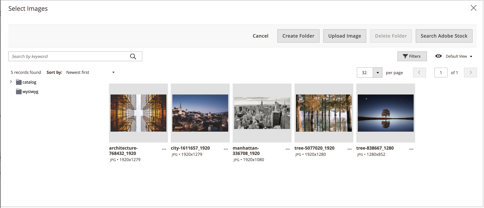

# [!DNL Media Gallery]

Adobe Commerce 또는 Magento Open Source 2.4를 사용하면 판매자는 새로운 _향상된_ [!DNL Media Gallery]을(를) 사용하여 서버에서 미디어 파일을 구성하고 관리할 수 있습니다. 이 새 [!DNL Media Gallery]에는 기존 미디어 저장소와 동일한 기능이 포함되어 있지만 개선된 사용자 인터페이스와 [Adobe Stock][adobe-stock]과의 긴밀한 통합이 포함되어 있습니다.

{width="700" zoomable="yes"}

>[!NOTE]
>
>[_[!UICONTROL Images and Videos]_제품 섹션](../catalog/product-image.md#upload-an-image)에 추가된 제품 이미지는 [!DNL Media Gallery]에서 관리되지 않습니다._[!UICONTROL Content]_ 제품 섹션 필드에 사용된 이미지만 새 [!DNL Media Gallery]에 표시되고 필터링됩니다.

## 새 [!DNL Media Gallery] 사용

1. _관리자_ 사이드바에서 **[!UICONTROL Stores]** > _[!UICONTROL Settings]_>**[!UICONTROL Configuration]**(으)로 이동합니다.

1. 왼쪽 패널에서 **[!UICONTROL Advanced]**&#x200B;을(를) 확장하고 **[!UICONTROL System]**&#x200B;을(를) 선택합니다.

1.  **[!UICONTROL Media Gallery]**&#x200B;을 확장합니다.

   ![고급 구성 - [!DNL Media Gallery]](./assets/system-media-gallery.png){width="600" zoomable="yes"}

1. **[!UICONTROL Enable Old Media Gallery]**&#x200B;을(를) `No`(으)로 설정합니다.

1. **[!UICONTROL Save Config]**&#x200B;을(를) 클릭합니다.

1. 메시지가 표시되면 시스템 메시지에서 **[!UICONTROL Cache Management]** 링크를 클릭하고 잘못된 캐시를 새로 고칩니다.

   이제 [[!UICONTROL Content] 메뉴](/help/content-design/content-menu.md)에 새 _[!UICONTROL Media Gallery]_옵션이 표시됩니다.

>[!NOTE]
>
>새 [!DNL Media Gallery]의 전체 기능을 사용하려면 초기 동기화를 위해 `media.gallery.synchronization` 및 `media.content.synchronization` 큐 소비자가 시작해야 합니다. 자세한 내용은 _구성 가이드_&#x200B;의 [메시지 큐 관리](https://experienceleague.adobe.com/docs/commerce-operations/configuration-guide/message-queues/manage-message-queues.html)를 참조하십시오.

## 새 [!DNL Media Gallery]에 액세스

[페이지를 추가 또는 편집](/help/content-design/page-add.md)할 때 콘텐츠 메뉴에서 새 [!DNL Media Gallery]에 액세스할 수 있습니다. [카테고리를 만들거나 편집](/help/catalog/category-create.md)하거나 [콘텐츠 편집기를 사용하여 이미지를 삽입](/help/content-design/editor-insert-image.md)할 때도 액세스할 수 있습니다.

[!UICONTROL Content] 메뉴를 통해 새 [!UICONTROL Media Gallery]에 액세스하려면:

- _관리자_ 사이드바에서 **[!UICONTROL Content]** > _[!UICONTROL Media]_>**[!UICONTROL Media Gallery]**(으)로 이동합니다.

페이지를 추가하거나 편집할 때 새 미디어 갤러리에 액세스하려면 다음 작업을 수행하십시오.

1. _관리자_ 사이드바에서 **[!UICONTROL Content]** > _[!UICONTROL Elements]_>**[!UICONTROL Pages]**(으)로 이동합니다.

1. **[!UICONTROL Add a New Page]**&#x200B;을(를) 클릭합니다.

   기존 페이지를 편집하려면 _[!UICONTROL Action]_열을 사용하여&#x200B;**[!UICONTROL Select]**을(를) 클릭하고&#x200B;**[!UICONTROL Edit]**을(를) 선택할 수 있습니다.

1. **[!UICONTROL Content]** 섹션에서 를 확장하고 다음을 수행합니다.

   - [페이지 빌더를 사용하도록 설정](../page-builder/setup.md)한 경우 **[!UICONTROL Media]** 패널을 확장하고 **[!UICONTROL Image]** 자리 표시자를 대상 컨테이너로 끕니다. **[!UICONTROL Select from Gallery]**&#x200B;을(를) 클릭합니다.

     {width="600" zoomable="yes"}

   - [WYSIWYG 편집기를 사용하도록 설정](/help/content-design/editor.md)한 경우 **[!UICONTROL Show/Hide Editor]**&#x200B;을(를) 클릭한 다음 **[!UICONTROL Insert Image]**&#x200B;을(를) 클릭합니다.

## [!DNL Media Gallery] 데모

[!DNL Media Gallery]에 대해 자세히 알아보려면 다음 비디오를 시청하십시오.

>[!VIDEO](https://video.tv.adobe.com/v/343785?quality=12&learn=on)

[adobe-stock]: https://stock.adobe.com

