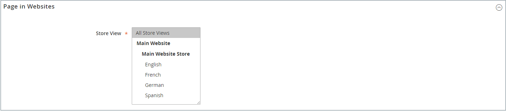
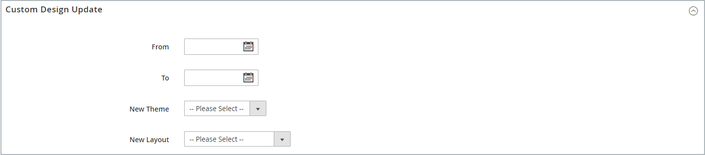

# 페이지 추가 및 제거

콘텐츠 페이지를 스토어에 추가하는 프로세스는 기본적으로 만들려는 모든 페이지 유형에 대해 동일합니다. 텍스트, 이미지, 콘텐츠 블록, 변수 및 위젯을 포함할 수 있습니다. 대부분의 콘텐츠 페이지는 검색 엔진별로 먼저 읽고 사람이 두 번째로 읽도록 디자인되었습니다. 페이지 제목 및 URL을 선택할 때와 메타 데이터 및 컨텐츠를 작성할 때 이러한 서로 다른 두 대상의 요구 사항을 염두에 두십시오. 페이지가 완료되면 저장소 탐색에 추가하거나, 다른 페이지에 연결하거나, 저장소의 바닥글에서 연결하거나, 새 [홈 페이지](page-home-new.md)(으)로 사용할 수 있습니다.

{width="700" zoomable="yes"}

## 페이지 추가

다음 지침은 기본 페이지를 만드는 각 단계를 설명합니다. 일부 고급 기능은 생략되었지만 다른 항목에서 다룹니다.

### 1단계: 페이지 만들기

1. _관리자_ 사이드바에서 **[!UICONTROL Content]** > _[!UICONTROL Elements]_>**[!UICONTROL Pages]**(으)로 이동합니다.

1. **[!UICONTROL Add New Page]**&#x200B;을(를) 클릭합니다.

   {width="600" zoomable="yes"}

1. 페이지를 즉시 게시하지 않으려면 **[!UICONTROL Enable Page]**&#x200B;을(를) `No`(으)로 설정하십시오.

1. **[!UICONTROL Page Title]** 입력.

   페이지 제목이 [이동 경로](../catalog/navigation-breadcrumb-trail.md) 탐색에 표시됩니다.

### 2단계: 콘텐츠 완료

[고급 콘텐츠 도구 구성](../configuration-reference/general/content-management.md)에 따라 페이지 콘텐츠를 추가하십시오.

#### 페이지 빌더 콘텐츠 도구 사용

1.  **[!UICONTROL Content]**&#x200B;을 확장합니다.

   {width="600" zoomable="yes"}

1. **[!UICONTROL Content Heading]** 상자에 페이지 맨 위에 표시할 제목을 입력합니다.

   사용하도록 설정하면 [페이지 빌더](../page-builder/introduction.md) 단계 및 패널이 콘텐츠 제목 아래에 나타납니다. 자세한 내용은 [Workspace](../page-builder/workspace.md)을 참조하세요. _페이지 빌더_&#x200B;를 사용하지 않으면 편집기가 맨 위에 도구 모음이 있는 WYSIWYG 모드로 열립니다.

1. 콘텐츠를 완성하고 필요에 따라 텍스트 서식을 지정합니다.

#### 편집기 도구 모음 사용

1.  **[!UICONTROL Content]**&#x200B;을 확장합니다.

   {width="600" zoomable="yes"}

1. **[!UICONTROL Content Heading]** 상자에 페이지 맨 위에 표시할 제목을 입력합니다.

1. 콘텐츠를 완성하고 필요에 따라 텍스트 형식을 지정합니다.

   필요에 따라 [이미지](media-storage.md), [변수](../systems/variables-predefined.md) 및 [위젯](widgets.md)을 추가할 수 있습니다. 자세한 내용은 [편집기 사용](editor.md)을 참조하세요.

### 3단계: SEO 정보 작성

1.  **[!UICONTROL Search Engine Optimization]**&#x200B;을 확장합니다.

   {width="600" zoomable="yes"}

1. 기본값을 사용하거나 모든 소문자로 구성된 다른 **[!UICONTROL URL Key]**&#x200B;을(를) 공백 대신 하이픈으로 입력하십시오.

   기본 URL 키는 페이지가 저장될 때 생성되었으며 콘텐츠 머리글을 기반으로 합니다.

1. 페이지의 **[!UICONTROL Meta Title]**&#x200B;을(를) 입력하십시오.

   메타 제목은 70자 미만이어야 하며 브라우저 제목 표시줄 및 탭에 표시됩니다.

1. 검색 엔진이 페이지를 인덱싱하는 데 사용할 수 있는 높은 값 **[!UICONTROL Meta Keywords]**&#x200B;을(를) 선택하십시오.

   여러 단어는 쉼표로 구분하십시오. 메타 키워드는 일부 검색 엔진에서 무시되지만 다른 검색 엔진에서 사용됩니다.

1. **[!UICONTROL Meta Description]**&#x200B;의 경우 검색 결과 목록 페이지에 대한 간단한 설명을 입력하십시오.

   설명은 150~160자 길이여야 하며 최대 255자로 제한됩니다.

1. **[!UICONTROL Save]**&#x200B;을(를) 클릭합니다.

### 4단계: 페이지 범위 지정

1.  **[!UICONTROL Page in Websites]**&#x200B;을 확장합니다.

   {width="600" zoomable="yes"}

1. **[!UICONTROL Store View]** 목록에서 페이지를 사용할 수 있는 각 보기를 선택하십시오.

   설치에 여러 웹 사이트가 있는 경우 페이지를 사용할 수 있는 각 웹 사이트 및 스토어 보기를 선택합니다.

### 5단계: 상위 페이지 식별(해당되는 경우)

{{ee-feature}}

1.  **[!UICONTROL Hierarchy]**&#x200B;을 확장합니다.

   {width="600" zoomable="yes"}

1. 이 페이지가 다른 페이지의 하위 페이지인 경우 **[!UICONTROL Parent page]**&#x200B;의 확인란을 선택하십시오.

### 6단계: 설계 변경 사항 입력(선택 사항)

1. 페이지의 레이아웃을 변경하려면  **[!UICONTROL Design]**&#x200B;을(를) 확장합니다.

   {width="600" zoomable="yes"}

1. 페이지의 열 레이아웃을 변경하려면 **[!UICONTROL Layout]**&#x200B;을(를) 다음 중 하나로 설정합니다.

   - `Empty`
   - `1 column`
   - `2 columns with left bar`
   - `2 columns with right bar`
   - `3 columns`
   - `Page -- Full Width`([페이지 빌더](../page-builder/introduction.md) 필요)
   - `Category -- Full Width`(Page Builder 필요)
   - `Product -- Full Width`(Page Builder 필요)

1. **[!UICONTROL Custom Layout Update]**&#x200B;을(를) 적용하려면 목록에서 파일 이름을 선택하십시오.

   자세한 내용은 [레이아웃 업데이트](layout-updates.md)를 참조하세요.

1. 페이지의 테마를 변경하려면 **[!UICONTROL New Theme]**&#x200B;을(를) 다음 중 하나로 설정합니다.

   - `Magento Black`
   - `Magento Luma`

1. (Magento Open Source만 해당) 디자인 변경을 예약하려면  **[!UICONTROL Custom Design Update]**&#x200B;을(를) 확장하고 다음을 수행하십시오.

   {width="600" zoomable="yes"}

   - 달력()을 사용하여 변경 내용을 적용할 **[!UICONTROL From]** 및 **[!UICONTROL To]** 날짜를 선택합니다.

   - 페이지에 다른 테마를 적용하려면 **[!UICONTROL New Theme]**&#x200B;의 이름을 선택합니다.

   - 페이지의 열 레이아웃을 변경하려면 적용할 **[!UICONTROL Layout]**&#x200B;을(를) 선택하십시오.

### 7단계: 페이지 미리보기

1. **[!UICONTROL Save]** 화살표를 클릭하고 **[!UICONTROL Save & Close]**&#x200B;을(를) 선택하여 페이지 그리드로 돌아갑니다.

1. 그리드에서 페이지를 찾은 다음 _[!UICONTROL Action]_&#x200B;열에서&#x200B;**[!UICONTROL View]**&#x200B;을(를) 선택합니다.

1. 그리드로 돌아가려면 브라우저 창의 왼쪽 상단 모서리에서 **[!UICONTROL Back]**&#x200B;을(를) 클릭합니다.

### 8단계: 페이지 게시

1. 그리드의 _[!UICONTROL Action]_&#x200B;열에서&#x200B;**[!UICONTROL Edit]**&#x200B;을(를) 선택합니다.

1. **[!UICONTROL Enable Page]**&#x200B;을(를) `Yes`(으)로 설정합니다.

1. **[!UICONTROL Save]** 화살표를 클릭하고 **[!UICONTROL Save & Close]**&#x200B;을(를) 선택합니다.

## 페이지 복제

컨텐츠 페이지는 템플릿으로 사용할 수 있으며, 중복으로 저장할 수 있습니다. 이 시간 절약 기법을 사용하여 사이트 전체의 콘텐츠 페이지에 대해 일관된 디자인을 만들 수 있습니다. 중복 페이지는 원본의 페이지 제목을 유지하지만 URL 키 및 상태 필드는 업데이트해야 합니다.

{width="600" zoomable="yes"}

1. _관리자_ 사이드바에서 **[!UICONTROL Content]** > _[!UICONTROL Elements]_>**[!UICONTROL Pages]**(으)로 이동합니다.

1. 그리드에서 복제할 페이지를 찾은 다음 _[!UICONTROL Action]_&#x200B;열에서&#x200B;**[!UICONTROL Edit]**&#x200B;을(를) 클릭합니다.

1. **[!UICONTROL Save]** 화살표를 클릭하고 **[!UICONTROL Save & Duplicate]**&#x200B;을(를) 선택합니다.

1. 페이지가 저장되고 복제되었다는 메시지가 표시되면 맨 위 단추 모음에서 **[!UICONTROL Back]**&#x200B;을(를) 클릭하여 그리드로 돌아갑니다.

1. 그리드에서 중복 페이지를 찾아 다음 사항에 유의하십시오.

   - 페이지 제목 은 원본과 동일합니다.
   - 고유하지만 임시 URL 키가 할당됩니다.
   - 페이지의 상태는 `Disabled`입니다.

1. _편집_ 모드에서 중복 페이지를 열고 다음을 수행합니다.

   - 페이지를 즉시 게시하려면 **[!UICONTROL Enable Page]**&#x200B;을(를) `Yes`(으)로 설정하십시오.

   - 필요에 따라 **[!UICONTROL Page Title]**&#x200B;을(를) 업데이트합니다.

   - **[!UICONTROL Search Engine Optimization]** 섹션에서 을(를) 확장하고 중복 페이지에 사용할 고유한 **[!UICONTROL URL Key]**&#x200B;을(를) 입력합니다.

     {width="600" zoomable="yes"}

   - 필요에 따라 나머지 페이지 콘텐츠를 업데이트합니다.

1. **[!UICONTROL Save]** 화살표를 클릭하고 **[!UICONTROL Save & Close]**&#x200B;을(를) 선택합니다.

   그리드의 중복 페이지는 변경 사항을 반영합니다.

## 저장 메뉴

| 명령 | 설명 |
|--- |--- |
| [!UICONTROL Save] | 현재 페이지를 저장하고 작업을 계속합니다. |
| [!UICONTROL Save & New] | 현재 페이지를 저장하고 닫은 다음 새 페이지를 시작합니다. |
| [!UICONTROL Save & Duplicate] | 현재 페이지를 저장하고 닫은 다음 새 복사본을 엽니다. |
| [!UICONTROL Save & Close] | 현재 페이지를 저장하고 닫은 다음 페이지 그리드로 돌아갑니다. |

{style="table-layout:auto"}

## 페이지 삭제

생성된 페이지를 제거하는 방법에는 두 가지가 있습니다. _[!UICONTROL Pages]_&#x200B;눈금 또는&#x200B;_[!UICONTROL Edit]_ 페이지에서 제거할 수 있습니다.

### 방법 1: 페이지 그리드에서 페이지 제거

1. _관리자_ 사이드바에서 **[!UICONTROL Content]** > _[!UICONTROL Elements]_>**[!UICONTROL Pages]**(으)로 이동합니다.

1. 그리드 위에서 필터를 사용하여 페이지를 찾은 다음 삭제할 하나 이상의 페이지에 대한 확인란을 선택합니다.

1. 목록의 왼쪽 상단 모서리에서 **[!UICONTROL Actions]**&#x200B;을(를) `Delete`(으)로 설정합니다.

1. 작업을 확인하려면 **[!UICONTROL OK]**&#x200B;을(를) 클릭합니다.

### 방법 2: 편집 페이지에서 페이지 제거

1. _관리자_ 사이드바에서 **[!UICONTROL Content]** > _[!UICONTROL Elements]_>**[!UICONTROL Pages]**(으)로 이동합니다.

1. 삭제할 페이지를 찾습니다.

1. 페이지 엔터티의 _[!UICONTROL Actions]_&#x200B;열에서&#x200B;**[!UICONTROL Select]**&#x200B;을(를) 클릭하고&#x200B;**[!UICONTROL Edit]**&#x200B;을(를) 선택합니다.

1. 단추 모음에서 **[!UICONTROL Delete Page]**&#x200B;을(를) 클릭합니다.

1. 작업을 확인하려면 **[!UICONTROL OK]**&#x200B;을(를) 클릭합니다.
