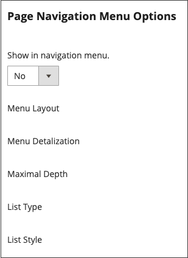

# 페이지 계층

{{ee-feature}}

저장소 페이지 계층 구조 시스템을 사용하면 콘텐츠 페이지를 구성하고 페이지 매김, 탐색 및 메뉴를 추가할 수 있습니다. 샘플 데이터의 개인정보 처리방침 페이지는 왼쪽에 메뉴가 있는 페이지의 예입니다. 많은 양의 콘텐츠를 정기적으로 게시하는 경우 페이지 계층 구조를 사용하여 사람들이 관심 있는 문서를 쉽게 찾을 수 있도록 콘텐츠를 구성할 수 있습니다.

페이지 계층 시스템은 노드를 사용하여 관련 콘텐츠를 식별하고 콘텐츠 페이지를 상위/하위 관계로 구성합니다. 상위 노드는 하위 노드 및 페이지를 포함할 수 있는 폴더와 같습니다. 계층 구조에서 각 노드 및 페이지의 상대 위치는 _트리_ 구조입니다. 노드에는 다른 노드 및 콘텐츠 페이지가 포함될 수 있으며 단일 콘텐츠 페이지가 상위/하위 또는 인접 관계의 여러 노드 및 다른 콘텐츠 페이지와 연결될 수 있습니다.

{width="600" zoomable="yes"}

## 페이지 계층 구성

구성 설정은 페이지 계층 시스템 및 메타데이터를 활성화하고 기본 메뉴 레이아웃을 결정합니다.

{width="600" zoomable="yes"}

1. 다음에서 _관리자_ 사이드바, 이동 **[!UICONTROL Stores]** > _[!UICONTROL Settings]_>**[!UICONTROL Configuration]**.

1. 아래의 왼쪽 패널에서 _[!UICONTROL General]_, 선택&#x200B;**[!UICONTROL Content Management]**.

1. 확장  **[!UICONTROL CMS Page Hierarchy]**  필요한 모든 변경 작업을 수행합니다.

1. 완료되면 다음을 클릭하십시오. **[!UICONTROL Save Config]**.

| 필드 | 설명 |
|--- |--- |
| [!UICONTROL Enable Hierarchy Functionality] | 콘텐츠 페이지에 대한 페이지 계층 구조 사용을 활성화합니다. 옵션: `Yes` / `No` |
| [!UICONTROL Enable Hierarchy Metadata] | 이 옵션이 활성화되면 계층 구조의 페이지와 메타데이터를 연결할 수 있습니다. 옵션: `Yes` / `No` |
| [!UICONTROL Default Layout for Hierarchy Menu] | 기본 메뉴 스타일을 결정합니다. 옵션: `Content` / `Left Column` / `Right Column` |

{style="table-layout:auto"}

## 계층 노드 추가

다음 예제에서는 관련 콘텐츠 페이지를 간편하게 탐색하여 노드를 만드는 방법을 보여 줍니다. 노드에는 연결된 콘텐츠 페이지가 없지만 사이트의 다른 위치에서 참조할 수 있는 URL 키가 있습니다.

예를 들어, 라는 노드를 만들 수 있습니다. _보도 자료_ 개별 보도 자료에 대한 탐색 기능이 있습니다. 그런 다음 페이지에 링크를 포함할 수 있습니다. _정보_ 페이지에 추가합니다. 또는 뉴스레터의 최신 문제 컬렉션에 대한 노드를 만들 수 있습니다.

노드에 연결하려면 [위젯](widgets.md) cms 계층 노드 링크를 만들고 위젯을 컨텐츠 블록이나 페이지에 배치하는 도구입니다.

{width="600" zoomable="yes"}

### 1단계: 노드 만들기

1. 다음에서 _관리자_ 사이드바, 이동 **[!UICONTROL Content]** > _[!UICONTROL Elements]_>**[!UICONTROL Hierarchy]**.

   {width="600" zoomable="yes"}

1. 그리드 위에서 **[!UICONTROL Add Node...]**.

1. 아래 _[!UICONTROL Page Properties]_, 를 입력합니다.**[!UICONTROL Title]**노드 및 적합한&#x200B;**[!UICONTROL URL Key]**.

   URL 키는 노드에 대한 고유한 웹 주소를 제공합니다. 모든 소문자여야 하며 공백 대신 하이픈을 사용하여 단어를 구분해야 합니다.

   {width="500" zoomable="yes"}

1. 클릭 **[!UICONTROL Save]**.

   노드는 페이지 왼쪽의 트리에 폴더로 나타납니다.

### 2단계: 노드에 페이지 추가

1. 계층 트리에서 를 클릭하여 노드를 선택합니다.

1. 클릭 **[!UICONTROL Add Selected Pages(s) to Tree]**.

   위로 스크롤하여 선택한 각 페이지가 노드 폴더 아래의 트리에 표시되는지 확인할 수 있습니다.

### 3단계: 구조 정의

1. 필요한 경우 페이지를 위치로 드래그하여 메뉴에 표시할 순서를 반영합니다.

   {width="500" zoomable="yes"}

1. 계층 맨 위에 있는 노드를 클릭합니다.

   다음 _[!UICONTROL Page Properties]_이제 섹션에 노드에 대한 정보가 표시됩니다.

1. 아래 **[!UICONTROL Render Metadata in HTML Head]**&#x200B;를 사용하여 다음을 수행합니다.

   {width="400" zoomable="yes"}

   - 노드를 계층 구조의 맨 위로 식별하려면 을 설정합니다. **[!UICONTROL First]** 끝 `Yes`.

   - 페이지 매김 컨트롤을 표시하려면 **[!UICONTROL Next/Previous]** 끝 `Yes`.

   - 계층 구조의 페이지를 책으로 구성하려면 다음을 설정합니다. **[!UICONTROL Enable Chapter/Section]** 끝 `Yes`.

     노드를 장부의 일부로 포함시키지 않으려면 기본값을 그대로 둡니다 `No`.

   - 책의 특정 부분에 노드를 할당하려면 다음을 설정합니다. **[!UICONTROL Chapter/Section]** 다음 중 하나를 수행합니다.

      - `No` - 노드를 챕터/섹션으로 정의하지 않습니다.
      - `Chapter` - 현재 노드를 챕터로 할당합니다.
      - `Section` - 현재 노드를 섹션으로 할당합니다.
      - `Both` - 현재 노드를 챕터와 섹션 모두로 할당합니다.

### 4단계: 페이지 매김 컨트롤 추가

1. 아래 _중첩된 페이지에 대한 페이지 매김 옵션_, 설정됨 **[!UICONTROL Enable Pagination]** 끝 `Yes`.

1. 대상 **[!UICONTROL Frame]**&#x200B;페이지 매김 컨트롤에 포함할 페이지 링크의 수를 입력합니다.

   계층 구조에 페이지 매김 컨트롤에 포함할 수 있는 페이지가 더 있는 경우.

1. 대상 **[!UICONTROL Frame Skip]**&#x200B;다음 페이지 매김 링크 집합에 대해 앞으로(또는 뒤로) 건너뛸 페이지 수를 입력합니다.

### 5단계: 메뉴 레이아웃 선택

노드를 메뉴에 표시하려면 다음을 수행합니다.

1. 아래 _페이지 탐색 메뉴 옵션_, 설정됨 **[!UICONTROL Show in navigation menu]** 끝 `Yes`.

   이 설정은 페이지 계층에 대해 탐색 메뉴가 생성되는지 여부를 결정합니다.

   {width="300" zoomable="yes"}

1. 내용과 관련하여 메뉴의 위치를 지정하려면 **[!UICONTROL Menu Layout]**:

   - `Content` - 메뉴 레이아웃이 컨텐츠 내에 있습니다.
   - `Use Default` - 다음에 지정된 메뉴 스타일을 사용합니다. [구성](../configuration-reference/general/content-management.md).
   - `Left Column` - 콘텐츠 왼쪽에 메뉴가 표시됩니다.
   - `Right Column` - 콘텐츠 오른쪽에 메뉴가 나타납니다.

1. 메뉴에 포함된 세부 사항의 양을 지정하려면 다음을 설정하십시오. **[!UICONTROL Menu Detalization]** 다음 중 하나를 수행합니다.

   - `Only Children` - 메뉴에 하위 페이지만 포함합니다.
   - `Neighbours and Children` - 계층 구조에서 동일한 수준에 있는 하위 페이지 및 기타 페이지를 포함합니다.

1. 메뉴의 깊이를 확인하려면 **[!UICONTROL Maximal Depth]** 포함할 최대 수준 수에 대해.

1. 메뉴의 서식을 지정하려면 **[!UICONTROL List Type]**:

   - `Unordered` - 메뉴 옵션에 번호가 매겨져 있지 않으며 글머리 기호로 포맷하거나 글머리 기호 없이 포맷할 수 있습니다. 무순서 목록 유형 옵션: 기본/원/디스크/사각형
   - `Ordered` - 메뉴 옵션에 번호가 매겨져 있으며, 대문자 또는 소문자로 숫자, 알파벳 또는 로마자 숫자 형식을 지정할 수 있습니다.

1. 설정 **[!UICONTROL List Style]** 다음 중 하나를 수행합니다.

   - `Circle`
   - `Disc`
   - `Square`

1. 탐색 메뉴에도 노드를 표시하려면 로 스크롤합니다 _메인 탐색 메뉴 옵션_ 및 설정 **[!UICONTROL Show in Navigation menu]** 끝 `Yes`.

   {width="250" zoomable="yes"}

1. 클릭 **[!UICONTROL Save]**.
