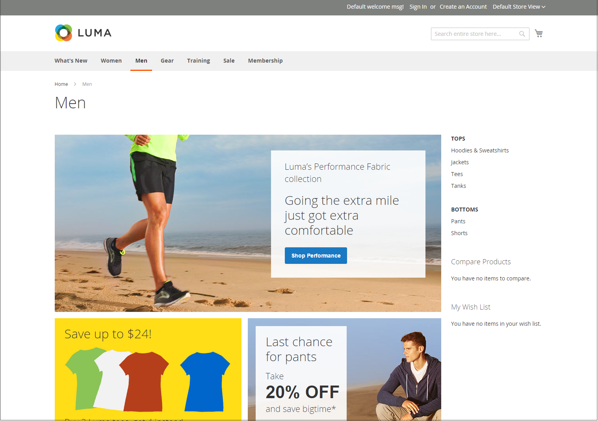

# Storefront 레이아웃 예

열 차원은 테마의 스타일 시트에 의해 결정됩니다. 일부 테마는 고정된 픽셀 너비를 페이지 레이아웃에 적용하고 다른 테마는 백분율을 사용하여 페이지가 창이나 디바이스의 너비에 응답하도록 합니다.

대부분의 데스크톱 테마는 기본 열에 대해 고정된 너비를 가지며 모든 활동은 이 둘러싸인 영역 내에서 발생합니다. 화면 해상도에 따라 주 열의 양쪽에 빈 공간이 있습니다.

## 1열

1열 레이아웃의 컨텐츠 영역은 기본 열의 전체 너비에 걸쳐 있습니다. 이 레이아웃은 큰 배너나 슬라이더가 있는 홈 페이지나 로그인 페이지, 스플래시 페이지, 비디오 또는 전체 페이지 광고와 같이 탐색이 필요하지 않은 페이지에 주로 사용됩니다.

{width="700" zoomable="yes"}

## 왼쪽 막대가 있는 2열

이 레이아웃의 컨텐츠 영역은 두 개의 열로 구분됩니다. 기본 콘텐츠 열은 오른쪽으로 이동하고 측면 막대는 왼쪽으로 이동합니다.

{width="700" zoomable="yes"}

## 오른쪽 막대가 있는 두 열

이 레이아웃은 다른 2열 레이아웃의 미러 이미지입니다. 이때 사이드바가 오른쪽으로 뜨고 메인 콘텐츠 열이 왼쪽으로 뜬다.

{width="700" zoomable="yes"}

## 3열

3열 레이아웃에는 2개의 측면 열이 있는 기본 컨텐츠 영역이 있습니다. 왼쪽 사이드바와 기본 콘텐츠 열은 함께 감싸지고 왼쪽으로 단위로서 이동합니다. 다른 쪽 사이드바는 오른쪽으로 떠있다.

{width="700" zoomable="yes"}
