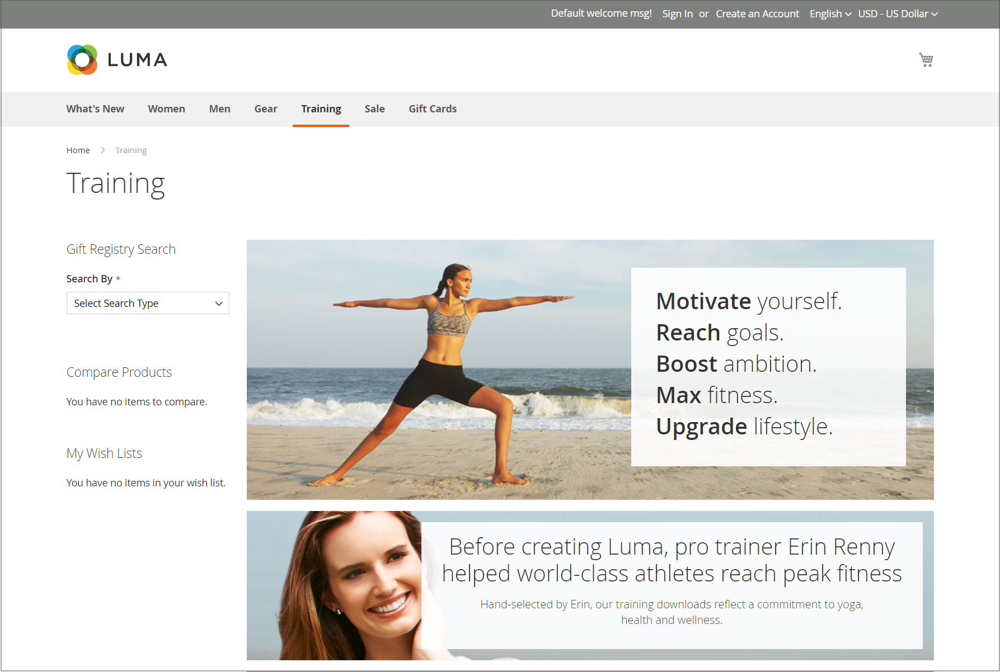
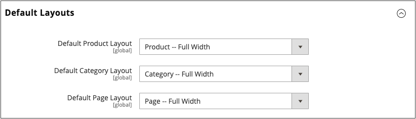

# 페이지 레이아웃

저장소에 있는 각 페이지의 레이아웃은 페이지의 머리글, 바닥글 및 컨텐츠 영역을 정의하는 고유한 섹션 또는 컨테이너로 구성됩니다. 레이아웃에 따라 각 페이지에는 1개, 2개, 3개 또는 그 이상의 열이 있을 수 있습니다. 레이아웃을 페이지의 _평면도_(으)로 간주하고 CMS, 제품 및 범주 페이지의 기본값으로 사용할 특정 레이아웃을 할당할 수 있습니다.

표시할 [페이지 레이아웃](layout-updates.md)의 섹션에 따라 페이지에서 콘텐츠 블록이 부동 상태로 사용 가능한 공간을 채웁니다. 레이아웃을 3열에서 2열 레이아웃으로 변경하면 기본 영역의 콘텐츠가 확장되어 사용 가능한 공간을 채웁니다. 또한 사용되지 않은 사이드바와 연관된 모든 블록이 사라지는 것처럼 보입니다. 그러나 3열 레이아웃을 복원하면 블록이 다시 나타납니다. 이 유동적 접근 방식 또는 _유동적 레이아웃_&#x200B;을 사용하면 콘텐츠를 다시 작업하지 않고도 페이지 레이아웃을 변경할 수 있습니다. 개별 HTML 페이지로 작업하는 데 익숙한 경우 이 모듈식 _빌딩 블록_ 접근 방식에는 다른 사고 방식이 필요합니다.

{width="700" zoomable="yes"}

## 기본 레이아웃 구성

1. _관리자_ 사이드바에서 **[!UICONTROL Stores]** > _[!UICONTROL Settings]_>**[!UICONTROL Configuration]**(으)로 이동합니다.

1. _[!UICONTROL General]_아래의 왼쪽 패널에서&#x200B;**[!UICONTROL Web]**을(를) 선택합니다.

1. **[!UICONTROL Default Layouts]** 섹션에서 를 확장합니다.

   {width="600" zoomable="yes"}

1. 제품 페이지에 사용할 **[!UICONTROL Default Product Layout]**&#x200B;을(를) 선택하십시오.

   이 설정은 제품 페이지에 기본적으로 사용되는 레이아웃을 결정합니다.

   - `No layout updates` - 제품 페이지에서 레이아웃 업데이트를 사용할 수 없습니다.
   - `Empty` - 제품 페이지에 빈 레이아웃을 사용합니다.
   - `1 column` - 제품 페이지에 단일 열 레이아웃을 사용합니다.
   - `2 columns with left bar` - 제품 페이지의 왼쪽에 사이드바가 있는 2열 레이아웃을 사용합니다.
   - `2 columns with right bar` - 제품 페이지의 오른쪽에 사이드바가 있는 2열 레이아웃을 사용합니다.
   - `3 columns` - 제품 페이지의 왼쪽 및 오른쪽에 사이드바가 있는 3열 레이아웃을 사용합니다.

   [페이지 빌더](../page-builder/introduction.md)를 사용하도록 설정하면 추가 전체 너비 옵션을 사용할 수 있습니다. 그런 다음 페이지 빌더 콘텐츠 도구를 사용하여 제품 페이지의 레이아웃을 디자인할 수 있습니다.

   - `Page -- Full Width` - 제품 페이지에 대해 _페이지 - 전체 너비_ 레이아웃을 사용합니다.
   - `Category -- Full Width` - 제품 페이지의 _범주 - 전체 너비_ 레이아웃을 사용합니다.
   - `Product -- Full Width` - (권장) 제품 페이지의 _제품 - 전체 너비_ 레이아웃을 사용합니다.

1. 범주 페이지에 사용할 **[!UICONTROL Default Category Layout]**&#x200B;을(를) 선택하십시오.

   이 설정은 범주 페이지에 기본적으로 사용되는 레이아웃을 결정합니다.

   - `No layout updates` - 범주 페이지에 대해 레이아웃 업데이트를 사용할 수 없습니다.
   - `Empty` - 범주 페이지에 빈 레이아웃을 사용합니다.
   - `1 column` - 범주 페이지에 단일 열 레이아웃을 사용합니다.
   - `2 columns with left bar` - 범주 페이지의 왼쪽에 사이드바가 있는 2열 레이아웃을 사용합니다.
   - `2 columns with right bar` - 범주 페이지의 오른쪽에 사이드바가 있는 2열 레이아웃을 사용합니다.
   - `3 columns` - 범주 페이지의 왼쪽과 오른쪽에 사이드바가 있는 3열 레이아웃을 사용합니다.

   [페이지 빌더](../page-builder/introduction.md)를 사용하도록 설정하면 추가 전체 너비 옵션을 사용할 수 있습니다. 그런 다음 페이지 빌더 콘텐츠 도구를 사용하여 범주 페이지의 레이아웃을 디자인할 수 있습니다.

   - `Page -- Full Width` - 범주 페이지에 _페이지 - 전체 너비_ 레이아웃을 사용합니다.
   - `Category -- Full Width` - (권장) 범주 페이지에 _범주 - 전체 너비_ 레이아웃을 사용합니다.
   - `Product -- Full Width` - 범주 페이지에 _제품 - 전체 너비_ 레이아웃을 사용합니다.

1. CMS 페이지에 사용할 **[!UICONTROL Default Page Layout]**&#x200B;을(를) 선택하십시오.

   이 설정은 CMS 페이지에 기본적으로 사용되는 레이아웃을 결정합니다.

   - `No layout updates` - CMS 페이지에 대해 레이아웃 업데이트를 사용할 수 없습니다.
   - `Empty` - CMS 페이지에 빈 레이아웃을 사용합니다.
   - `1 column` - CMS 페이지에 단일 열 레이아웃을 사용합니다.
   - `2 columns with left bar` - CMS 페이지의 왼쪽에 사이드바가 있는 2열 레이아웃을 사용합니다.
   - `2 columns with right bar` - CMS 페이지의 오른쪽에 사이드바가 있는 2열 레이아웃을 사용합니다.
   - `3 columns` - CMS 페이지의 왼쪽 및 오른쪽에 사이드바가 있는 3열 레이아웃을 사용합니다.

   [페이지 빌더](../page-builder/introduction.md)를 사용하도록 설정하면 추가 전체 너비 옵션을 사용할 수 있습니다. 그런 다음 페이지 빌더 콘텐츠 도구를 사용하여 CMS 페이지의 레이아웃을 디자인할 수 있습니다.

   - `Page -- Full Width` - (권장) CMS 페이지에 대해 _페이지 - 전체 너비_ 레이아웃을 사용합니다.
   - `Category - Full Width` - CMS 페이지에 대해 _범주 - 전체 너비_ 레이아웃을 사용합니다.
   - `Product - Full Width` - CMS 페이지에 대해 _제품 - 전체 너비_ 레이아웃을 사용합니다.

1. 완료되면 **[!UICONTROL Save Config]**&#x200B;을(를) 클릭합니다.

## 표준 페이지 레이아웃

### 1열

{zoomable="yes"}

_[!UICONTROL 1 Column]_레이아웃은 큰 이미지 또는 초점을 가진 극적인 홈 페이지를 만드는 데 사용할 수 있습니다. 또한 랜딩 페이지나 텍스트, 이미지 및 비디오의 조합이 있는 다른 페이지에 적합합니다.

### 왼쪽 막대가 있는 2열

{zoomable="yes"}

_[!UICONTROL 2 Columns with Left Bar]_레이아웃은 대개 계층 탐색이 있는 카탈로그 또는 검색 결과 페이지와 같이 왼쪽에 탐색이 있는 페이지에 사용됩니다. 또한 추가 탐색이 필요한 홈 페이지나 왼쪽에 있는 지원 콘텐츠 블록을 위한 탁월한 선택입니다.

### 오른쪽 막대가 있는 두 열

{zoomable="yes"}

_[!UICONTROL 2 Columns with Right Bar]_레이아웃의 경우 기본 컨텐츠 영역이 눈길을 끄는 이미지나 배너에 충분히 큽니다. 이 레이아웃은 오른쪽에 지원 콘텐츠 블록이 있는 제품 페이지에도 자주 사용됩니다.

### 3열

{zoomable="yes"}

_[!UICONTROL 3 Column]_레이아웃의 가운데 열은 페이지의 기본 텍스트를 충분히 확장하며, 각 면에 추가 탐색을 위한 공간과 지원 콘텐츠 블록을 배치할 수 있는 공간이 있습니다.

### 비어 있음

{zoomable="yes"}

_[!UICONTROL Empty]_레이아웃은 사용자 지정 페이지 레이아웃을 정의하는 데 사용할 수 있습니다.
