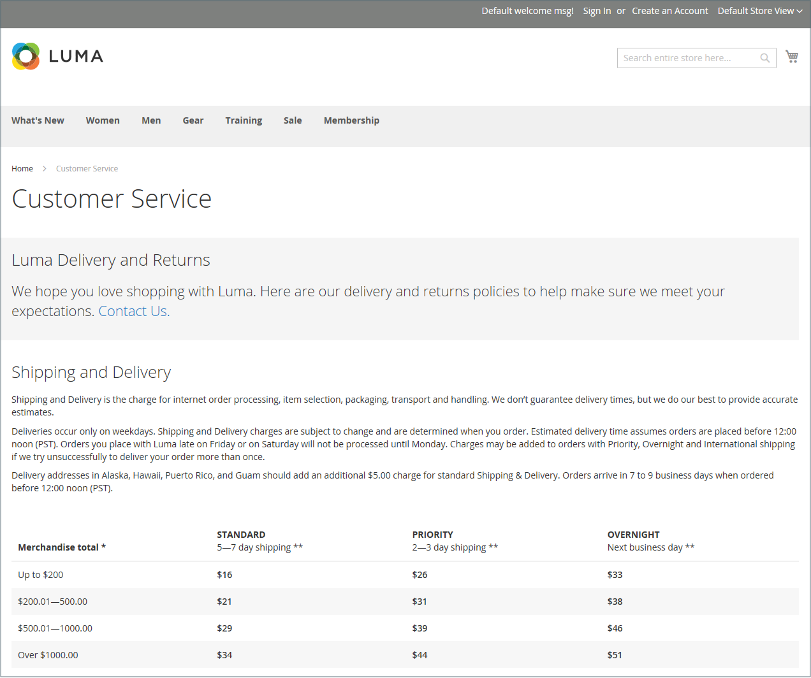

# 페이지

콘텐츠는 상점의 모든 제품과 마찬가지로 유통기한의 관점에서 볼 수 있습니다. 소셜 미디어 콘텐츠의 저장 수명이 24시간 미만이라는 것을 알고 있었습니까? 만든 콘텐츠의 잠재적 유통기한은 리소스를 투자할 위치를 결정하는 데 도움이 될 수 있습니다.

저장 수명이 긴 콘텐츠는 경우에 따라 _항상 사용 가능한 콘텐츠_&#x200B;라고도 합니다. 항상 사용되는 콘텐츠의 예로는 고객 성공 사례, _방법_ 지침 및 자주 묻는 질문(FAQ)이 있습니다. 이와 달리 자연적으로 상하기 쉬운 내용에는 이벤트, 업계 뉴스, 보도 자료 등이 포함된다.

{width="700" zoomable="yes"}에 포함된 미국 정보 페이지

## 핵심 콘텐츠 페이지

[!DNL Commerce] 데모 스토어에는 시작하는 데 도움이 되는 핵심 콘텐츠 페이지의 예가 있습니다. 이러한 모든 페이지는 사용자의 요구 사항에 맞게 수정할 수 있습니다. 스토어에서 다음 페이지를 살펴보고 콘텐츠가 메시지, 음성 및 브랜드를 전달하는지 확인하십시오.

### 홈

데모 [홈](../getting-started/storefront.md#home-page) 페이지에는 배너, 이미지 캐러셀, 링크가 있는 여러 정적 블록 및 새 제품 목록이 포함되어 있습니다.

### 개인정보 처리방침

저장소 [개인정보 처리방침](../getting-started/privacy-policy.md) 페이지를 사용자 정보로 업데이트해야 합니다. 개인정보 처리방침은 회사에서 수집하는 정보의 유형과 그 사용 방법을 고객에게 설명하는 것이 좋습니다.

### 404 찾을 수 없음

404 Page Not Found 페이지는 페이지를 찾을 수 없을 때 반환되는 응답 코드에 대해 이름이 지정됩니다. URL 리디렉션을 사용하면 이 페이지가 표시되는 횟수가 줄어듭니다. 그러나 필요한 경우 고객이 관심을 가질 수 있는 제품에 대한 몇 가지 링크를 제공하는 기회를 활용할 수도 있습니다.

### 액세스 거부됨

{{b2b-feature}}

회사 사용자에게 할당된 권한으로 인해 페이지에 액세스할 수 없는 경우 [액세스 거부됨](../b2b/account-company-roles-permissions.md) 페이지가 나타납니다.

### 쿠키 활성화

사이트 방문자의 브라우저에서 쿠키가 활성화되지 않은 경우 [쿠키 활성화](../getting-started/compliance-cookie-law.md) 페이지가 나타납니다. 이 페이지에서는 가장 많이 사용되는 브라우저에 대해 쿠키를 활성화하는 방법에 대해 단계별로 설명하는 지침을 제공합니다.

### 서비스를 사용할 수 없음

서버를 사용할 수 없을 때 반환되는 응답 코드에 대해 [503 서비스를 사용할 수 없음](../configuration-reference/general/general.md) 페이지의 이름이 지정됩니다.

### 정보

정보 사용자 페이지는 스토어의 바닥글에서 연결됩니다. 이미지, 비디오, 보도 자료 및 공지 링크를 포함할 수 있습니다. 샘플 페이지의 오른쪽에는 이미지가 있고, 장식용 이미지는 페이지의 끝을 나타냅니다.

### 고객 서비스

고객 서비스 페이지는 페이지 계층 구조의 다른 노드입니다. 페이지의 두 헤더에는 고객이 헤더를 클릭할 때만 표시되는 콘텐츠가 있습니다.

{width="700" zoomable="yes"}

## 기본 페이지 구성

_기본 페이지_ 구성은 [기본 URL](../stores-purchase/store-urls.md) 및 해당 홈 페이지와 연결된 랜딩 페이지를 결정합니다. 또한 _페이지를 찾을 수 없음_ 오류가 발생할 때 표시되는 페이지와 각 페이지의 맨 위에 [이동 경로 추적](../catalog/navigation-breadcrumb-trail.md)이 나타나는 경우에도 표시됩니다.

1. _관리자_ 사이드바에서 **[!UICONTROL Stores]** > _[!UICONTROL Settings]_>**[!UICONTROL Configuration]**(으)로 이동합니다.

1. _[!UICONTROL General]_아래의 왼쪽 패널에서&#x200B;**[!UICONTROL Web]**을(를) 선택합니다.

1. **[!UICONTROL Default Pages]** 섹션에서 를 확장합니다.

   {width="500" zoomable="yes"}

   | 필드 | [범위](../getting-started/websites-stores-views.md#scope-settings) | 설명 |
   |--- |--- |--- |
   | [!UICONTROL Default Web URL] | 스토어 뷰 | 기본 URL과 연결된 랜딩 페이지를 나타냅니다. 기본적으로 이 필드는 [!DNL Commerce] 콘텐츠 관리 시스템의 페이지를 나타내도록 `cms`(으)로 설정됩니다. 블로그와 같은 다른 유형의 랜딩 페이지를 사용할 수도 있습니다. 예를 들어 블로그가 `magento/blog`의 서버에 설치되어 있는 경우 폴더 이름 `blog`을(를) 페이지 선택에 대한 상대 경로로 입력할 수 있습니다. |
   | [!UICONTROL CMS Home Page] | 스토어 뷰 | 스토어의 홈 페이지를 선택하려면 목록에서 CMS 페이지를 선택하면 됩니다. 기본적으로 CMS 홈 페이지에는 스토어에 사용할 수 있는 CMS 페이지의 전체 목록이 있습니다. |
   | [!UICONTROL Default No-route URL] | 스토어 뷰 | `404 Page not Found` 오류가 발생할 때 표시할 기본 페이지의 URL을 포함합니다. 기본값은 `cms/noroute/index`입니다. |
   | [!UICONTROL CMS No Route Page] | 스토어 뷰 | 404 페이지를 찾을 수 없음 오류가 발생할 때 표시할 특정 CMS 페이지를 식별합니다. 기본 페이지는 `404 Not Found`입니다. |
   | [!UICONTROL CMS No Cookies Page] | 스토어 뷰 | 브라우저에 대해 쿠키가 활성화되지 않은 경우 나타나는 특정 CMS 페이지를 식별합니다. 이 페이지에서는 쿠키가 사용되는 이유와 각 브라우저에 대해 쿠키를 활성화하는 방법을 설명합니다. 기본 페이지는 `Enable Cookies`입니다. |
   | [!UICONTROL Show Breadcrumbs for CMS Pages] | 스토어 뷰 | 이동 경로 추적이 카탈로그의 모든 CMS 페이지에 표시되는지 여부를 결정합니다. 옵션: `Yes` / `No` |

   {style="table-layout:auto"}

1. **[!UICONTROL Default Web URL]**&#x200B;의 경우 랜딩 페이지를 포함하는 [!DNL Commerce] 설치에서 폴더의 상대 경로를 입력하십시오.

   기본 설정인 `cms`은(는) [!DNL Commerce] 콘텐츠 관리 시스템의 페이지를 나타냅니다.

   >[!NOTE]
   >
   >특정 저장소 보기의 경우 _[!UICONTROL Default Web URL]_옆에 있는&#x200B;**[!UICONTROL Use Default]**확인란의 선택을 취소하고 다른 기본 설정을 변경합니다.

1. 홈 페이지로 사용할 CMS 페이지로 **[!UICONTROL CMS Home Page]**&#x200B;을(를) 설정합니다. 다음과 같이 생성된 다른 페이지를 홈 페이지로 사용할 수 있습니다.

   - 독점 온라인 스토어에 오신 것을 환영합니다
   - 보상 포인트
   - 정보
   - 고객 서비스
   - 쿠키 활성화
   - 개인정보 처리방침
   - 회사: 액세스 거부됨

1. **[!UICONTROL Default No-route URL]**&#x200B;의 경우 _404 페이지를 찾을 수 없음_ 오류가 발생하면 페이지가 리디렉션되는 [!DNL Commerce] 설치에서 폴더의 상대 경로를 입력하십시오.

   기본값은 `cms/index/noRoute`입니다.

1. _404 페이지를 찾을 수 없음_ 오류가 발생할 때 나타나는 CMS 페이지로 **[!UICONTROL CMS No Route Page]**&#x200B;을(를) 설정합니다.

1. 브라우저에서 쿠키가 비활성화되어 있을 때 표시되는 CMS 페이지로 **[!UICONTROL CMS No Cookies Page]**&#x200B;을(를) 설정합니다. 이 페이지에서는 쿠키가 사용되는 이유와 각 브라우저에 대해 쿠키를 활성화하는 방법을 설명합니다. 기본 페이지는 `Enable Cookies`입니다.

1. 이동 경로 추적을 모든 CMS 페이지의 맨 위에 표시하려면 **[!UICONTROL Show Breadcrumbs for CMS Pages]**&#x200B;을(를) `Yes`(으)로 설정하십시오.

1. 완료되면 **[!UICONTROL Save Config]**&#x200B;을(를) 클릭합니다.
