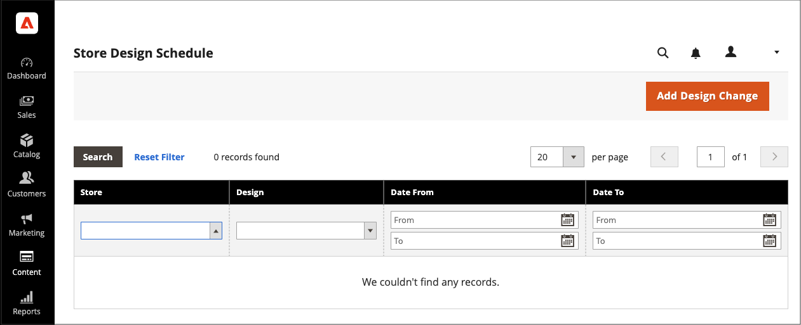

# 디자인 변경 예약

비즈니스 주기 및 이벤트에 따라 테마 디자인이 적용되도록 미리 예약합니다. 계절별 변경 사항, 프로모션에 대해 예약된 디자인 변경 사항을 사용하거나 변형을 추가하는 데만 사용할 수 있습니다.

{width="700" zoomable="yes"}

## 예약된 디자인 변경 내용 추가

1. _관리자_ 사이드바에서 **[!UICONTROL Content]** > _[!UICONTROL Design]_>**[!UICONTROL Schedule]**(으)로 이동합니다.

1. **[!UICONTROL Add Design Change]**&#x200B;을(를) 클릭합니다.

   {width="600" zoomable="yes"}

1. 변경 내용을 적용할 저장소 보기로 **[!UICONTROL Store]**&#x200B;을(를) 설정합니다.

1. 사용할 테마 또는 테마의 변형으로 **[!UICONTROL Custom Design]**&#x200B;을(를) 설정합니다.

1. **[!UICONTROL Date From]** 및 **[!UICONTROL Date To]**&#x200B;에 대해 _달력_() 아이콘을 클릭하여 변경 사항이 적용되는 기간의 시작 값과 끝 값을 선택합니다.

1. 완료되면 **[!UICONTROL Save]**&#x200B;을(를) 클릭합니다.

## 예약된 디자인 변경 편집

1. _관리자_ 사이드바에서 **[!UICONTROL Content]** > _[!UICONTROL Design]_>**[!UICONTROL Schedule]**(으)로 이동합니다.

1. 편집할 항목을 선택합니다.

1. 필요한 사항을 변경합니다.

1. 완료되면 **[!UICONTROL Save]**&#x200B;을(를) 클릭합니다.

## 예약된 디자인 변경 내용 삭제

1. _관리자_ 사이드바에서 **[!UICONTROL Content]** > _[!UICONTROL Design]_>**[!UICONTROL Schedule]**(으)로 이동합니다.

1. 삭제할 항목을 선택합니다.

1. 페이지 상단의 단추 모음에서 **[!UICONTROL Delete]**&#x200B;을(를) 클릭합니다.

1. 작업을 확인하려면 **[!UICONTROL OK]**&#x200B;을(를) 클릭합니다.
