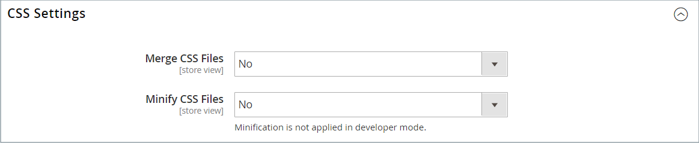

# 테마 에셋

_정적 파일_&#x200B;은(는) 테마에 사용되는 CSS, 글꼴, 이미지 및 JavaScript과 같은 에셋의 컬렉션입니다. 정적 파일의 위치는 [기본 URL](../stores-purchase/store-urls.md) 구성에 지정되어 있습니다. 각 정적 파일의 URL에 디지털 서명을 추가하여 브라우저에서 최신 버전을 사용할 수 있는 시기를 감지할 수 있도록 할 수 있습니다. 서명이 브라우저 캐시에 저장된 것과 다른 경우 파일의 최신 버전이 사용됩니다.

표준 설치의 경우 테마와 연결된 자산은 [!DNL Commerce] 루트 아래의 다음 위치에 있는 `web` 폴더에 구성됩니다.

`[commerce_root]/app/design/frontend/Magento/[theme_name]/web`

## 정적 파일 URL에 디지털 서명 추가

1. _관리자_ 사이드바에서 **[!UICONTROL Stores]** > _[!UICONTROL Settings]_>**[!UICONTROL Configuration]**(으)로 이동합니다.

1. 왼쪽 패널에서 **[!UICONTROL Advanced]**&#x200B;을(를) 확장하고 **[!UICONTROL Developer]**&#x200B;을(를) 선택합니다.

1. **[!UICONTROL Static Files Settings]** 섹션에서 를 확장합니다.

   {width="500" zoomable="yes"}

1. **[!UICONTROL Sign Static Files]**&#x200B;을(를) `Yes`(으)로 설정합니다.

1. 완료되면 **[!UICONTROL Save Config]**&#x200B;을(를) 클릭합니다.

| 파일 유형 | 설명 |
|--- |--- |
| CSS | 피부와 관련된 시각적 스타일을 제어합니다. 서버의 위치 예: `[commerce]/app/design/frontend/Magento/[theme]/web/css` |
| 글꼴 | 테마에 사용할 수 있는 글꼴을 제공합니다. 서버의 위치: `[commerce]/app/design/frontend/Magento/[theme]/web/fonts` |
| 이미지 | 버튼, 배경 텍스처 등을 포함하여 테마가 사용하는 그래픽 자산을 제공합니다. 서버의 위치 예: `[commerce]/app/design/frontend/Magento/[theme]/web/images` |
| JS | 테마별 JavaScript 루틴 및 호출 가능한 함수. 서버의 위치 예: `[commerce]/app/design/frontend/Magento/[theme]/web/js` |

{style="table-layout:auto"}

## CSS 파일 병합

사이트를 최적화하고 페이지 로드 시간을 줄이기 위한 노력의 일환으로 별도의 CSS 파일을 압축된 하나의 파일로 병합하여 파일 수를 줄일 수 있습니다. 병합된 CSS 파일을 열면 줄바꿈이 제거된 텍스트 연속 스트림이 표시됩니다. 병합된 파일은 편집할 수 없으므로 개발 모드를 종료하고 더 이상 CSS를 자주 변경하지 않을 때까지 기다리는 것이 좋습니다.

>[!NOTE]
>
>[개발자 모드](../systems/developer-tools.md#operation-modes)에서 작업하는 경우에만 _관리자_ 패널에서 CSS 파일을 병합할 수 있습니다.

1. _관리자_ 사이드바에서 **[!UICONTROL Stores]** > _[!UICONTROL Settings]_>**[!UICONTROL Configuration]**(으)로 이동합니다.

1. 왼쪽 패널에서 **[!UICONTROL Advanced]**&#x200B;을(를) 선택하고 **[!UICONTROL Developer]**&#x200B;을(를) 선택합니다.

1. **[!UICONTROL CSS Settings]** 섹션에서 를 확장합니다.

   {width="500" zoomable="yes"}

   이러한 구성 옵션에 대한 자세한 설명은 _구성 참조_&#x200B;에서 [CSS 설정](../configuration-reference/advanced/developer.md#css-settings)을 참조하십시오.

1. **[!UICONTROL Merge CSS Files]**&#x200B;을(를) `Yes`(으)로 설정합니다.

1. 완료되면 **[!UICONTROL Save Config]**&#x200B;을(를) 클릭합니다.

## JavaScript 파일 병합

여러 JavaScript 파일을 압축된 하나의 파일로 병합하여 페이지 로드 시간을 줄일 수 있습니다. 병합된 JavaScript 파일을 열면 줄바꿈이 제거된 텍스트 연속 스트림이 표시됩니다. 개발 프로세스를 마쳤으며 코드에 오류가 없는 경우 파일을 병합하는 것이 좋습니다.

>[!NOTE]
>
>JavaScript 파일은 [개발자 모드](../systems/developer-tools.md#operation-modes)에서 작업하는 경우에만 _관리자_ 패널에서 병합할 수 있습니다.

1. _관리자_ 사이드바에서 **[!UICONTROL Stores]** > _[!UICONTROL Settings]_>**[!UICONTROL Configuration]**(으)로 이동합니다.

1. 왼쪽 패널에서 **[!UICONTROL Advanced]**&#x200B;을(를) 선택하고 **[!UICONTROL Developer]**&#x200B;을(를) 선택합니다.

1. **[!UICONTROL JavaScript Settings]** 섹션에서 를 확장합니다.

   {width="600" zoomable="yes"}

   이러한 구성 옵션에 대한 자세한 설명은 _구성 참조_&#x200B;에서 [JavaScript 설정](../configuration-reference/advanced/developer.md#javascript-settings)을 참조하십시오.

1. **[!UICONTROL Merge JavaScript Files]**&#x200B;을(를) `Yes`(으)로 설정합니다.

1. 완료되면 **[!UICONTROL Save Config]**&#x200B;을(를) 클릭합니다.
