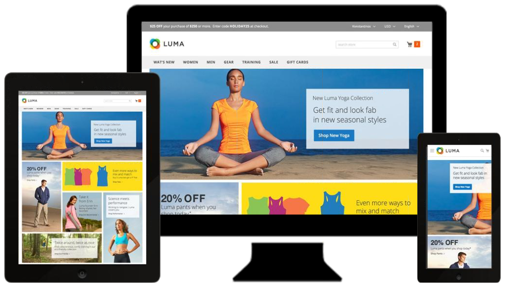

# 테마

테마는 스토어의 시각적 프레젠테이션을 결정하는 파일 컬렉션입니다. [!DNL Commerce]을(를) 처음 설치하면 스토어의 디자인 요소는 _기본_ 테마를 기반으로 합니다. [!DNL Commerce] 설치와 함께 제공되는 초기 기본 테마 외에도 _그대로_&#x200B;를 사용하거나 필요에 따라 수정할 수 있는 다양한 테마가 있습니다.

반응형 테마는 장치의 보기 포트에 맞게 페이지 레이아웃을 조정합니다. 샘플 _Luma_ 테마는 데스크톱, 태블릿 또는 모바일 장치에서 볼 수 있는 유연하고 반응형 레이아웃을 가집니다.

[!DNL Commerce]개의 테마에 레이아웃 파일, 템플릿 파일, 번역 파일 및 스킨이 포함되어 있습니다. 스킨은 CSS, 이미지 및 JavaScript 파일을 지원하는 컬렉션으로, 고객이 스토어를 방문할 때 경험하는 시각적 프레젠테이션과 상호 작용을 만듭니다. Commerce 테마 디자인을 이해하고 서버에 액세스할 수 있는 개발자 또는 디자인 전문가가 테마와 스킨을 수정하고 사용자 지정할 수 있습니다. 자세한 내용은 [_프론트엔드 개발자 안내서_](https://developer.adobe.com/commerce/frontend-core/guide/themes/)를 참조하세요.

{width="600" zoomable="yes"}

## 기본 테마

`Magento Blank` 반응형 테마는 다양한 장치에 대한 상점 표시를 렌더링하고 데스크톱, 테이블 및 모바일 장치에 대한 모범 사례를 통합합니다. 일부 테마는 특정 디바이스에서만 사용하도록 설계되었습니다. [!DNL Commerce]이(가) 특정 브라우저 ID 또는 사용자 에이전트를 검색하면 특정 브라우저에 대해 구성된 테마를 사용합니다. 검색 문자열에는 Perl 호환 정규 표현식(PCRE)도 포함될 수 있습니다.

{width="700" zoomable="yes"}

### 테마 그리드 필터링

1. _관리자_ 사이드바에서 **[!UICONTROL Content]** > _[!UICONTROL Design]_>**[!UICONTROL Themes]**(으)로 이동합니다.

1. **[!UICONTROL Filters]**&#x200B;을(를) 클릭합니다.

1. ID 범위, 테마 이름(또는 제목), 폴더 경로 또는 상위 테마를 입력합니다.

1. 테마 목록을 업데이트하려면 **[!UICONTROL Apply Filters]**&#x200B;을(를) 클릭하십시오.

## 현재 테마 설정 보기

1. _관리자_ 사이드바에서 **[!UICONTROL Content]** > _[!UICONTROL Design]_>**[!UICONTROL Themes]**(으)로 이동합니다.

1. 설치된 테마 목록에서 검사할 테마를 찾은 다음 행을 클릭하여 설정을 표시합니다.

1. 샘플 페이지를 보려면 **[!UICONTROL Theme Preview Image]**&#x200B;을(를) 클릭하십시오.

{width="600" zoomable="yes"}

## 기본 테마 적용

1. _관리자_ 사이드바에서 **[!UICONTROL Content]** > _[!UICONTROL Design]_>**[!UICONTROL Configuration]**(으)로 이동합니다.

1. 구성할 저장소 보기를 찾은 다음 _[!UICONTROL Action]_&#x200B;열에서&#x200B;**[!UICONTROL Edit]**&#x200B;을(를) 클릭합니다.

1. _[!UICONTROL Default Theme]_&#x200B;에서 현재 보기에 사용할&#x200B;**[!UICONTROL Applied Theme]**&#x200B;을(를) 설정합니다.

   {width="600" zoomable="yes"}

1. 완료되면 **[!UICONTROL Save Configuration]**&#x200B;을(를) 클릭합니다.

## 사용자 에이전트 규칙 추가

1. _관리자_ 사이드바에서 **[!UICONTROL Content]** > _[!UICONTROL Design]_>**[!UICONTROL Configuration]**(으)로 이동합니다.

1. _[!UICONTROL Design Rule]_&#x200B;에서&#x200B;**[!UICONTROL Add New User Agent Rule]**&#x200B;을(를) 클릭합니다.

   {width="600" zoomable="yes"}

1. **[!UICONTROL Search String]**&#x200B;의 경우 특정 장치의 브라우저 ID를 입력하십시오.

   검색 문자열은 입력한 순서대로 일치합니다. 예를 들어 Firefox의 경우 다음을 입력합니다.

   `/^mozilla/i`

1. 추가 장치를 입력하려면 이 과정을 반복합니다.

1. 완료되면 **[!UICONTROL Save Configuration]**&#x200B;을(를) 클릭합니다.
