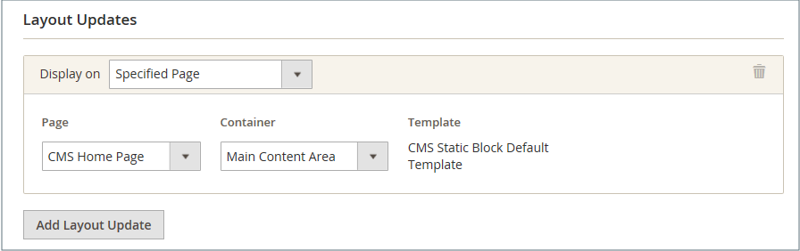

# 위젯 만들기 및 관리

위젯은 재사용 가능한 구성 요소입니다. 위젯을 쉽게 만들고 기존 위젯을 수정하여 스토어 전체에 걸쳐 콘텐츠를 자동으로 업데이트할 수 있습니다. 더 이상 사용되지 않는 위젯을 삭제할 수도 있습니다.

{width="700" zoomable="yes"}

## 위젯 만들기

위젯을 만드는 프로세스는 각 [위젯 유형](widgets.md#widget-types)에 대해 거의 동일합니다. 지침의 첫 번째 부분을 따른 다음 원하는 특정 유형의 위젯에 대한 마지막 부분을 완료할 수 있습니다.

### 1단계: 유형 선택

1. _관리자_ 사이드바에서 **[!UICONTROL Content]** > _[!UICONTROL Elements]_>**[!UICONTROL Widgets]**(으)로 이동합니다.

1. **[!UICONTROL Add Widget]**&#x200B;을(를) 클릭합니다.

1. _[!UICONTROL Settings]_섹션에서:

   - **[!UICONTROL Type]**&#x200B;을(를) 만들려는 위젯 유형으로 설정하십시오.

   - **[!UICONTROL Design Theme]**&#x200B;이(가) 현재 테마로 설정되어 있는지 확인하십시오.

     {width="600" zoomable="yes"}

1. **[!UICONTROL Continue]**&#x200B;을(를) 클릭합니다.

### 2단계: 상점 속성 및 레이아웃 지정

1. _[!UICONTROL Storefront Properties]_섹션에서:

   - **[!UICONTROL Widget Title]**&#x200B;의 경우 위젯에 대한 설명 제목을 입력합니다.

     이 제목은 관리자만 볼 수 있습니다.

   - **[!UICONTROL Assign to Store Views]**&#x200B;의 경우 위젯을 표시할 스토어 보기를 선택하십시오.

     특정 스토어 보기 또는 `All Store Views`을(를) 선택할 수 있습니다. 여러 뷰를 선택하려면 Ctrl 키(PC) 또는 Command 키(Mac)를 누른 상태에서 각 옵션을 클릭합니다.

   - (선택 사항) **[!UICONTROL Sort Order]**&#x200B;의 경우 숫자를 입력하여 이 항목이 페이지의 동일한 부분에 있는 다른 항목과 함께 표시되는 순서를 결정합니다. (`0` = 첫 번째, `1` = 두 번째, `3` = 세 번째 등)

     {width="600" zoomable="yes"}

1. _[!UICONTROL Layout Updates]_섹션에서&#x200B;**[!UICONTROL Add Layout Update]**을(를) 클릭합니다.

1. **[!UICONTROL Display On]**&#x200B;을(를) 표시할 페이지 형식으로 설정하십시오.

1. **[!UICONTROL Container]** 목록에서 배치할 페이지 레이아웃의 영역을 선택합니다.

   {width="600" zoomable="yes"}

1. 위젯이 링크인 경우 **[!UICONTROL Template]**&#x200B;을(를) 다음 중 하나로 설정하십시오.

   - `Block Template` - 페이지에서 독립 실행형 단위로 배치할 수 있도록 콘텐츠의 형식을 지정합니다.
   - `Inline Template` - 다른 콘텐츠 내부에 배치할 수 있도록 콘텐츠의 형식을 지정합니다. 예를 들어, 텍스트 단락 내부로 이동하는 링크입니다.

### 3단계: 위젯 옵션 완료

각 위젯 유형에 대한 옵션은 약간 다르지만 프로세스는 기본적으로 동일합니다. 다음 예제에서는 페이지 매김 컨트롤이 있는 특정 범주에 대한 제품 목록을 표시합니다.

1. 왼쪽 패널에서 **[!UICONTROL Widget Options]**&#x200B;을(를) 선택합니다.

1. **[!UICONTROL Select Block]**&#x200B;을(를) 클릭합니다.

1. 목록 위에 표시할 **[!UICONTROL Title]**(예: `Featured Products`)을(를) 입력하십시오.

1. 페이지 매김 컨트롤의 경우 **[!UICONTROL Display Page Control]**&#x200B;을(를) `Yes`(으)로 설정하고 다음을 수행합니다.

   - **[!UICONTROL Number of Products per Page]** 입력.

   - 총 **[!UICONTROL Number of Products to Display]**&#x200B;을(를) 입력하십시오.

   - **[!UICONTROL Condition]**&#x200B;을(를) 추천 제품 범주로 설정합니다.

     프로세스는 [가격 규칙](../merchandising-promotions/price-rules-catalog.md)에 대한 조건을 설정하는 것과 같습니다.

### 4단계: 저장 및 결과 확인

1. 완료되면 **[!UICONTROL Save]**&#x200B;을(를) 클릭합니다.

1. 메시지가 표시되면 작업 영역 상단에 있는 지침에 따라 필요에 따라 캐시를 업데이트합니다.

1. 상점으로 돌아가서 위젯이 올바르게 작동하는지 확인합니다.

   다른 위치로 이동하려면 위젯을 다시 열고 다른 페이지 또는 블록 참조를 시도할 수 있습니다.

## 위젯 생성 데모

위젯을 만드는 방법에 대해 알아보려면 이 비디오를 시청하십시오.

>[!VIDEO](https://video.tv.adobe.com/v/343786?quality=12)

## 위젯 편집

1. _관리자_ 사이드바에서 **[!UICONTROL Content]** > _[!UICONTROL Elements]_>**[!UICONTROL Widgets]**(으)로 이동합니다.

1. 그리드 위의 필터를 사용하여 위젯을 찾은 다음 위젯 이름을 클릭합니다.

1. 필요한 사항을 변경합니다.

   위젯 옵션에 대한 자세한 내용은 위젯 만들기 단계를 검토하십시오.

1. **[!UICONTROL Save]**&#x200B;을(를) 클릭합니다.

## 위젯 삭제

1. _관리자_ 사이드바에서 **[!UICONTROL Content]** > _[!UICONTROL Elements]_>**[!UICONTROL Widgets]**(으)로 이동합니다.

1. 그리드 위의 필터를 사용하여 위젯을 찾은 다음 삭제할 위젯의 확인란을 선택합니다.

1. 목록의 왼쪽 상단 모서리에서 **[!UICONTROL Actions]**&#x200B;을(를) `Delete`(으)로 설정합니다.

1. 완료되면 **[!UICONTROL Submit]**&#x200B;을(를) 클릭합니다.

1. 작업을 확인하려면 **[!UICONTROL OK]**&#x200B;을(를) 클릭합니다.
