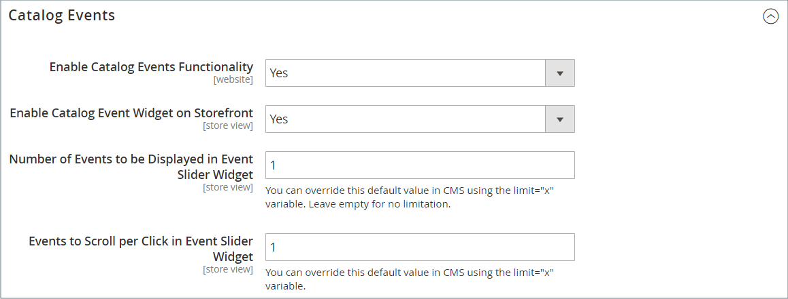
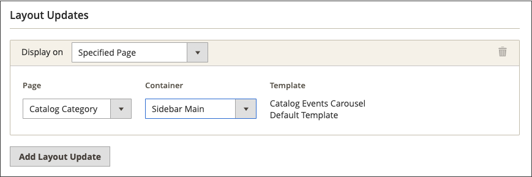

# 카탈로그 이벤트 캐러셀 위젯

{{ee-feature}}

카탈로그 이벤트 캐러셀 위젯에는 각 이벤트에 대한 카운트다운 티커가 있는 예정된 이벤트 슬라이더가 표시됩니다. 캐러셀을 표시할 페이지 레이아웃의 페이지 및 영역을 선택하고 한 번에 표시되는 이벤트의 너비와 수를 제어할 수 있습니다. 표시되는 결과는 테마, 페이지에 표시되도록 배치된 위치 및 선택한 옵션에 따라 다릅니다.

{width="700" zoomable="yes"}

## 1단계: 카탈로그 캐러셀 위젯 활성화

시작하기 전에 [지침](../merchandising-promotions/event-configure.md)에 따라 _카탈로그 이벤트_ 위젯을 구성하여 상점 앞에서 사용하도록 설정하십시오.

{width="500" zoomable="yes"}

## 2단계: 위젯 만들기

1. _관리자_ 사이드바에서 **[!UICONTROL Content]** > _[!UICONTROL Elements]_>**[!UICONTROL Widgets]**(으)로 이동합니다.

1. 오른쪽 상단에서 **[!UICONTROL Add Widget]**&#x200B;을(를) 클릭합니다.

1. _[!UICONTROL Settings]_섹션에서 다음을 수행합니다.

   - **[!UICONTROL Type]**&#x200B;을(를) `Catalog Events Carousel`(으)로 설정합니다.

   - 스토어에서 사용하는 **[!UICONTROL Design Theme]**&#x200B;을(를) 선택하십시오.

1. **[!UICONTROL Continue]**&#x200B;을(를) 클릭합니다.

   이벤트 캐러셀에 대한 {width="500" zoomable="yes"}

1. _[!UICONTROL Storefront Properties]_섹션에서 다음을 수행합니다.

   - **[!UICONTROL Widget Title]**&#x200B;의 경우 위젯에 대한 설명 제목을 입력합니다.

     이 제목은 _관리자_&#x200B;에서만 볼 수 있습니다.

   - **[!UICONTROL Assign to Store Views]**&#x200B;의 경우 위젯을 표시할 스토어 보기를 선택하십시오.

     특정 스토어 보기 또는 `All Store Views`을(를) 선택할 수 있습니다. 여러 뷰를 선택하려면 Ctrl 키(PC) 또는 Command 키(Mac)를 누른 상태에서 각 옵션을 클릭합니다.

   - (선택 사항) **[!UICONTROL Sort Order]**&#x200B;의 경우 숫자를 입력하여 이 항목이 페이지의 동일한 부분에 있는 다른 항목과 함께 표시되는 순서를 결정합니다. (`0` = 첫 번째, `1` = 두 번째, `3` = 세 번째 등)

     {width="600" zoomable="yes"}

## 3단계: 위치 선택

1. _레이아웃 업데이트_ 섹션에서 **[!UICONTROL Add Layout Update]**&#x200B;을(를) 클릭합니다.

1. **[!UICONTROL Display On]**&#x200B;을(를) `Specified Page`(으)로 설정합니다.

1. **[!UICONTROL Page]**&#x200B;을(를) `CMS Home Page`(으)로 설정합니다.

1. 다음 중 하나를 **[!UICONTROL Container]**&#x200B;로 설정합니다.

   - `Main Content Area`
   - `Sidebar Additional`
   - `Sidebar Main`

   >[!NOTE]
   >
   >결과는 테마 및 페이지 레이아웃에 따라 달라집니다. 범주 구성에 _[!UICONTROL Catalog Events Carousel Default Template]_도 지정해야 합니다.

1. 이벤트 캐러셀을 상점 앞의 다른 위치에 표시하려면 **[!UICONTROL Add Layout Update]**&#x200B;을(를) 클릭하고 해당 위치에 대해 이 단계를 반복합니다.

   {width="600" zoomable="yes"}

1. **[!UICONTROL Save and Continue Edit]**&#x200B;을(를) 클릭합니다.

   지금은 메시지를 무시하여 캐시를 새로 고칠 수 있습니다.

## 4단계: 옵션 구성

1. 왼쪽 패널에서 **[!UICONTROL Widget Options]**&#x200B;을(를) 선택합니다.

1. **[!UICONTROL Frame Size]**&#x200B;에 대해 슬라이더에 동시에 나열할 이벤트 수를 입력합니다.

   한 번에 하나의 이벤트만 보려면 `1`을(를) 입력하십시오.

1. **[!UICONTROL Scroll]**&#x200B;의 경우 클릭당 스크롤할 이벤트 목록 수를 입력합니다.

   다음 이벤트로 스크롤하려면 `1`을(를) 입력하십시오.

1. 사용자 지정 너비의 경우 **[!UICONTROL Block Custom Width]**&#x200B;의 픽셀 수를 입력합니다.

   다음 예제 페이지에서 사용자 지정 너비는 250픽셀로 설정됩니다.

   {width="400" zoomable="yes"}

1. 완료되면 **[!UICONTROL Save]**&#x200B;을(를) 클릭합니다.

1. 캐시를 새로 고치라는 메시지가 표시되면 페이지 상단에 있는 메시지에서 링크를 클릭하고 지침을 따릅니다.
