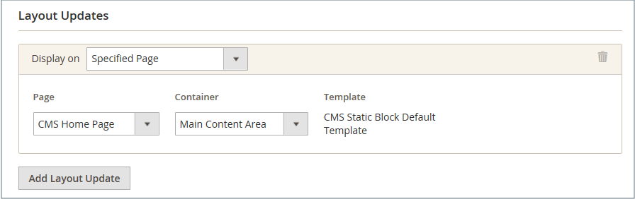

# 새 제품 목록 위젯

새 제품 목록은 다이내믹 컨텐츠의 예제이며 제품 카탈로그에서 가져오는 라이브 데이터로 구성됩니다. 기본적으로 _새 제품_ 목록에는 가장 최근에 추가된 제품 중 처음 8개가 포함됩니다. 그러나 지정된 날짜 범위 내의 제품만 포함하도록 구성할 수도 있습니다.

{width="700" zoomable="yes"}

## 1단계: 각 제품을 새 제품으로 설정

 이 단계는 Magento Open Source에만 적용됩니다.

 Adobe Commerce 스토어의 경우 [업데이트 예약](content-staging-scheduled-update.md)을 참조한 다음 이 페이지의 2단계를 계속 진행하십시오.

_[!UICONTROL Set Product as New]_&#x200B;날짜 범위 설정은 예약된 업데이트에서만 구성할 수 있습니다.

제품을 새 제품으로 설정하면 _새 제품_ 목록에 제품이 추가됩니다. 목록에 더 이상 포함하지 않으려는 경우 언제든지 설정을 다시 변경할 수 있습니다.

1. _관리자_ 사이드바에서 **[!UICONTROL Catalog]** > **[!UICONTROL Products]**(으)로 이동합니다.

1. 기능을 사용할 각 제품을 찾아 편집 모드로 엽니다.

1. **[!UICONTROL Set Product as New]**&#x200B;의 경우 옵션을 전환하여 제품을 새 제품으로 설정할지 여부를 지정합니다.

   {width="400" zoomable="yes"}

1. 완료되면 **[!UICONTROL Save]**&#x200B;을(를) 클릭합니다.

1. 페이지 캐시를 다시 인덱싱하고 새로 고치라는 메시지가 표시되면 페이지 상단에 있는 링크를 클릭하고 지침을 따릅니다.

## 2단계: 위젯 만들기

새 제품 목록의 콘텐츠와 스토어에서의 배치를 결정하는 코드는 위젯 도구를 통해 생성됩니다.

1. _관리자_ 사이드바에서 **[!UICONTROL Content]** > _[!UICONTROL Elements]_>**[!UICONTROL Widgets]**(으)로 이동합니다.

1. 오른쪽 상단에서 **[!UICONTROL Add Widget]**&#x200B;을(를) 클릭합니다.

1. _[!UICONTROL Settings]_&#x200B;섹션에서 다음을 수행합니다.

   - **[!UICONTROL Type]**&#x200B;을(를) `Catalog New Products List`(으)로 설정합니다.

   - 스토어에서 사용하는 **[!UICONTROL Design Theme]**&#x200B;을(를) 선택하십시오.

1. **[!UICONTROL Continue]**&#x200B;을(를) 클릭합니다.

   {width="600" zoomable="yes"}

1. _[!UICONTROL Storefront Properties]_&#x200B;섹션에서 다음을 수행합니다.

   - **[!UICONTROL Widget Title]**&#x200B;의 경우 위젯에 대한 설명 제목을 입력합니다. 이 제목은 _관리자_&#x200B;에서만 볼 수 있습니다.

   - **[!UICONTROL Assign to Store Views]**&#x200B;의 경우 위젯이 표시되는 스토어 보기를 선택하십시오.

     특정 스토어 보기 또는 `All Store Views`을(를) 선택할 수 있습니다. 여러 뷰를 선택하려면 Ctrl 키(PC) 또는 Command 키(Mac)를 누른 상태에서 각 옵션을 클릭합니다.

   - (선택 사항) **[!UICONTROL Sort Order]**&#x200B;의 경우 숫자를 입력하여 이 항목이 페이지의 동일한 부분에 있는 다른 항목과 함께 표시되는 순서를 결정합니다. (`0` = 첫 번째, `1` = 두 번째, `3` = 세 번째 등)

   {width="600" zoomable="yes"}

## 3단계: 위치 선택

1. _[!UICONTROL Layout Updates]_&#x200B;섹션에서&#x200B;**[!UICONTROL Add Layout Update]**&#x200B;을(를) 클릭합니다.

1. **[!UICONTROL Display On]**&#x200B;을(를) `Specified Page.`(으)로 설정

1. **[!UICONTROL Page]**&#x200B;을(를) `CMS Home Page`(으)로 설정합니다.

1. **[!UICONTROL Block Reference]**&#x200B;을(를) `Main Content Area`(으)로 설정합니다.

1. **[!UICONTROL Template]**&#x200B;을(를) 다음 중 하나로 설정합니다.

   - `New Product List Template`
   - `New Products Grid Template`

     {width="600" zoomable="yes"}

1. **[!UICONTROL Save and Continue Edit]**&#x200B;을(를) 클릭합니다.

   지금은 메시지를 무시하여 캐시를 새로 고칠 수 있습니다.

## 4단계: 목록 구성

1. 왼쪽 패널에서 **[!UICONTROL Widget Options]**&#x200B;을(를) 선택합니다.

1. **[!UICONTROL Display Products]**&#x200B;을(를) 다음 중 하나로 설정합니다.

   - `All Products` - 가장 최근에 추가된 항목부터 차례로 제품을 나열합니다.
   - `New Products` - _new_(으)로 식별된 제품만 나열합니다. 제품은 _[!UICONTROL Set Product As New From/To]_&#x200B;에 지정된 날짜 범위 동안 새로운 것으로 간주됩니다. 새 제품을 정의하지 않고 날짜 범위가 만료되면 목록이 비어 있습니다.

1. 여러 페이지가 있는 목록에 탐색 컨트롤을 제공하려면 **[!UICONTROL Display Page Control]**&#x200B;을(를) `Yes`(으)로 설정하십시오.

   **[!UICONTROL Number of Products per Page]**&#x200B;의 경우 각 페이지에 표시할 제품 수를 입력하십시오.

1. **[!UICONTROL Number of Products to Display]** 옵션을 목록에 포함할 새 제품 수로 설정하십시오.

   기본 설정은 `10`입니다.

1. **[!UICONTROL Cache Lifetime (Seconds)]**&#x200B;의 경우 새 제품 목록을 새로 고칠 빈도를 선택하십시오.

   기본적으로 캐시는 86,400초(24시간)로 설정됩니다.

   {width="600" zoomable="yes"}

1. 완료되면 **[!UICONTROL Save]**&#x200B;을(를) 클릭합니다.

1. 캐시를 새로 고치라는 메시지가 표시되면 페이지 상단에 있는 메시지에서 링크를 클릭하고 지침을 따릅니다.

## 5단계: 작업 미리보기

1. _관리자_ 사이드바에서 **[!UICONTROL Content]** > _[!UICONTROL Elements]_>**[!UICONTROL Pages]**(으)로 이동합니다.

1. 그리드에서 _새 제품_ 목록이 표시될 페이지를 찾은 다음 _[!UICONTROL Action]_&#x200B;열에서&#x200B;**[!UICONTROL Preview]**&#x200B;링크를 클릭합니다.
