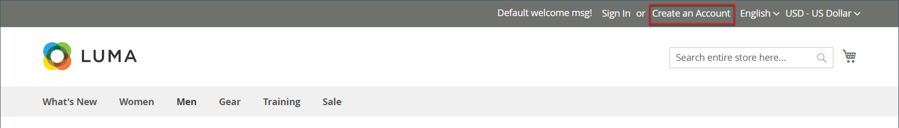
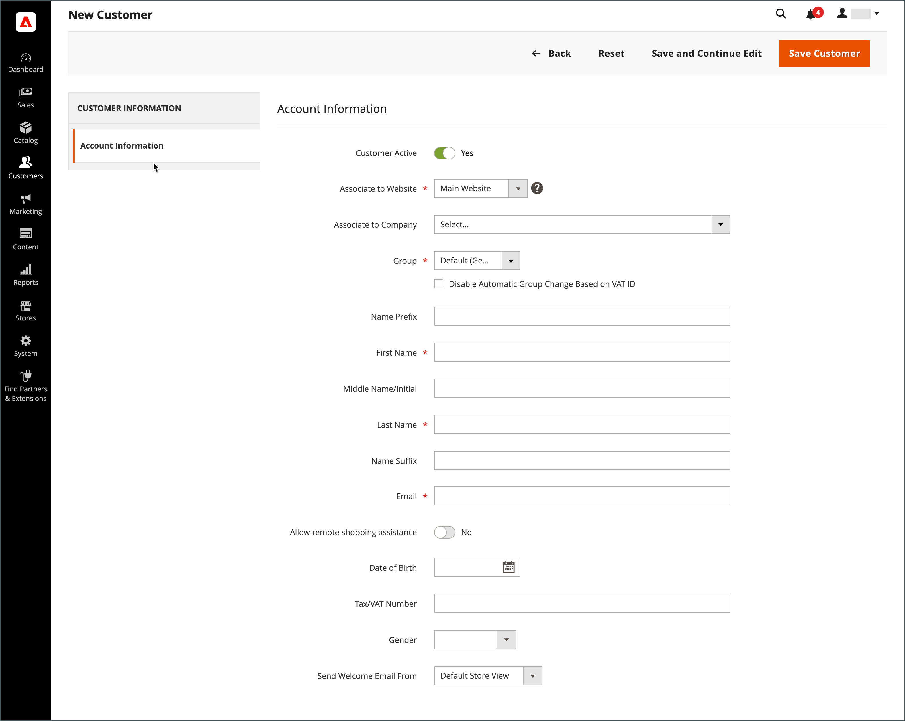
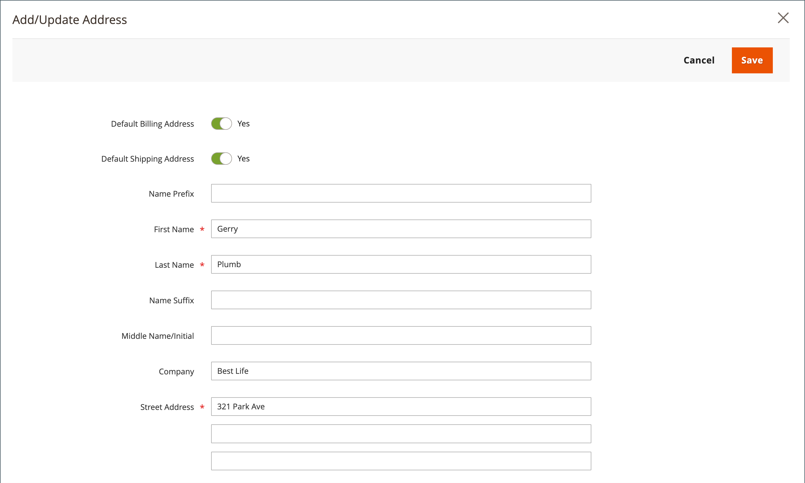

# 개별 고객 계정 만들기

스토어 방문자는 계정을 열어 구매 및 활동을 관리할 수 있습니다. 고객은 일반적으로 스토어에서 자신의 계정을 만듭니다. 그러나 관리자로부터 직접 고객 계정을 만들 수도 있으므로 전화상으로 고객을 지원하는 데 유용합니다.

다음 지침은 기본 고객 계정 구성을 나타냅니다. 양식의 일부 필드 선택 및 동작을 변경하려면 [고객 계정 구성](../customers/customer-account-scope.md)을 참조하세요.

저장소 관리자는 [새 계정 옵션](../customers/account-options-new.md)을 설정하여 새로 등록된 고객에게 확인 이메일을 보낼 수도 있습니다. 이렇게 하면 등록된 계정이 유효한지 확인할 수 있습니다.

>[!NOTE]
>
>버전 2.4.7부터 고객은 브라우저에 관계없이 이메일 확인 후 계정에 로그인하려면 이메일 및 암호를 다시 입력해야 합니다.

## 상점 첫 화면에서 계정 만들기

상점 고객이 상점 앞에 계정을 만듭니다.

1. 상점 앞에서 헤더의 오른쪽 상단 모서리에서 **[!UICONTROL Create an Account]**&#x200B;을(를) 클릭합니다.

   {width="700" zoomable="yes"}

1. **[!UICONTROL Personal Information]**&#x200B;에서 **[!UICONTROL First Name]** 및 **[!UICONTROL Last Name]**&#x200B;을(를) 입력합니다.

   {width="600" zoomable="yes"}

1. 뉴스레터 구독자 목록에 이름과 이메일 주소를 추가하려면 고객이 **[!UICONTROL Sign Up for Newsletter]** 확인란을 선택합니다.

   >[!INFO]
   >
   > 이 옵션은 스토어에서 뉴스레터를 게시하지 않는 경우에도 표시됩니다.

1. 상점 지원 직원이 [볼 수 있는 내용을 보고](../customers/login-as-customer.md)원격 지원을 제공하기를 원하는 경우 고객은 **[!UICONTROL Allow remote shopping assistance]** 확인란을 선택합니다.

1. **[!UICONTROL Sign-in Information]**&#x200B;에서 **[!UICONTROL Email]** 주소를 입력합니다.

   >[!INFO]
   >
   > 이 이메일 주소는 로그인 자격 증명의 일부가 되며 다른 고객 계정과 연결될 수 없습니다.

   {width="600" zoomable="yes"}

1. 다음 유형의 정보 세 개를 포함하는 **[!UICONTROL Password]**&#x200B;을(를) 입력합니다.

   - 소문자
   - 대문자
   - 숫자
   - 특수 문자

   **[!UICONTROL Enter]**&#x200B;을(를) 누르면 암호의 강도가 평가되고 필드 아래에 나타납니다. 암호가 _Weak_&#x200B;인 것으로 간주되면 _Strong_(으)로 평가될 때까지 다른 암호를 시도하십시오.

   {width="600" zoomable="yes"}

1. 그런 다음 고객이 다시 **[!UICONTROL Confirm Password]**&#x200B;에 입력합니다.

1. 필요한 경우 **[!UICONTROL Show Password]**&#x200B;을(를) 클릭하여 입력한 암호를 확인합니다.

1. 완료되면 **계정 만들기**&#x200B;를 클릭합니다.

그런 다음 고객은 전자 메일 주소와 암호를 사용하여 계정에 [로그인](../customers/customer-sign-in.md)하고 주소 정보를 완료할 수 있습니다.

## 책임자로부터 계정 만들기

판매자는 관리자로부터 고객 계정을 생성할 수 있습니다.

1. _관리자_ 사이드바에서 **[!UICONTROL Customers]** > **[!UICONTROL All Customers]**(으)로 이동합니다.

1. **[!UICONTROL Add New Customer]**&#x200B;을(를) 클릭합니다.

### 1단계: 계정 정보 작성

{width="700" zoomable="yes"}

1. **[!UICONTROL Account Information]** 섹션에서 다음을 수행합니다.

   - 다중 사이트 설치의 경우 고객 계정이 적용되는 웹 사이트로 **[!UICONTROL Associate to Website]**&#x200B;을(를) 설정하십시오.
   - 해당하는 경우 고객을 다른 **[!UICONTROL Customer Group]**&#x200B;에 할당하십시오.
   - [VAT ID 유효성 검사](../stores-purchase/vat.md)를 사용 중이고 **[!UICONTROL Disable Automatic Group Change Based on VAT ID]**&#x200B;을(를) 원하는 경우 확인란을 선택하십시오.

1. 필수 필드를 작성합니다.

   - **[!UICONTROL First Name]**
   - **[!UICONTROL Last Name]**
   - **[!UICONTROL Email]**

1. 필요에 따라 선택적 필드를 완료합니다.

   - **[!UICONTROL Name Prefix]**
   - **[!UICONTROL Middle Name/Initial]**
   - **[!UICONTROL Name Suffix]**
   - **[!UICONTROL Date of Birth]**
   - **[!UICONTROL Tax/VAT Number]**
   - **[!UICONTROL Gender]**

   >[!WARNING]
   >
   >현재 보안 및 개인 정보 보호 모범 사례를 준수하면서 다른 개인 식별자를 사용한 고객의 전체 생년월일(월, 일, 년) 저장과 관련된 잠재적 법적 및 보안 위험에 대해 알아두어야 합니다. 고객의 전체 생년월일 보관을 제한하는 것이 좋으며 대안으로 고객의 생년월일을 사용할 것을 제안했습니다.

1. **[!UICONTROL Send Welcome Email From]**&#x200B;을(를) _시작_ 전자 메일을 보낼 스토어 보기로 설정합니다.

   >[!INFO]
   >
   > 스토어에 다른 [언어](../stores-purchase/store-localize.md)에 대한 보기가 있는 경우 이 설정은 시작 전자 메일의 언어를 결정합니다.

1. 페이지 맨 위에서 **[!UICONTROL Save and Continue Edit]**&#x200B;을(를) 클릭합니다.

   >[!INFO]
   >
   >고객 계정이 저장되면 전체 옵션 세트가 왼쪽 패널과 페이지 상단의 메뉴에 나타납니다. _[!UICONTROL Customer View]_탭에는 계정의 요약이 표시됩니다.

   {width="600" zoomable="yes"}

### 2단계: 주소 정보 작성

1. 왼쪽 패널에서 **[!UICONTROL Addresses]**&#x200B;을(를) 선택하고 **[!UICONTROL Add New Addresses]**&#x200B;을(를) 클릭합니다.

1. 청구와 배송 모두에 동일한 주소가 사용되는 경우 두 옵션을 모두 전환합니다.

   - **[!UICONTROL Default Billing Address]**
   - **[!UICONTROL Default Shipping Address]**

   {width="600" zoomable="yes"}

1. 아래로 스크롤하여 두 번째 열의 필수 주소 필드를 작성합니다.

   - **[!UICONTROL Street Address]**
   - **[!UICONTROL City]**
   - **[!UICONTROL Country]**
   - **[!UICONTROL State/Province]**
   - **[!UICONTROL ZIP/Postal Code]**

1. 이 주소의 **[!UICONTROL Phone Number]**&#x200B;을(를) 입력하십시오.

1. 해당하는 경우 고객과 연결된 **[!UICONTROL VAT Number]**&#x200B;을(를) 입력하십시오.

1. 이 주소만 계정에 필요한 경우 **[!UICONTROL Save]**&#x200B;을(를) 클릭합니다.

   그렇지 않으면 **[!UICONTROL Save and Continue Edit]**&#x200B;을(를) 클릭하고 이전 단계를 반복하여 주소를 추가합니다.

   선택한 _[!UICONTROL Default Billing]_및_[!UICONTROL Default Shipping]_ 주소가 전체 목록 위에 있는 [!UICONTROL Addresses] 페이지에 새 주소가 표시됩니다.

   {width="600" zoomable="yes"}

### 3단계: 암호 재설정

책임자로부터 생성된 고객 계정에는 처음에 할당된 암호가 없습니다.

1. 표에서 새 고객 계정을 찾습니다.

1. _[!UICONTROL Action]_열에서&#x200B;**[!UICONTROL Edit]**을(를) 클릭합니다.

1. 페이지 상단의 메뉴 표시줄에서 **[!UICONTROL Reset Password]**&#x200B;을(를) 클릭합니다.

1. 암호 설정 지침과 함께 알림이 계정 소유자에게 전송됩니다.

## 단추 막대

프로파일을 처음 저장하면 추가 버튼을 사용할 수 있습니다. 자세한 내용은 [고객 프로필 업데이트](../customers/update-account.md)를 참조하세요.

| 단추 | 설명 |
|--- |--- |
| **[!UICONTROL Back]** | 변경 내용을 저장하지 않고 _[!UICONTROL Customers]_페이지로 돌아갑니다. |
| **[!UICONTROL Delete Customer]** | 현재 고객을 삭제합니다. 고객과 연관된 완료된 주문은 제거되지 않습니다. |
| **[!UICONTROL Reset]** | 고객 양식에서 저장되지 않은 변경 사항을 이전 값으로 재설정합니다. |
| **[!UICONTROL Create Order]** | 고객에 대한 주문을 생성합니다. |
| **[!UICONTROL Reset Password]** | 고객에게 [암호 재설정](../customers/password-reset.md) 링크를 이메일로 보냅니다. |
| **[!UICONTROL Force Sign-in]** | 고객 계정과 연결된 OAuth 액세스 토큰을 취소합니다. 이 함수는 웹 API [통합](../systems/integrations.md)의 일부로 OAuth 토큰이 할당된 고객 계정에서만 사용할 수 있습니다. 자세한 내용은 개발자 설명서에서 [OAuth 기반 인증](https://developer.adobe.com/commerce/webapi/get-started/authentication/gs-authentication-oauth/)을 참조하십시오. |
| **[!UICONTROL Manage Shopping Cart]** | 관리자가 고객의 장바구니를 관리할 수 있습니다. |
| **[!UICONTROL Save and Continue Edit]** | 변경 사항을 저장하고 고객 프로필을 열어 둡니다. |
| **[!UICONTROL Save Customer]** | 변경 사항을 저장하고 고객 프로필을 닫습니다. |

{style="table-layout:auto"}

## 필드 설명

### [!UICONTROL Account Information]

| 필드 | 설명 |
|--- |--- |
| **[!UICONTROL Associate to Website]** | 고객 계정과 연결된 웹 사이트를 식별합니다. |
| **[!UICONTROL Group]** | 고객이 멤버인 [고객 그룹](../customers/customer-groups.md)을(를) 식별합니다. 해당하는 경우 확인란을 선택하여 VAT에 따른 자동 그룹 변경을 비활성화합니다. |
| **[!UICONTROL Name Prefix]** | 사용되는 경우 고객 이름과 연결된 접두사(예: Mr, Ms, 또는 Dr). 접두사 값은 [configuration](../configuration-reference/customers/customer-configuration.md)에 의해 결정됩니다. 구성에 따라 입력 컨트롤은 텍스트 필드이거나 옵션 목록일 수 있습니다. |
| **[!UICONTROL First Name]** | 고객의 이름. |
| **[!UICONTROL Middle Name / Initial]** | 고객의 중간 이름 또는 이니셜입니다. 이 필드는 [configuration](../configuration-reference/customers/customer-configuration.md) 주제에 지정된 경우에만 포함됩니다. |
| **[!UICONTROL Last Name]** | 고객의 성입니다. |
| **[!UICONTROL Name Suffix]** | 사용되는 경우 고객 이름과 연결된 접미사(예: Jr., Sr. 또는 III). 접미사 값은 [configuration](../configuration-reference/customers/customer-configuration.md)에 의해 결정됩니다. 구성에 따라 입력 컨트롤은 텍스트 필드이거나 옵션 드롭다운 목록일 수 있습니다. |
| **[!UICONTROL Email]** | 고객의 이메일 주소입니다. |
| **[!UICONTROL Date of Birth]** | 고객의 생년월일 생년월일은 [구성](../configuration-reference/customers/customer-configuration.md) 주제에 지정된 경우 포함됩니다.   최신 보안 및 개인 정보 보호 모범 사례를 준수하면서 다른 개인 식별자를 사용한 고객의 전체 생년월일(월, 일, 년) 저장과 관련된 법적 및 보안 위험에 대해 알아봅니다. 고객의 전체 생년월일 보관을 제한하고 고객 생년월일을 대안으로 사용하는 것이 좋습니다. |
| **[!UICONTROL Tax / VAT Number]** | 해당되는 경우 고객의 세금 또는 부가가치세 번호. |
| **[!UICONTROL Gender]** | 고객의 성별을 식별합니다. 성별은 [구성](../configuration-reference/customers/customer-configuration.md)에 지정된 경우 포함됩니다. 옵션: `Male` / `Female` / `Not Specified` |
| **[!UICONTROL Send Welcome Email From]** | 스토어 보기가 여러 개 있는 경우 이 설정은 시작 메시지가 전송되는 스토어 보기를 식별합니다. 스토어 보기가 다른 언어에 사용되는 경우 이 설정은 시작 이메일의 언어를 결정합니다. |

### [!UICONTROL Addresses]

| 필드 | 설명 |
|--- |--- |
| **[!UICONTROL New Addresses]** | 새 주소의 유형을 식별합니다. 옵션: `Default Billing Address` / `Default Shipping Address` |
| **[!UICONTROL Add New Addresses]** | 입력할 주소의 유형을 식별하는 다른 새 주소 섹션을 표시합니다. |
| **[!UICONTROL Company]** | 해당 주소에 해당하는 경우 회사 이름. |
| **[!UICONTROL Street Address]** | 고객의 거리 주소입니다. [구성](../configuration-reference/customers/customer-configuration.md) 항목에서 지정한 경우 상세 주소의 두 번째 줄을 사용할 수 있습니다. |
| **[!UICONTROL City]** | 고객 주소가 있는 도시입니다. |
| **[!UICONTROL Country]** | 고객 주소가 있는 국가입니다. |
| **[!UICONTROL State/Province]** | 고객 주소가 있는 시/도입니다. |
| **[!UICONTROL Zip/Postal Code]** | 고객 주소가 있는 ZIP 또는 우편 번호입니다. |
| **[!UICONTROL Phone Number]** | 주소와 연결된 고객 전화번호. |
| **[!UICONTROL VAT Number]** | 해당되는 경우, 이 주소의 고객에게 적용되는 부가가치세 번호. |
