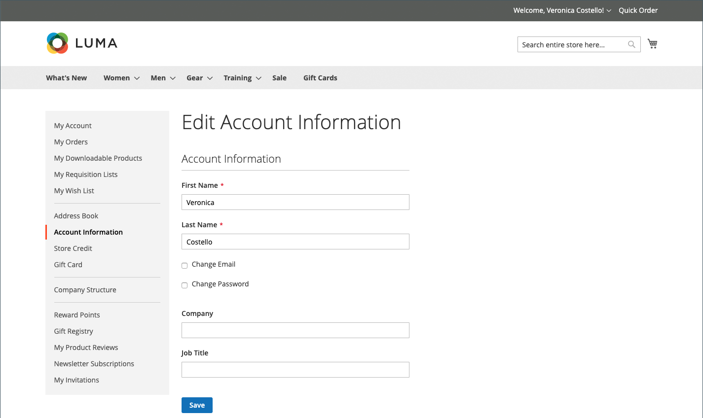
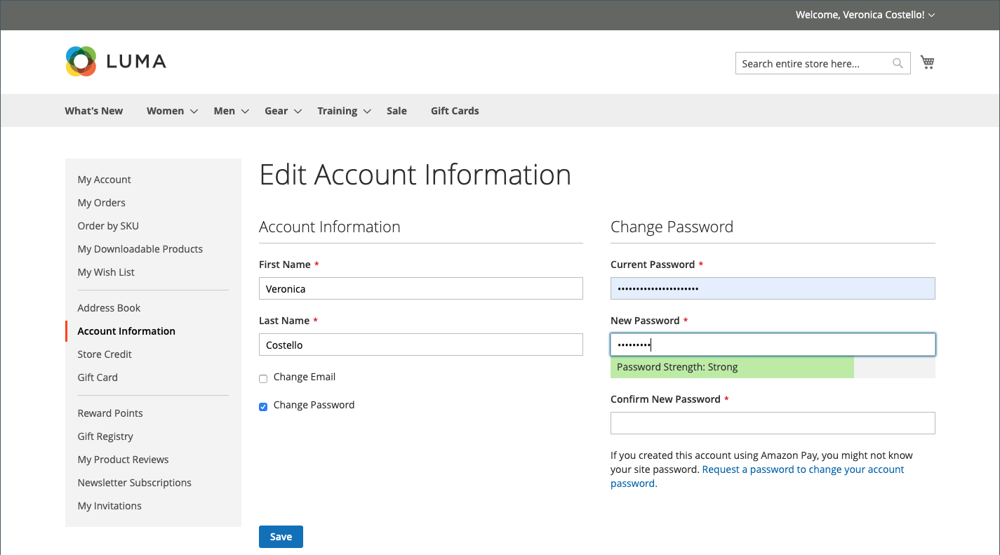

# 고객 계정 정보

기본 고객 계정 정보에는 사용자 이름, 이메일 주소 및 암호가 포함되며 상점 전면의 고객 계정 대시보드에서 유지 관리할 수 있습니다.

{width="700" zoomable="yes"}

계정의 사이드바에서 고객이 선택할 수 있습니다. **[!UICONTROL Account Information]** 계정 정보를 업데이트하려면 다음 중 하나를 수행하십시오.

## 계정 이름의 이름 업데이트

계정 이름을 업데이트하기 위해 고객은 **[!UICONTROL First Name]** 및 **[!UICONTROL Last Name]** 필요에 따라 필드를 선택합니다.

>[!INFO]
>
>다음과 같은 경우 추가 필드가 이름의 일부로 나타납니다. [고객 구성](../configuration-reference/customers/customer-configuration.md) 접두사, 중간 이니셜 및 접미사를 포함합니다.

## 이메일 주소 변경

1. 고객이 다음을 선택합니다 **[!UICONTROL Change Email]** 확인란.

1. 새 항목 입력 **[!UICONTROL Email]** 주소.

1. 입력 **[!UICONTROL Current Password]**.

   {width="700" zoomable="yes"}

1. 클릭수 **[!UICONTROL Save]**.

## 암호 변경

1. 고객이 다음을 선택합니다 **[!UICONTROL Change Password]** 확인란.

1. 입력 **[!UICONTROL Current Password]**.

1. 입력 **[!UICONTROL New Password]**.

   >[!INFO]
   >
   >암호는 최소 8자 이상이어야 하며 대소문자, 숫자 및 기호의 조합을 포함할 수 있습니다. 암호 강도 표시기는 고객이 최상의 암호를 선택할 수 있도록 도와줍니다.

   {width="700" zoomable="yes"}

1. 확인하려면 다시 입력합니다.
