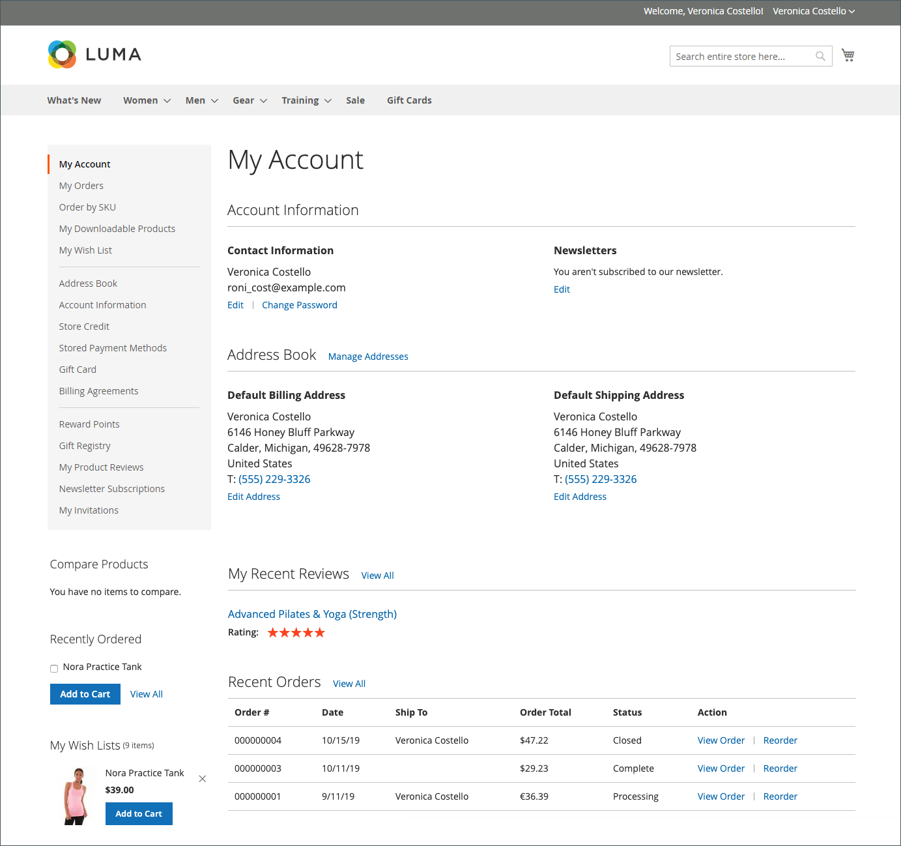

# [!UICONTROL My Account]페이지

고객 대시보드의 **[!UICONTROL My Account]** 페이지에서 고객에게 스토어와 관련된 정보 및 활동에 대한 개요를 제공합니다.

이 페이지는 다음 섹션으로 구성됩니다.

* [**[!UICONTROL Account Information]**](../customers/account-dashboard-account-information.md)
* [**[!UICONTROL Address Book]**](../customers/account-dashboard-address-book.md)
* [**[!UICONTROL My Recent Reviews]**](../merchandising-promotions/product-reviews.md#product-reviews-on-the-storefront)
* [**[!UICONTROL Recent Orders]**](../stores-purchase/orders-storefront.md#view-recently-ordered-products)

{width="700" zoomable="yes"}
