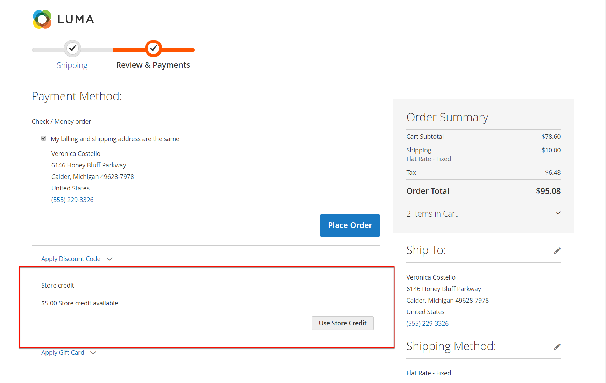

# 고객 계정 대시보드에 크레딧 저장

{{ee-feature}}

고객 계정 대시보드의 _[!UICONTROL Store Credit]_페이지에는 향후 구매에 적용할 수 있는 반환 및 환불 금액이 나열됩니다. 또한 고객은 기프트 카드에서 해당 금액을 사용할 수 있습니다.

{width="700" zoomable="yes"}

## 체크아웃 중 스토어 크레딧 적용

1. 고객이 사용 가능한 매장 크레딧의 양을 결정합니다.

   _검토 및 결제_ 단계에서 사용 가능한 금액이 **[!UICONTROL Store Credit]**&#x200B;에 표시됩니다.

1. 주문량에 금액을 적용하려면 고객이 **[!UICONTROL Use Store Credit]**&#x200B;을(를) 클릭합니다.

   {width="600" zoomable="yes"}

1. 주문 합계가 다시 계산되며 적용된 스토어 크레딧 금액이 주문 요약에 나타납니다.

   {width="600" zoomable="yes"}

1. 준비가 되면 **[!UICONTROL Place Order]**&#x200B;을(를) 클릭합니다.

## 스토어 신용 잔고 및 내역 보기

신용 잔고와 내역을 조회하는 방법에는 두 가지가 있습니다.

방법 1: **고객 계정 대시보드에서**

1. 상점에서 고객은 계정에 로그인합니다.

1. 왼쪽 패널에서 **[!UICONTROL Store Credit]**&#x200B;을(를) 선택합니다.

방법 2: **_검토 및 결제_ 페이지에서**

1. 고객이 장바구니에 제품을 추가합니다.

1. 체크아웃 페이지로 이동합니다.

1. **[!UICONTROL Shipping]** 단계를 전달합니다.

1. 스토어 크레딧을 사용할 수 있는 경우 고객은 **스토어 크레딧 사용**&#x200B;을 클릭합니다.

1. 고객이 스토어 크레딧 사용에 대해 마음이 바뀌면 _[!UICONTROL Order Summary]_섹션에서&#x200B;**[!UICONTROL Remove]**을(를) 클릭합니다.
