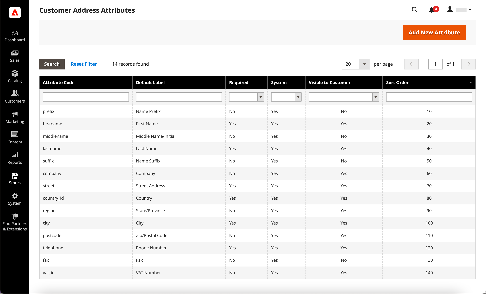
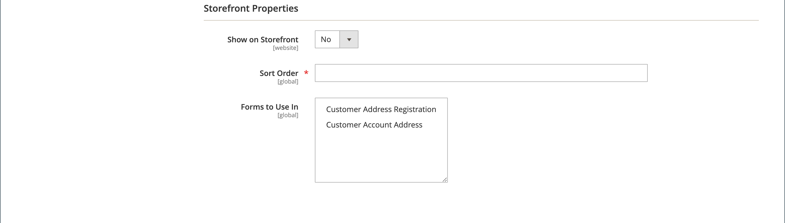

# 고객 주소 속성

{{ee-feature}}

고객 주소 특성 집합은 고객 계정에서 또는 [체크아웃](../stores-purchase/checkout-process.md)하는 동안 [주소록](account-dashboard-address-book.md)에 입력된 거리 주소의 속성을 결정합니다.

사용자 정의 주소 속성을 설정하여 선택적 이메일 주소, Skype 계정, 대체 전화번호, 건물 또는 카운티와 같은 추가 정보를 제공할 수 있습니다. 그런 다음 사용자 지정 특성을 판매 문서를 만드는 데 사용되는 [주소 템플릿](address-templates.md)에 통합할 수 있습니다. 사용자 지정 주소 특성을 만드는 프로세스는 [고객 특성](attribute-properties.md)을(를) 만드는 프로세스와 거의 동일합니다.

고객 주소 속성은 다음 양식에서 사용됩니다.

- [고객 주소 등록](account-create.md)
- [고객 계정 주소](account-dashboard-address-book.md)

{width="700" zoomable="yes"}

## 1단계: 속성 속성 완료

1. _관리자_ 사이드바에서 **[!UICONTROL Stores]** > _[!UICONTROL Attributes]_>**[!UICONTROL Customer Address]**(으)로 이동합니다.

1. 오른쪽 상단에서 **[!UICONTROL Add New Attribute]**&#x200B;을(를) 클릭합니다.

   {width="600" zoomable="yes"}

1. **[!UICONTROL Attribute Properties]** 섹션에서 다음을 수행합니다.

   - 데이터를 입력하는 동안 특성을 식별하는 **[!UICONTROL Default Label]**&#x200B;을(를) 입력하십시오.

   - 시스템 내에서 특성을 식별하는 **[!UICONTROL Attribute Code]**&#x200B;을(를) 입력하십시오.

     속성 코드는 문자로 시작해야 하며 소문자(a-z)와 숫자(0-9)의 조합을 포함할 수 있습니다. 코드는 길이가 30자 미만이어야 하며 특수 문자 또는 공백을 포함할 수 없습니다. 밑줄 문자(_)를 사용하여 공백을 나타낼 수 있습니다.

     >[!TIP]
     >
     >**_바로 가기:_** 필수 필드만 완료하려면 [!UICONTROL Storefront Properties](으)로 스크롤하여 [!UICONTROL Sort Order]을(를) 입력한 다음 저장하십시오.

1. 데이터 입력에 사용되는 입력 컨트롤의 형식을 확인하려면 **[!UICONTROL Input Type]**&#x200B;을(를) 다음 중 하나로 설정하십시오.

   - `Text Field` - 한 줄 텍스트 필드입니다.
   - `Text Area` - 여러 줄 텍스트 영역입니다.
   - `Multiple Line` - 여러 줄 주소(여러 줄 주소)와 유사하게 특성에 대해 여러 텍스트 줄을 만듭니다. 개별 데이터 입력 라인의 수는 2개에서 20개까지 지정할 수 있습니다. 필드의 초기 값을 지정하려면 `Default Value`을(를) 사용하십시오.
   - `Date` - 팝업 달력이 있는 날짜 필드를 표시합니다. 추가 속성: 필드의 초기 값을 지정하려면 `Default Value`을(를) 사용합니다.  입력할 수 있는 가장 빠른 날짜를 지정하려면 `Minimal Value`을(를) 사용합니다.  `Maximum Value`을(를) 사용하여 입력할 수 있는 최신 날짜를 지정하십시오.
   - `Dropdown` - 하나의 값만 선택할 수 있는 드롭다운 목록입니다.
   - `Multiple Select` - 여러 값을 선택할 수 있는 드롭다운 목록입니다.
   - `Yes/No` - `Yes` 또는 `No` 값을 선택할 수 있는 필드입니다.
   - `File (attachment)` - 파일을 업로드하고 고객 특성과 연결할 수 있는 필드입니다.
   - `Image File` - 갤러리에 이미지를 업로드하고 고객 특성과 연결할 수 있는 필드입니다.

1. 고객이 필드에 값을 입력해야 하는 경우 **[!UICONTROL Values Required]**&#x200B;을(를) `Yes`(으)로 설정하십시오.

1. 필드에 초기 값을 할당하려면 **[!UICONTROL Default Value]**&#x200B;을(를) 입력하십시오.

1. 레코드를 저장하기 전에 필드에 입력한 데이터의 정확성을 확인하려면 필드에 사용할 수 있는 데이터 형식으로 **[!UICONTROL Input Validation]**&#x200B;을(를) 설정하십시오. 사용 가능한 값은 지정된 _[!UICONTROL Input Type]_에 따라 다릅니다.

   - `None` - 데이터 입력 중에 필드에 입력 유효성 검사가 없습니다.
   - `Alphanumeric` - 데이터를 입력하는 동안 숫자(0-9)와 영문자(a-z, A-Z)의 조합을 사용할 수 있습니다. 특수 문자를 포함하려면 다음 단계에서 [!UICONTROL Escape HTML Entities]을(를) 참조하십시오.
   - `Alphanumeric with Space` - 데이터를 입력하는 동안 숫자(0-9), 영문자(a-z, A-Z) 및 공백을 모두 허용합니다.
   - `Numeric Only` - 데이터를 입력하는 동안 숫자(0-9)만 허용합니다.
   - `Alpha Only` - 데이터를 입력하는 동안 영문자만 허용합니다(a-z, A-Z).
   - `URL` - 데이터를 입력하는 동안 URL만 허용합니다.
   - `Email` - 데이터를 입력하는 동안 전자 메일 주소만 허용합니다.
   - `Length Only` - 필드에 입력한 데이터의 길이를 기반으로 입력의 유효성을 검사합니다.

1. 텍스트 필드, 텍스트 영역 또는 여러 줄 입력 형식에 입력한 값에 전처리 필터를 적용하려면 **[!UICONTROL Input/Output Filter]**&#x200B;을(를) 다음 중 하나로 설정합니다.

   - `None` - 필드에 입력한 텍스트에 필터를 적용하지 않습니다.
   - `Strip HTML Tags` - 텍스트에서 HTML 태그를 제거합니다. 이 필터는 HTML 태그가 포함된 다른 소스의 필드에 붙여넣은 데이터를 정리하는 데 도움이 될 수 있습니다.
   - `Escape  HTML Entities` - 텍스트에 있는 특수 문자를 유효한 HTML 이스케이프 시퀀스(예: `&;`)로 변환합니다. 이스케이프 시퀀스는 앰퍼샌드와 세미콜론 사이에 있으며, 타이포그래퍼의 스마트 따옴표, 저작권 및 상표 기호에 자주 사용됩니다. 이스케이프 시퀀스를 사용하여 보다 작음(`<`) 및 보다 큼(`>`) 기호, 코드에서도 사용되는 앰퍼샌드 문자 등의 문자를 식별합니다. 이 필터는 워드 프로세서에서 데이터베이스 필드에 붙여넣는 특수 문자를 정리하는 데 도움이 될 수 있습니다.

1. 고객 그리드 및 세그먼트 속성을 완료합니다.

   - Customers 표에 열을 포함하려면 **[!UICONTROL Add to Column Options]**&#x200B;을(를) `Yes`(으)로 설정하십시오.

   - 이 특성으로 Customers 그리드를 필터링하려면 **[!UICONTROL Use in Filter Options]**&#x200B;을(를) `Yes`(으)로 설정합니다.

   - 필터 일치 조건이 다른 텍스트 특성별로 Customers 그리드를 필터링하려면 **[!UICONTROL Grid Filter Condition Type]**&#x200B;을(를) `Partial Match`, `Prefix Match` 또는 `Full Match`(으)로 설정하십시오. 눈금에 대한 _키워드로 검색_ 필드에는 영향을 주지 않습니다.

   - 이 특성으로 고객 그리드를 검색하려면 **[!UICONTROL Use in Search Options]**&#x200B;을(를) `Yes`(으)로 설정합니다.

   - 이 특성을 [고객 세그먼트](customer-segments.md)에서 사용할 수 있도록 하려면 **[!UICONTROL Use in Customer Segment]**&#x200B;을(를) `Yes`(으)로 설정하십시오.

## 2단계: 상점 속성 완료

1. **[!UICONTROL Storefront Properties]** 섹션까지 아래로 스크롤합니다.

   {width="600" zoomable="yes"}

1. 특성이 고객에게 표시되도록 하려면 **[!UICONTROL Show on Storefront]**&#x200B;을(를) `Yes`(으)로 설정하십시오.

1. **[!UICONTROL Sort Order]** 필드에 숫자를 입력하여 다른 특성과 함께 나열될 때 나타나는 순서를 결정합니다.

1. 특성을 포함할 각 양식에 **[!UICONTROL Forms to Use]**&#x200B;을(를) 설정합니다.

   두 옵션을 모두 선택하려면 Ctrl 키(PC) 또는 Command 키(Mac)를 누른 채 각 양식을 클릭합니다.

   - [고객 주소 등록](account-create.md)
   - [고객 계정 주소](account-dashboard-address-book.md)

## 3단계: 레이블 작성 및 저장

1. 왼쪽 패널에서 **[!UICONTROL Manage Labels/Options]**&#x200B;을(를) 선택합니다.

1. **[!UICONTROL Manage Titles]**&#x200B;에서 각 [스토어 보기](../getting-started/websites-stores-views.md)에 대한 특성을 식별하는 레이블을 입력합니다.

1. 완료되면 **[!UICONTROL Save Attribute]**&#x200B;을(를) 클릭합니다.

   {width="600" zoomable="yes"}

## 필드 설명

### [!UICONTROL Attribute Properties]

| 필드 | 설명 |
|--- |--- |
| [!UICONTROL Default Label] | 관리자 및 상점 첫 화면에서 속성을 식별하는 기본 레이블입니다. |
| [!UICONTROL Attribute Code] | 시스템 내에서 속성을 식별하는 고유 코드입니다. 코드는 길이가 최대 21자이며 공백이나 특수 문자를 포함할 수 없습니다. 공백 대신 밑줄 기호를 사용할 수 있습니다. |
| [!UICONTROL Input Type] | 데이터 입력에 사용되는 [입력 컨트롤](../catalog/attributes-input-types.md)을 결정합니다. 옵션:  **`Text Field`**- 한 줄 텍스트 필드입니다. **`Text Area`** - 여러 줄 텍스트 영역입니다.  **`Multiple Line`**- 여러 줄 주소(여러 줄 주소)와 유사하게 특성에 대해 여러 텍스트 줄을 만듭니다. 개별 데이터 입력 라인의 수는 2개에서 20개까지 지정할 수 있습니다. **`Date`** - 팝업 달력이 있는 날짜 필드를 표시합니다. **`Dropdown`**- 하나의 값만 선택할 수 있는 드롭다운 목록입니다. **`Multiple Select`** - 여러 값을 선택할 수 있는 드롭다운 목록입니다.  **`Yes/No`**- `Yes` 또는 `No` 값을 선택할 수 있는 필드입니다. **`File (attachment)`** - 파일을 업로드하고 고객 특성과 연결할 수 있는 필드입니다.  **`Image File`**- 갤러리에 이미지를 업로드하고 고객 특성과 연결할 수 있는 필드입니다. |
| [!UICONTROL Values Required] | 필드에 값을 입력해야 하는지 여부를 결정합니다. 옵션: `Yes` / `No` |
| [!UICONTROL Default Value] | 특성의 초기 값을 지정합니다. |
| [!UICONTROL Input Validation] | 옵션 선택은 입력 유형에 따라 결정됩니다. 옵션:  **`None`**- 데이터 입력 중에 필드에 입력 유효성 검사가 없습니다. **`Alphanumeric`** - 데이터를 입력하는 동안 숫자(0-9)와 영문자(a-z, A-Z)의 조합을 사용할 수 있습니다.  **`Alphanumeric with Space`**- 거리 주소의 공백이 통신사의 최대 길이 요구 사항을 준수하도록 허용합니다. 체크아웃 시 고객은 수신자 및 발신자의 거리 주소에 숫자(0-9), 알파벳 문자(a-z, A-Z) 및 공백의 조합을 입력할 수 있습니다. 주소를 저장하면 추가 공백이 트리밍됩니다. **`Numeric Only`** - 데이터를 입력하는 동안 숫자(0-9)만 허용합니다.  **`Alpha Only`**- 데이터를 입력하는 동안 영문자만 허용합니다(a-z, A-Z). ** URL **- 데이터를 입력하는 동안 URL만 허용합니다. **`Email`** - 데이터를 입력하는 동안 전자 메일 주소만 허용합니다.  **`Length Only`**- 필드에 입력한 데이터의 길이를 기반으로 입력의 유효성을 검사합니다. |
| [!UICONTROL Input/Output Filter] | 레코드가 저장되기 전에 텍스트 필드, 텍스트 영역 또는 여러 줄 입력 유형에 입력된 값에 전처리 필터를 적용합니다. 옵션:  **`None`**- 필드에 입력한 텍스트에 필터를 적용하지 않습니다. **`Strip HTML Tags`** - 텍스트에서 HTML 태그를 제거합니다. 이 필터는 HTML 태그가 포함된 다른 소스의 필드에 붙여넣은 데이터를 정리하는 데 도움이 될 수 있습니다.  **`Escape HTML Entities`**- 텍스트에 있는 특수 문자를 유효한 HTML 이스케이프 시퀀스(예: `amp;`)로 변환합니다. 이스케이프 시퀀스는 앰퍼샌드와 세미콜론 사이에 있으며, 타이포그래퍼의 스마트 따옴표, 저작권 기호 및 상표 기호에 자주 사용됩니다. 이스케이프 시퀀스를 사용하여 보다 작음(`<`) 및 보다 큼(`>`) 기호, 코드에서도 사용되는 앰퍼샌드 문자 등의 문자를 식별합니다. 이 필터는 워드 프로세서에서 데이터베이스 필드에 붙여넣는 특수 문자를 정리하는 데 도움이 될 수 있습니다. |
| [!UICONTROL Add to Column Options] | 특성이 [Customers](./customers-all.md) 표에 열로 포함되는지 여부를 지정합니다. 옵션: `Yes` / `No` |
| 필터 옵션에서 사용 | 특성이 그리드에서 검색 작업을 위한 필터로 사용될 수 있는지 여부를 지정합니다. 옵션: `Yes` / `No` |
| [!UICONTROL Grid Filter Condition Type] | 표에서 검색 작업의 속성에 대한 필터 일치 조건을 지정합니다. 표의 _[!UICONTROL Search by keyword]_필드에는 영향을 주지 않습니다. 옵션: `Partial Match` / `Prefix Match` / `Full Match` |
| [!UICONTROL Use in Search Options] | 속성 값을 검색 작업에서 키워드로 사용할 수 있는지 여부를 지정합니다. 옵션: `Yes` / `No` |
| [!UICONTROL Use in Customer Segment] | 특성이 [고객 세그먼트](./customer-segments.md) 조건에 포함되는지 여부를 결정합니다. 옵션: `Yes` / `No` |

### [!UICONTROL Storefront Properties]

| 필드 | 설명 |
|--- |--- |
| [!UICONTROL Show on Storefront] | 속성이 상점 앞의 고객 정보에 필드로 표시되는지 여부를 결정합니다. 옵션: `Yes` / `No` |
| [!UICONTROL Sort Order] | 다른 고객 특성과 관련하여 이 특성의 정렬 순서를 지정합니다. 정렬 순서는 키보드 탐색을 사용할 때 데이터 입력 중에 필드가 포커스를 받는 순서를 결정합니다. |
| [!UICONTROL Forms to Use in] | 속성이 표시되는 데이터 항목 양식이 있는 페이지를 결정합니다. 옵션:  [`Customer Address Registration`](account-create.md)  [`Customer Account Address`](account-dashboard-address-book.md) |
