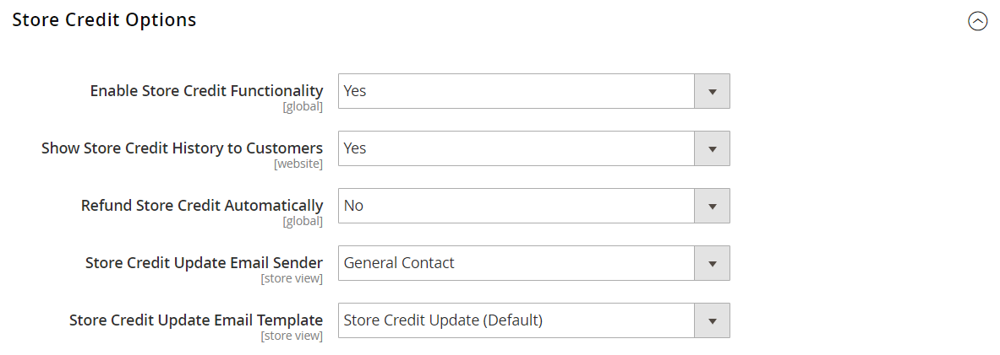

# 스토어 크레딧 구성

{{ee-feature}}

저장소 신용 구성은 자동 환불, 고객 계정의 사용 가능한 신용 표시 및 고객에게 발송되는 통지에 사용되는 이메일 템플릿을 제어합니다.

1. _관리자_ 사이드바에서 **[!UICONTROL Stores]** > _[!UICONTROL Settings]_>**[!UICONTROL Configuration]**(으)로 이동합니다.

1. 왼쪽 패널에서 **[!UICONTROL Customers]**&#x200B;을(를) 확장하고 **[!UICONTROL Customer Configuration]**&#x200B;을(를) 선택합니다.

1. **[!UICONTROL Store Credit Options]** 섹션을 확장합니다.

   {width="600" zoomable="yes"}

1. **[!UICONTROL Enable Store Credit Functionality]**&#x200B;을(를) `Yes`(으)로 설정합니다.

1. 기본 설정에 따라 다음을 설정하십시오.

   * **[!UICONTROL Show Store Credit History to Customers]**
   * **[!UICONTROL Refund Store Credit Automatically]**

1. 고객에게 보낸 전자 메일 알림의 보낸 사람으로 표시되는 스토어 ID로 **[!UICONTROL Store Credit Update Email Sender]**&#x200B;을(를) 설정합니다.

1. 고객에게 보낸 전자 메일 알림에 사용되는 템플릿으로 **[!UICONTROL Store Credit Update Email Template]**&#x200B;을(를) 설정합니다.

1. 완료되면 **[!UICONTROL Save Config]**&#x200B;을(를) 클릭합니다.
