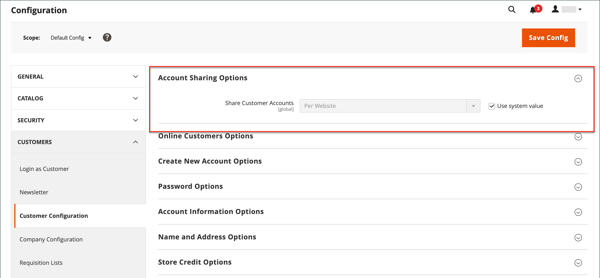

# 고객 계정 범위

스토어에 있는 모든 페이지의 헤더가 쇼핑객을 위한 초대장을 다음으로 확장합니다. _로그인 또는 등록_ 스토어에 있는 계정입니다. 계정을 개설하는 고객은 다음을 포함한 다양한 혜택을 누립니다.

* **고객 계정 만들기** - 방문자가 상점을 등록된 고객으로 사용할 수 있도록 고객 계정을 만들 수 있습니다.
* **회사 계정 만들기** 구성에 따라 스토어 방문자가 회사 계정을 만들도록 선택할 수 있습니다. 자세한 내용은 [Adobe Commerce용 B2B](../b2b/introduction.md).
* **더 빠른 체크아웃** — 등록된 고객은 이미 많은 정보를 자신의 계정에 보관하고 있으므로 더욱 신속하게 체크아웃할 수 있습니다.
* **셀프서비스** — 등록된 고객은 정보를 업데이트하고 주문 상태를 확인하며 계정 재주문도 수행할 수 있습니다.

고객은 다음을 클릭하여 계정에 액세스할 수 있습니다. **[!UICONTROL My Account]** 저장소의 헤더에 있는 링크. 고객은 계정에서 과거 및 현재 주소, 청구 및 배송 환경 설정, 뉴스레터 구독, 위시리스트 등의 정보를 보고 수정할 수 있습니다.

{width="600" zoomable="yes"}

## 고객 계정의 범위 설정

고객 계정의 범위는 계정이 생성된 웹 사이트로 제한되거나 스토어 계층 구조의 모든 웹 사이트 및 스토어와 공유될 수 있습니다.

>[!NOTE]
>
>홈페이지가 고객군에서 제외된 경우, 고객 계정 범위를 홈페이지로 제한하거나 모든 웹사이트와 공유하는 경우, 고객은 해당 웹사이트에 로그인할 수 없다. 다음을 참조하십시오 [고객 그룹 만들기](customer-groups.md#create-a-customer-group) 그룹에서 웹 사이트를 제외하는 방법에 대한 자세한 내용은 를 참조하십시오.

1. 다음에서 _관리자_ 사이드바, 이동 **[!UICONTROL Stores]** > [!UICONTROL _[!UICONTROL Settings]_] > **[!UICONTROL Configuration]**.

1. 왼쪽 패널에서 를 확장합니다. **[!UICONTROL Customers]** 및 선택 **[!UICONTROL Customer Configuration]**.

1. 확장 **[!UICONTROL Account Sharing Options]** 섹션.

   {width="600" zoomable="yes"}

1. 설정 **[!UICONTROL Share Customer Accounts]** 다음 중 하나를 수행합니다.

   | 옵션 | 설명 |
   | --- | --- |
   | `Global` | 고객 계정 정보를 모든 웹 사이트 및 설치 스토어와 공유합니다. |
   | `Per Website` | 고객 계정 정보를 계정이 생성된 웹 사이트로 제한합니다. |

   {style="table-layout:auto"}

   >[!INFO]
   >
   > 필요한 경우 **[!UICONTROL User system value]** 확인란을 선택하여 변경할 수 있습니다.

1. 완료되면 다음을 클릭하십시오. **[!UICONTROL Save Config]**.

   >[!NOTE]
   >
   >날짜 `Global` 에서 고객 정보가 선택됩니다. **내 계정** (연락처 세부 정보 등 주소 및 계정 정보)가 공유됩니다.
