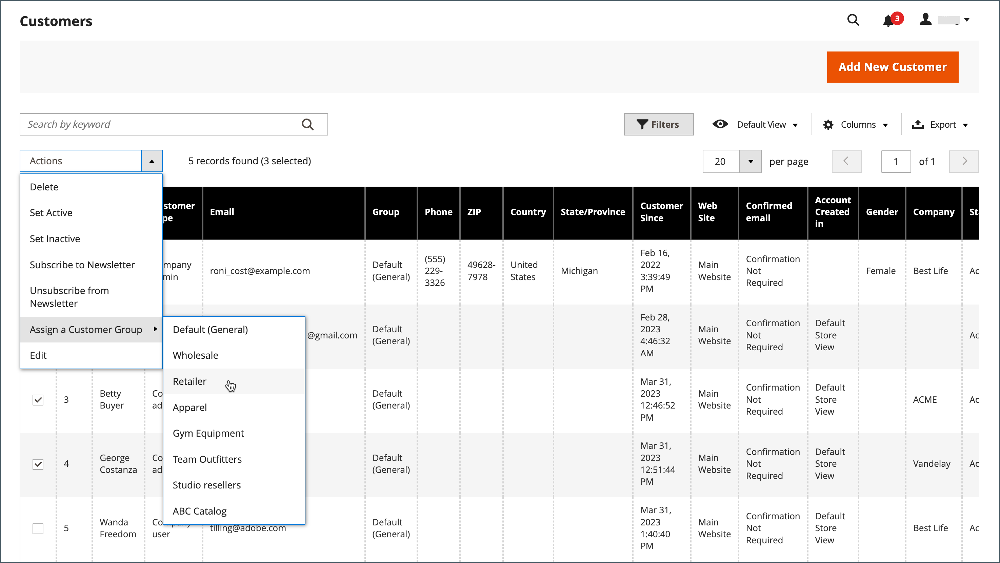

# 고객 그룹

고객 그룹은 사용할 수 있는 할인 및 그룹과 연관된 세금 분류를 결정합니다. 기본 고객 그룹은 다음과 같습니다 `General`, `Not Logged In`, 및 `Wholesale`.

{width="700" zoomable="yes"}

## 필터 [!UICONTROL Customer Groups] 목록

1. 다음에서 _관리자_ 사이드바, 이동 **[!UICONTROL Customers]** > **[!UICONTROL Customer Groups]**.

1. 클릭 **[!UICONTROL Filters]**.

1. ID 범위, 그룹 또는 세금 분류를 포함한 그룹 검색 기준을 입력합니다.

   {width="600" zoomable="yes"}

1. 완료되면 다음을 클릭하십시오. **[!UICONTROL Apply Filters]**.

## 고객 그룹 만들기

>[!NOTE]
>
>모든 웹 사이트에 대한 액세스 권한이 없는 관리자 사용자(&#39;사용자 지정&#39;이 있는 역할이 할당됨) [!UICONTROL Role Scope])은 고객 그룹을 생성, 수정 또는 삭제할 수 없습니다.

1. 다음에서 _관리자_ 사이드바, 이동 **[!UICONTROL Customers]** > **[!UICONTROL Customer Groups]**.

1. 클릭 **[!UICONTROL Add New Customer Group]**.

1. 대상 [!DNL **Group Name]** 그룹을 식별하려면 32자 미만의 고유 이름을 입력하십시오.

1. 다음 항목 선택 **[!UICONTROL Tax Class]** 그룹에 적용됩니다.

   {width="600" zoomable="yes"}

1. 다음 항목 선택 **[!UICONTROL Excluded Website(s)]** 그룹에서 제외할 그룹입니다.

   >[!IMPORTANT]
   >
   >제외된 웹 사이트는 인덱싱되지 않으므로 웹 사이트를 제외하면 제품 가격 및 카탈로그 규칙 인덱싱 시간이 줄어들 수 있습니다. 고객 그룹을 웹 사이트 제외가 추가된 상태로 저장하면 제품 가격, 카탈로그 규칙 및 카탈로그 검색 인덱스가 무효화됩니다. 제품, 웹 사이트 및 고객 그룹이 많은 경우 고객 그룹에서 웹 사이트를 제외할 때까지 색인 재지정 프로세스를 일시 중지하는 것이 좋습니다.

   기본적으로 제외되는 웹 사이트가 없습니다. 여러 값을 선택하려면 _Ctrl_ 키(PC) 또는 _명령_ 키(Mac)를 입력하고 각 옵션을 클릭합니다.

1. 완료되면 다음을 클릭하십시오. **[!UICONTROL Save Customer Group]**.

## 고객 그룹 편집

1. 다음에서 _관리자_ 사이드바, 이동 **[!UICONTROL Customers]** > **[!UICONTROL Customer Groups]**.

1. 편집 모드로 레코드를 엽니다.

1. 필요한 사항을 변경합니다.

1. 완료되면 다음을 클릭하십시오. **[!UICONTROL Save Customer Group]**.

## 고객을 다른 그룹에 할당

>[!NOTE]
>
>회사 그룹을 변경한 후, 회사 사용자는 로그아웃하고 Storefront에 로그인하여 카탈로그에서 새로운 가격을 확인해야 합니다.

1. 다음에서 _관리자_ 사이드바, 이동 **[!UICONTROL Customers]** > **[!UICONTROL All Customers]**.

1. 목록에서 고객을 찾고 첫 번째 열에서 확인란을 선택합니다.

1. 설정 **작업** 제어 대상 `Assign a Customer Group` 메뉴에서 그룹을 선택합니다.

   {width="600" zoomable="yes"}

1. 확인을 묻는 메시지가 나타나면 **확인**.

## 특정 할인과 고객 그룹 연결

1. 다음에서 _관리자_ 사이드바, 이동 **[!UICONTROL Marketing]** > _프로모션_ > **[!UICONTROL Cart Price Rules]**.

1. 반제 할인에 대한 그룹을 연관시킬 장바구니 가격 규칙을 선택하거나 [가격 규칙 만들기](../merchandising-promotions/price-rules-catalog.md).

1. 규칙이 적용되는 고객 그룹을 선택합니다.

   {width="600" zoomable="yes"}

1. 클릭 **[!UICONTROL Save]**.

>[!NOTE]
>
> 사전 가격을 사용하여 고객 그룹에 제품 할인을 적용할 수도 있습니다. 다음을 참조하십시오 [고급 가격 책정](../catalog/product-price-group.md).

## 고객 그룹 삭제

1. 다음에서 _관리자_ 사이드바, 이동 **[!UICONTROL Customers]** > **[!UICONTROL Customer Groups]**.

1. 편집 모드로 레코드를 엽니다.

1. 단추 모음에서 **[!UICONTROL Delete Customer Group]**.

1. 확인을 묻는 메시지가 나타나면 **확인**.

## 고객 그룹 데모

이 데모를 시청하여 고객 그룹을 만드는 방법에 대해 알아보십시오.

>[!VIDEO](https://video.tv.adobe.com/v/343660/?quality=12)
