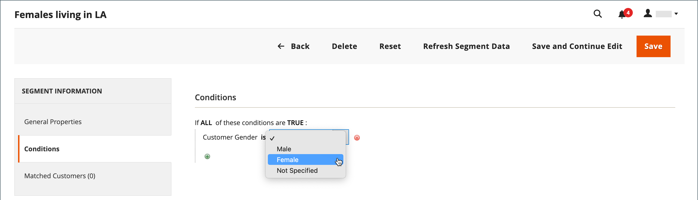
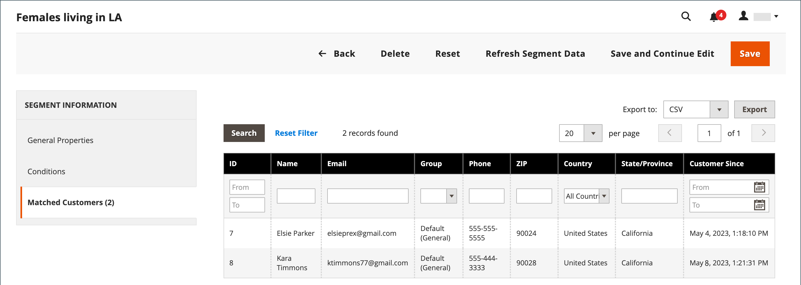

# 고객 세그먼트 만들기 및 삭제

{{ee-feature}}

옵션에 [고객 세그먼트별 특성](../customers/customer-segments.md)이 포함되어 있다는 점을 제외하면 고객 세그먼트를 만드는 것은 [장바구니 가격 규칙](../merchandising-promotions/price-rules-cart.md)을 만드는 것과 비슷합니다.

{width="700" zoomable="yes"}

_&#x200B;**[!UICONTROL Customer Segments]눈금&#x200B;**&#x200B;_

| 열 | 설명 |
|--- |--- |
| **[!UICONTROL ID]** | 고객 세그먼트에 대한 고유 ID. |
| **[!UICONTROL Segment]** | 고객 세그먼트의 이름입니다. |
| **[!UICONTROL Status]** | 고객 세그먼트가 _[!UICONTROL Active]_&#x200B;인지&#x200B;_[!UICONTROL Inactive]_&#x200B;인지를 나타냅니다. |
| **[!UICONTROL Website]** | 고객 세그먼트가 속한 웹 사이트를 나타냅니다. |

{style="table-layout:auto"}

## 전제 조건: 고객 세그먼트 활성화

1. _관리자_ 사이드바에서 **[!UICONTROL Stores]** > _[!UICONTROL Settings]_>**[!UICONTROL Configuration]**(으)로 이동합니다.

1. 왼쪽 패널에서 **[!UICONTROL Customers]**&#x200B;을(를) 확장하고 **[!UICONTROL Customer Configuration]**&#x200B;을(를) 선택합니다.

1. **[!UICONTROL Customer Segments]** 섹션을 확장합니다.

1. **[!UICONTROL Enable Customer Segment Functionality]**&#x200B;이(가) `Yes`(으)로 설정되어 있는지 확인하십시오.

   {width="600" zoomable="yes"}

1. (선택 사항) 고객 세그먼트에 대한 실시간 유효성 검사를 비활성화하려면 **[!UICONTROL Real-time Check if Customer is Matched by Segment]**&#x200B;을(를) `No`(으)로 설정하십시오.

   실시간 유효성 검사를 비활성화하면 단일 결합 조건 SQL 쿼리를 통해 고객 세그먼트의 유효성이 검사됩니다. 이 기능을 비활성화하면 시스템에 고객 세그먼트가 많은 경우 세그먼트 유효성 검사 성능이 향상됩니다. 그러나 분할 데이터베이스나 등록된 고객이 없는 경우에는 유효성 검사가 작동하지 않습니다.

1. 완료되면 **[!UICONTROL Save Config]**&#x200B;을(를) 클릭합니다.

## 세그먼트 만들기

다음 단계에서는 Los Angeles의 여성 고객을 타겟팅하는 고객 세그먼트를 만드는 예를 사용합니다.

### 1단계: 고객 세그먼트 추가

1. _관리자_ 사이드바에서 **[!UICONTROL Customers]** > **[!UICONTROL Segments]**(으)로 이동합니다.

1. 오른쪽 상단에서 **[!UICONTROL Add Segment]**&#x200B;을(를) 클릭합니다.

1. 관리자에서 작업할 때 고객 세그먼트를 식별하는 **[!UICONTROL Segment Name]**&#x200B;을(를) 입력하십시오.

1. 세그먼트의 목적을 설명하는 간단한 **[!UICONTROL Description]**&#x200B;을(를) 입력하십시오.

1. 고객 세그먼트를 사용할 수 있는 웹 사이트로 **[!UICONTROL Assigned to Website]**&#x200B;을(를) 설정합니다.

1. **[!UICONTROL Status]**&#x200B;을(를) _활성_ 또는 _비활성_(으)로 설정하십시오.

1. 세그먼트를 적용하는 데 사용할 고객 유형을 식별하려면 **[!UICONTROL Apply to]**&#x200B;을(를) 다음 중 하나로 설정하십시오.

   - `Visitors and Registered Customers` - 계정에 로그인했는지 여부에 관계없이 모든 쇼핑객이 포함됩니다.
   - `Registered Customers` - 계정에 로그인한 쇼핑객만 포함합니다.
   - `Visitors` - 계정에 로그인하지 않은 쇼핑객만 포함합니다.

   >[!TIP]
   >
   >고객 계정에 저장된 고객 속성을 기반으로 세그먼트를 만드는 경우 등록된 고객에게만 세그먼트를 적용하는 것이 좋습니다.

   >[!NOTE]
   >
   > 세그먼트가 `Visitors and Registered Customers`에 적용되면 [!UICONTROL Matched Customers]에 `Registered Customers`만 표시됩니다. 이는 방문자에게 적용되는 조건을 기반으로 방문자를 타깃팅할 수 있는 경우에도 마찬가지입니다. `Visitors`개의 세그먼트만 표시할 경우 `Matched Customers` 탭이 표시되지 않습니다.

1. **[!UICONTROL Save and Continue Edit]**&#x200B;을(를) 클릭합니다.

   _[!UICONTROL General Properties]_&#x200B;세그먼트를 저장한 후 왼쪽 패널에서 추가 옵션을 사용할 수 있습니다.

   {width="600" zoomable="yes"}

**_[!UICONTROL General Properties]_**

| 필드 | 설명 |
|--- |---|
| **[!UICONTROL Segment Name]** | 내부 참조용 세그먼트를 식별하는 이름입니다. |
| **[!UICONTROL Description]** | 내부 참조를 위해 세그먼트의 용도를 설명하는 간단한 설명입니다. |
| **[!UICONTROL Assigned to Website]** | 세그먼트를 사용할 수 있는 단일 웹 사이트입니다. |
| **[!UICONTROL Status]** | 세그먼트를 활성화하고 비활성화합니다. 세그먼트가 비활성화되면 연결된 모든 가격 규칙 및 배너가 비활성화됩니다. 옵션: `Active` / `Inactive` |
| **[!UICONTROL Apply to]** | 세그먼트가 적용되는 고객 유형을 정의합니다. 이 선택은 세그먼트를 만드는 데 사용할 수 있는 조건 세트에 영향을 줍니다. 세그먼트를 저장한 후에는 설정을 변경할 수 없습니다. |

{style="table-layout:auto"}

### 2단계: 조건 정의

>[!NOTE]
>
> 방문자의 경우 장바구니 조건(장바구니 소계 금액, 장바구니 라인 항목 및 장바구니 제품 수량), 제품 규칙(장바구니 및 제품 내역에 있는 제품) 및 이러한 항목의 조합만 적용할 수 있습니다. 세그먼트가 방문자와 등록된 고객 모두에 적용되어야 하는 경우 방문자는 나열된 조건만 기준으로 추적됩니다.

1. 왼쪽 창에서 **[!UICONTROL Conditions]**&#x200B;을(를) 클릭합니다.

   기본 조건은 페이지에서 _[!UICONTROL If ALL of these conditions are TRUE:]_(으)로 시작합니다.

   {width="600" zoomable="yes"}

1. 여성 고객을 타겟팅하는 조건을 만듭니다.

   - **[!UICONTROL Add]** 아이콘을 클릭하여 조건 목록을 표시하고 `Gender`을(를) 선택합니다.

   - 기본 **is** 조건 제어 옵션을 그대로 둡니다.

   - **..**&#x200B;을(를) 클릭하고 `female`을(를) 선택합니다.

   {width="600" zoomable="yes"}

1. Los Angeles 거주자를 타겟팅하는 다른 조건을 만듭니다.

   - 다음 줄에서 **[!UICONTROL Add]** 아이콘을 클릭하고 `Customer Address`을(를) 선택합니다.

     이 작업은 일치시킬 하나 이상의 주소 필드를 정의할 수 있는 상위 조건을 만듭니다.

   - **[!UICONTROL Add]** 아이콘을 클릭하여 주소 필드 목록을 표시하고 `City`을(를) 선택합니다.

   - **is**&#x200B;을(를) 클릭하여 조건 제어 옵션을 표시하고 `contains`을(를) 선택합니다.

   - **..**&#x200B;을(를) 클릭하고 `Los Angeles`을(를) 입력하십시오.

   - 다음 줄에서 **[!UICONTROL Add]** 아이콘을 클릭하고 `State/Province`을(를) 선택합니다.

   - 기본 **is** 조건 제어 옵션을 그대로 둡니다.

   - **..**&#x200B;을(를) 클릭하고 `United States > California`을(를) 선택합니다.

   {width="600" zoomable="yes"}

1. **[!UICONTROL Save and Continue Edit]**&#x200B;을(를) 클릭합니다.

### 3단계: 일치하는 고객 목록 검토

1. 왼쪽 창에서 **[!UICONTROL Matched Customers]**&#x200B;을(를) 클릭하여 조건에 일치하는 모든 고객을 표시합니다.

   {width="600" zoomable="yes"}

1. 고객 목록이 목표를 달성하면 **[!UICONTROL Save]**&#x200B;을(를) 클릭하여 고객 세그먼트를 완료합니다.

1. 이제 고객 세그먼트를 타겟팅 프로모션, 콘텐츠 및 메일링에 사용할 수 있습니다.

_&#x200B;**[!UICONTROL Matched Customers]눈금&#x200B;**&#x200B;_

| 열 | 설명 |
|--- |--- |
| **[!UICONTROL ID]** | 등록된 고객의 고객 ID입니다. |
| **[!UICONTROL Name]** | 등록된 고객의 이름입니다. |
| **[!UICONTROL Email]** | 등록된 고객의 이메일 주소입니다. |
| **[!UICONTROL Group]** | 고객이 할당된 고객 그룹. |
| **[!UICONTROL Phone]** | 고객 전화번호. |
| **[!UICONTROL ZIP]** | 고객의 우편 번호입니다. |
| **[!UICONTROL Country]** | 고객이 있는 국가입니다. |
| **[!UICONTROL State / Province]** | 고객이 있는 시/도. |
| **[!UICONTROL Customer Since]** | 고객 계정이 생성된 날짜와 시간입니다. |

{style="table-layout:auto"}

## 고객 세그먼트 제거

1. _관리자_ 사이드바에서 **[!UICONTROL Customers]** > **[!UICONTROL Segments]**(으)로 이동합니다.

1. 삭제할 세그먼트를 찾아 선택합니다.

1. 메뉴 모음에서 **[!UICONTROL Delete]** 단추를 클릭합니다.

1. 작업을 확인하려면 **[!UICONTROL OK]**&#x200B;을(를) 클릭합니다.

## 단추 막대

| 단추 | 설명 |
|--- |--- |
| **[!UICONTROL Back]** | 변경 내용을 저장하지 않고 _[!UICONTROL Customer Segments]_&#x200B;페이지로 돌아갑니다. |
| **[!UICONTROL Delete]** | 현재 고객 세그먼트를 삭제합니다. 세그먼트의 고객과 연관된 고객 또는 완료된 주문은 제거되지 않습니다. |
| **[!UICONTROL Reset]** | 고객 세그먼트 양식에서 저장되지 않은 변경 사항을 이전 값으로 재설정합니다. |
| **[!UICONTROL Refresh Segment Data]** | 세그먼트 데이터를 가장 최근에 저장된 값으로 새로 고칩니다. 세그먼트 데이터를 사용할 수 없거나 오래된 경우 관련성이 있습니다. |
| **[!UICONTROL Save and Continue Edit]** | 변경 사항을 저장하고 고객 세그먼트를 열어 둡니다. |
| **[!UICONTROL Save]** | 변경 사항을 저장하고 고객 세그먼트를 닫습니다. |

{style="table-layout:auto"}

## 고객 세그먼트 데모

고객 세그먼트 만들기에 대한 시연은 이 비디오 를 참조하십시오.

>[!VIDEO](https://video.tv.adobe.com/v/343659/?quality=12&learn=on)
