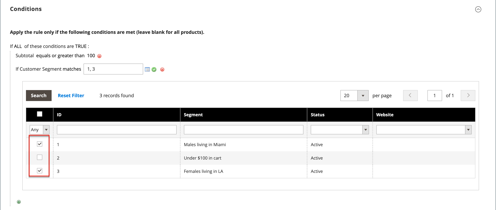

# 가격 규칙의 고객 세그먼트

{{ee-feature}}

고객 세그먼트를 [장바구니 가격 규칙](../merchandising-promotions/price-rules-cart.md)과 연결하여 타깃팅된 프로모션에 사용할 수 있습니다.

{width="700" zoomable="yes"}

_&#x200B;**세그먼트를 장바구니 가격 규칙에 연결하려면:**&#x200B;_

1. _관리자_ 사이드바에서 **[!UICONTROL Marketing]** > _프로모션_ > **[!UICONTROL Cart Price Rules]**(으)로 이동합니다.

1. 새 규칙 또는 기존 규칙을 엽니다.

   * 새 규칙을 사용하려면 오른쪽 상단의 **[!UICONTROL Add New Rule]**&#x200B;을(를) 클릭합니다.
   * 기존 규칙을 사용하려면 목록에서 규칙을 클릭하여 편집 모드로 엽니다.

1. 아래로 스크롤하여 **[!UICONTROL Conditions]** 섹션을 확장합니다.

1. 조건을 추가합니다.

   * 조건 목록을 표시하는 _추가_() 아이콘을 클릭합니다. **[!UICONTROL Customer Segment]**&#x200B;을(를) 선택합니다.

   {width="600" zoomable="yes"}

   기본적으로 조건은 일치하는 조건을 찾도록 설정됩니다. 필요한 경우 **[!UICONTROL matches]** 링크를 클릭하고 연산자를 다음 중 하나로 변경합니다.

   * `does not match`
   * `is one of`
   * `is not one of`

   {width="600" zoomable="yes"}

1. 특정 세그먼트를 타겟팅하려면 기타 **..** 링크를 클릭하여 추가 옵션을 표시합니다. 그런 다음 _선택기_() 아이콘을 클릭하여 고객 세그먼트 목록을 표시합니다.

1. 목록에서 조건을 타겟팅할 각 세그먼트의 확인란을 선택합니다.

   {width="600" zoomable="yes"}

1. 선택한 고객 세그먼트를 조건에 배치하려면 **[!UICONTROL Select]**&#x200B;을(를) 클릭하십시오.

1. 필요에 따라 나머지 가격 규칙을 완료합니다.

1. 완료되면 **[!UICONTROL Save]**&#x200B;을(를) 클릭합니다.
