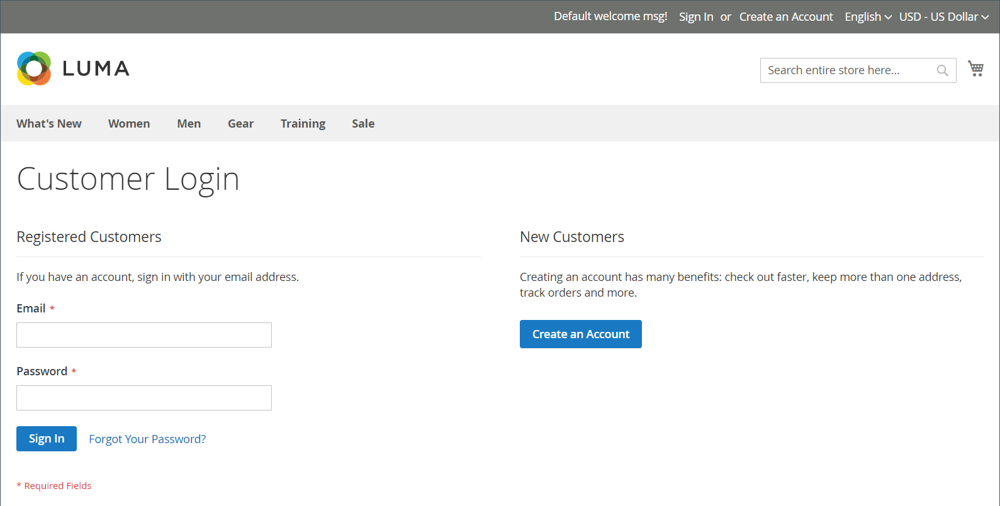
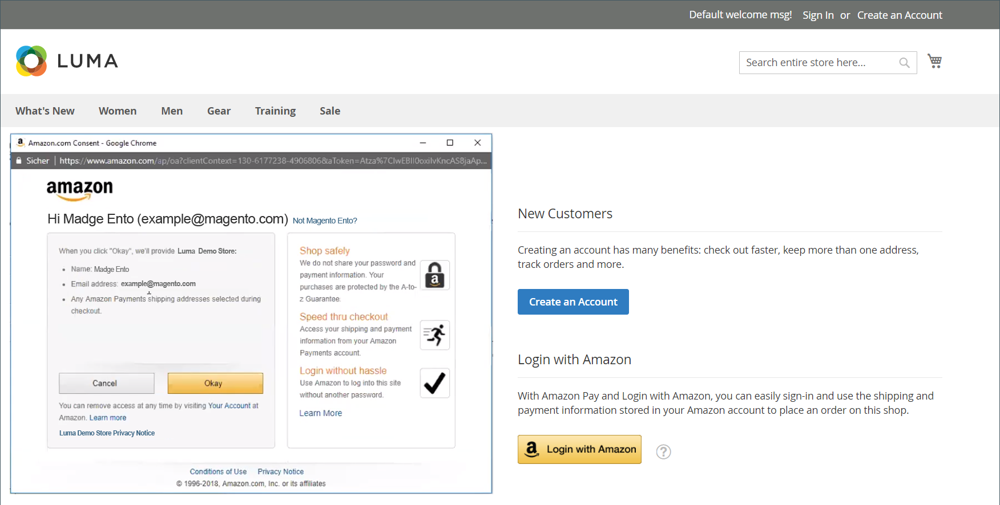

# 고객 로그인

고객은 스토어의 모든 페이지에서 계정에 쉽게 액세스할 수 있습니다. [구성](../customers/account-options-new.md)에 따라 고객이 계정 대시보드로 리디렉션되거나 계정에 로그인한 후 쇼핑을 계속할 수 있습니다.

구성에서 [CAPTCHA](../systems/security-captcha.md)을(를) 사용하도록 설정한 경우 해당 사용자는 계정에 액세스하기 전에 자신이 사람인지 확인하는 테스트를 올바르게 완료해야 합니다.

고객이 암호를 잊어버리면 계정과 연결된 이메일 주소로 재설정 링크가 전송됩니다. [암호 옵션](../customers/password-options.md) 구성은 로그인 시도에 대한 고객 환경을 제어합니다.

- 고객이 암호를 입력할 수 있는 횟수
- 시도 간격(분)
- 계정이 잠기기 전 총 시도 횟수
- 잠금 기간

{width="700" zoomable="yes"}

## 고객 계정에 로그인

1. 스토어 헤더에서 고객이 **[!UICONTROL Sign in]**&#x200B;을(를) 클릭합니다.

   {width="700" zoomable="yes"}

1. **[!UICONTROL Email]** 주소 및 **[!UICONTROL Password]**&#x200B;을(를) 입력합니다.

1. **[!UICONTROL Sign in]**&#x200B;을(를) 클릭합니다.

   >[!IMPORTANT]
   >
   >암호를 기억할 수 없는 경우 고객은 **[!UICONTROL Forgot Your Password?]**&#x200B;을(를) 클릭하고 [지침](../customers/password-reset.md)에 따라 암호를 재설정할 수 있습니다.

## 고객 로그인 후 계정 대시보드로 리디렉션을 설정합니다.

고객이 로그인하거나 쇼핑을 계속할 수 있도록 스토어를 구성하여 계정 대시보드로 리디렉션할 수 있습니다.

1. _관리자_ 사이드바에서 **[!UICONTROL Stores]** > _[!UICONTROL Settings]_>**[!UICONTROL Configuration]**(으)로 이동합니다.

1. 왼쪽 패널에서 **[!UICONTROL Customers]**&#x200B;을(를) 확장하고 **[!UICONTROL Customer Configuration]**&#x200B;을(를) 선택합니다.

1. **[!UICONTROL Login Options]** 섹션을 확장합니다.

1. **[!UICONTROL Redirect Customer to Account Dashboard after Logging in]**&#x200B;을(를) 다음 중 하나로 설정합니다.

   - `Yes` - 고객이 계정에 로그인하면 계정 대시보드가 나타납니다.
   - `No` - 고객은 계정에 로그인한 후 계속 쇼핑을 할 수 있습니다.

1. 완료되면 **[!UICONTROL Save Config]**&#x200B;을(를) 클릭합니다.

## Amazon으로 로그인

구성된 [!DNL Amazon Pay] 및 [!DNL Login with Amazon] 통합을 사용하는 스토어의 경우 고객은 Amazon 구매자 계정에 로그인할 수 있습니다.

1. 스토어 헤더에서 고객이 **[!UICONTROL Sign in]**&#x200B;을(를) 클릭합니다.

1. **[!UICONTROL Login with Amazon]**&#x200B;을(를) 클릭합니다.

   {width="700" zoomable="yes"}

1. 로그인하라는 메시지가 표시되면 고객이 Amazon 구매자 계정의 **[!UICONTROL email address]** 및 **[!UICONTROL password]**&#x200B;을(를) 입력합니다.

   {width="700" zoomable="yes"}

1. 구매를 처리할 때 스토어와 계정의 다음 정보를 공유할 수 있는 Amazon 권한을 부여하려면 **확인**&#x200B;을 클릭합니다.

   - 이름
   - 이메일 주소
   - 배송 주소

   {width="700" zoomable="yes"}

## 고객 계정에서 로그아웃

1. _[!UICONTROL Welcome, Customer Name!]_옆의 오른쪽 상단 모서리에서 고객이&#x200B;**[!UICONTROL v]**메뉴 선택기를 클릭합니다.

1. **[!UICONTROL Sign Out]**&#x200B;을(를) 선택하십시오.

로그아웃 후 고객은 홈페이지로 리디렉션됩니다.
