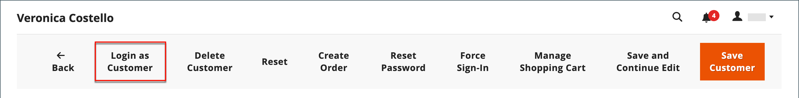
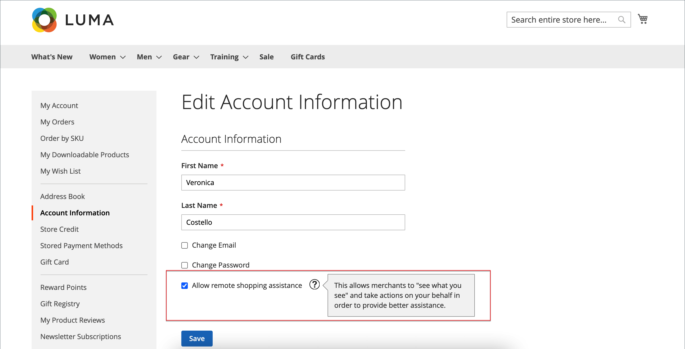

# 쇼핑객 지원 제공

고객은 때때로 주문에 대한 도움이 필요합니다. 스토어 관리자는 _고객으로 로그인_&#x200B;을 사용하여 고객이 보는 항목을 보고 업데이트할 수 있습니다.

고객으로 로그인된 상태에서 수행한 모든 작업은 실제 고객의 계정에 적용됩니다.

_관리자_ 사용자에 대해 _[!UICONTROL Login as Customer]_&#x200B;단추가 활성화되면 여러 페이지에 표시됩니다.

* [고객 편집 페이지](../customers/update-account.md)
* [주문 보기 페이지](../stores-purchase/order-processing.md)
* [송장 보기 페이지](../stores-purchase/invoices.md)
* [배송 조회 페이지](../stores-purchase/shipments.md)
* [대변 메모 보기 페이지](../stores-purchase/credit-memo-create.md)

{width="600" zoomable="yes"}

## 고객으로 로그인 활성화

_고객으로 로그인_&#x200B;을(를) 활성화하려면 Commerce 인스턴스에서 기능을 활성화한 다음 사용자 역할 권한에서 관리자 사용자에 대한 액세스를 활성화해야 합니다.

### 기능 활성화

1. 관리 사이드바에서 **[!UICONTROL Stores]** > _[!UICONTROL Settings]_>**[!UICONTROL Configuration]**(으)로 이동합니다.

1. 왼쪽 패널에서 **[!UICONTROL Customers]**&#x200B;을(를) 확장하고 **[!UICONTROL Login as Customer]**&#x200B;을(를) 선택합니다.

   {width="600" zoomable="yes"}

1. **[!UICONTROL Enable Login as Customer]**&#x200B;을(를) `Yes`(으)로 설정합니다.

1. _(선택 사항)_ 관리자 사용자가 고객으로 로그인할 때 페이지 캐시를 활성화하려면 **[!UICONTROL Disable Page Cache for Admin User]**&#x200B;을(를) `No`(으)로 설정합니다.

   >[!WARNING]
   >
   > 페이지 캐시(`Yes` - 기본값)를 비활성화하면 사용자로 로그인한 사용자가 캐시되지 않은 새 데이터를 받게 됩니다.

1. _(선택 사항)_ 다중 사이트 및/또는 다중 스토어 설정이 있고 관리자로 로그인할 때 관리자가 스토어 보기를 선택하게 하려면 **[!UICONTROL Store View to Log in]**&#x200B;을(를) `Manual Selection`(으)로 설정합니다.

1. 완료되면 **[!UICONTROL Save Config]**&#x200B;을(를) 클릭합니다.

### 관리 사용자에 대한 액세스 활성화

1. _관리자_ 사이드바에서 **[!UICONTROL System]** > _권한_ > **[!UICONTROL User Roles]**(으)로 이동합니다.

1. 목록에서 역할을 클릭합니다.

1. [!UICONTROL _역할 정보_] 왼쪽 패널에서 **[!UICONTROL Role Resources]**&#x200B;을(를) 클릭합니다.

1. 페이지의 **[!UICONTROL Role Resources]**&#x200B;을(를) `Custom`(으)로 변경합니다.

   >[!INFO]
   >
   > 이 옵션을 선택하면 페이지에 리소스 계층 구조가 표시됩니다.

1. **[!UICONTROL Customers]** 상위 항목 및 그 아래의 **[!UICONTROL Login as Customer]** 항목으로 스크롤합니다. 그런 다음 역할에 대해 활성화할 리소스를 선택합니다.

   * **[!UICONTROL Allow Login as Customer]** - 관리자가 _고객으로 로그인_ 기능을 사용할 수 있습니다.
   * **[!UICONTROL View Login as Customer Log]** - 관리자가 _고객으로 로그인_ 로그를 볼 수 있습니다.

   {width="400" zoomable="yes"}

1. **[!UICONTROL Save Role]**&#x200B;을(를) 클릭합니다.

## 관리자에서 고객으로 로그인

1. _관리자_ 사이드바에서 **[!UICONTROL Customers]** > [!UICONTROL _모든 고객_] (으)로 이동합니다.

1. 편집 모드에서 사용자를 엽니다.

1. **[!UICONTROL Customer Information]** 패널에서 **[!UICONTROL Account Information]** 섹션을 선택합니다.

1. **[!UICONTROL Allow remote shopping assistance]**&#x200B;을(를) `Yes`(으)로 설정합니다.

   >[!INFO]
   >
   >이제 관리자는 상점 첫 화면에서 권한 없이 사용자로 로그인할 수 있습니다.

## 원격 쇼핑 지원을 위한 고객 계정 권한

관리자의 스토어 지원 직원에 대한 계정 액세스를 활성화하려면 고객은 자신의 계정에 대해 기능을 활성화해야 합니다.

1. 고객이 **[!UICONTROL Account Information]** 페이지로 이동합니다.

1. **[!UICONTROL Allow remote shopping assistance]** 확인란을 선택합니다.

1. 고객이 **[!UICONTROL Save]**&#x200B;을(를) 클릭합니다.

{width="700" zoomable="yes"}

>[!WARNING]
>
>이 권한이 없으면 관리자 사용자는 이 고객으로 로그인할 수 없습니다.

## 고객으로 로그인 사용

>[!INFO]
>
>_고객으로 로그인_&#x200B;을 사용하려면 관리자가 앞에서 설명한 대로 구성되어 있는지 확인하십시오.

_고객으로 로그인_&#x200B;을 통해 고객처럼 사이트를 볼 수 있으며 문제를 해결하고 고객을 위해 다른 조치를 취할 수 있습니다. 필요한 권한이 있는 할당된 사용자 역할이 있는 경우:

1. 이전 섹션에 나열된 페이지에서 **[!UICONTROL Login as Customer]**&#x200B;을(를) 클릭합니다.
1. 고객으로 로그인 작업은 작업 보고서에서 사용할 수 있습니다.

>[!WARNING]
>
>[!UICONTROL _as Customer_]&#x200B;에 로그인하는 동안 수행한 모든 작업(예: 제품 추가/제거)이 실제 고객의 주문에 적용됩니다. `logged in as customer_name`일 때 상점 앞에는 특수 상태를 알리는 배너가 표시됩니다.

## 고객 로그인으로 로그인

{{ee-feature}}

Adobe Commerce은 _고객으로 로그인_ 작업에 대한 로깅을 제공합니다. 이 목록에는 관리 사용자가 기능에 액세스하는 모든 세션이 나열됩니다. 기록된 작업에 액세스하려면 [관리자 작업 보고서](../systems/action-log-report.md)(으)로 이동하십시오.

보고서 설정 **[!UICONTROL Action Group]**&#x200B;을(를) `Login As Customer`(으)로 필터링하고 **[!UICONTROL Search]**&#x200B;을(를) 클릭할 수 있습니다.

{width="700" zoomable="yes"}
