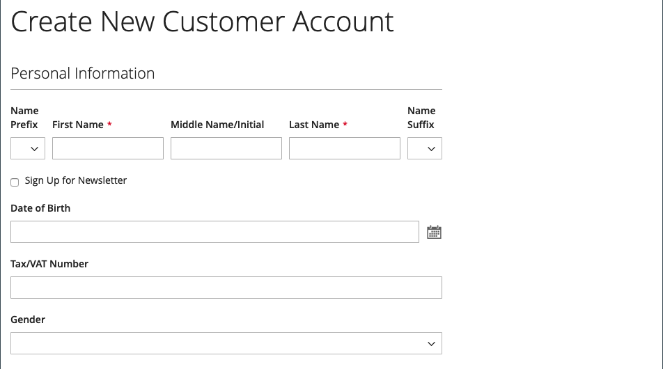

# 고객 이름 및 주소 옵션

_이름 및 주소 옵션_&#x200B;은(는) 고객이 스토어로 [계정](../customers/account-create.md)을(를) 만들 때 이름 및 주소 양식에 포함할 필드를 결정합니다.

{width="500" zoomable="yes"}

이름 및 주소 옵션을 구성하는 단계는 Adobe Commerce 및 Magento Open Source에 따라 다릅니다.

## Adobe Commerce에 대한 이름 및 주소 옵션 구성

고객이 계정을 만들 때 상점 첫 화면에서 표시되는 이름과 주소 옵션을 구성할 수 있습니다.

### 1단계: 구성 범위 설정

1. _관리자_ 사이드바에서 **[!UICONTROL Stores]** > _[!UICONTROL Settings]_>**[!UICONTROL Configuration]**(으)로 이동합니다.

1. 왼쪽 패널에서 **[!UICONTROL Customers]**&#x200B;을(를) 확장하고 **[!UICONTROL Customer Configuration]**&#x200B;을(를) 선택합니다.

1. **[!UICONTROL Name and Address Options]** 섹션을 확장합니다.

   >[!INFO]
   >
   >이름 및 주소 옵션의 범위는 `website` 수준에서 적용됩니다.

1. 페이지 맨 위로 스크롤하고 구성 범위를 다음 중 하나로 설정합니다.

   - `Default Config`
   - `Main Website`(또는 다중 사이트 설치용 특정 사이트)

   >[!INFO]
   >
   >범위가 `Default Store View`(으)로 설정되어 있으면 _[!UICONTROL Name and Address Options]_섹션이 표시되지 않습니다.

   {width="700" zoomable="yes"}

### 2단계: 이름 및 주소 옵션 구성

1. 고객 구성 페이지의 [!UICONTROL _이름 및 주소 옵션_] 섹션으로 돌아갑니다.

   >[!INFO]
   >
   > `Default config` 범위 설정을 사용하지 않는 경우 값을 변경하기 전에 각 필드에 대한 `Use Default` 확인란의 선택을 취소해야 합니다.

   {width="600" zoomable="yes"}

1. **[!UICONTROL Prefix Dropdown Options]**&#x200B;의 경우 목록에 표시할 각 접두사를 세미콜론으로 구분하여 입력하십시오.

   >[!IMPORTANT]
   >
   >목록의 맨 위에 빈 값을 표시하려면 첫 번째 값 앞에 세미콜론을 넣습니다.

1. **[!UICONTROL Suffix Dropdown Options]**&#x200B;의 경우 목록에 표시할 각 접미사를 세미콜론으로 구분하여 입력합니다.

1. 고객 양식에 다음 필드를 포함하려면 필요에 따라 각 값을 `Optional` 또는 `Required`(으)로 설정하십시오.

   - **[!UICONTROL Show Telephone]**
   - **[!UICONTROL Show Company]**
   - **[!UICONTROL Show Fax]**

### 3단계: 저장 및 새로 고침

1. 완료되면 **[!UICONTROL Save Config]**&#x200B;을(를) 클릭합니다.

1. 페이지 맨 위에 있는 메시지에서 **[!UICONTROL Cache Management]** 및 [새로 고침](../systems/cache-management.md)을 클릭합니다.

## Magento Open Source에 대한 이름 및 주소 옵션 구성

고객이 계정을 만들 때 상점 첫 화면에서 표시되는 이름과 주소 옵션을 구성합니다.

{width="500" zoomable="yes"}

### 1단계: 구성 범위 설정

1. _관리자_ 사이드바에서 **[!UICONTROL Stores]** > _[!UICONTROL Settings]_>**[!UICONTROL Configuration]**(으)로 이동합니다.

1. 왼쪽 패널에서 **[!UICONTROL Customers]**&#x200B;을(를) 확장하고 **[!UICONTROL Customer Configuration]**&#x200B;을(를) 선택합니다.

1. **[!UICONTROL Name and Address Options]** 섹션을 확장합니다.

   >[!IMPORTANT]
   >
   > 이름 및 주소 옵션의 범위는 `website` 수준에서 적용됩니다.

   {width="600" zoomable="yes"}

1. 페이지 맨 위로 스크롤하여 구성 범위를 다음 중 하나로 설정합니다.

   - `Default Config`
   - `Main Website`(또는 다중 사이트 설치용 특정 사이트)

   >[!NOTE]
   >
   >범위가 `Default Store View`(으)로 설정되어 있으면 _이름 및 주소 옵션_ 섹션이 표시되지 않습니다.

   {width="600" zoomable="yes"}

### 2단계: 이름 및 주소 옵션 구성

1. 고객 구성 페이지의 [!UICONTROL _이름 및 주소 옵션_] 섹션으로 돌아갑니다.

   >[!INFO]
   >
   >`Default config` 범위 설정을 사용하지 않는 경우 값을 변경하기 전에 각 필드에 대한 `Use Default` 확인란의 선택을 취소해야 합니다.

1. **일반 주소의 줄 수**&#x200B;에 대해 1에서 4까지의 숫자를 입력하세요.

   >[!WARNING]
   >
   >기본적으로 상세 주소는 세 줄입니다.

1. Mr 또는 Ms와 같은 접두사를 이름의 일부로 포함하려면 **접두사 표시**&#x200B;를 `Yes`(으)로 설정하십시오.

   {width="600" zoomable="yes"}

   >[!INFO]
   >
   >**접두사 드롭다운 옵션**&#x200B;의 경우 목록에 표시할 각 접두사를 세미콜론으로 구분하여 입력하십시오. 첫 번째 값 앞에 세미콜론을 배치하여 목록의 맨 위에 빈 값을 표시할 수 있습니다.

1. 고객의 중간 이름 또는 이니셜에 대한 선택적 필드를 포함하려면 **[!UICONTROL Show Middle Name (initial)]**&#x200B;을(를) `Yes`(으)로 설정하십시오.

1. 접미사(예: Jr.) 포함 또는 Sr.) 고객 이름 뒤에 **[!UICONTROL Show Suffix]**&#x200B;을(를) 다음 중 하나로 설정합니다.

   - `Optional`
   - `Required`

   >[!INFO]
   >
   >**접미사 드롭다운 옵션**&#x200B;의 경우 목록에 표시할 각 접미사를 세미콜론으로 구분하여 입력하십시오. 첫 번째 값 앞에 세미콜론을 배치하여 목록의 맨 위에 빈 값을 표시할 수 있습니다.

1. 생년월일을 포함하려면 **[!UICONTROL Show Date of Birth]**&#x200B;을(를) 다음 중 하나로 설정하십시오.

   - `Optional`
   - `Required`

   >[!INFO]
   >
   >현재 보안 및 개인 정보 보호 모범 사례를 준수하면서 다른 개인 식별자를 사용한 고객의 전체 생년월일(월, 일, 년) 저장과 관련된 잠재적 법적 및 보안 위험에 대해 알아두어야 합니다. 고객의 전체 생년월일 보관을 제한하고 고객 생년월일을 대안으로 사용하는 것이 좋습니다.

   고객은 필드 뒤에 있는 캘린더 아이콘을 사용하여 팝업 달력에서 생년월일을 선택할 수 있습니다.

   {width="600" zoomable="yes"}

1. 고객이 세금 또는 [VAT](../stores-purchase/vat.md) 번호를 입력할 수 있도록 하려면 **[!UICONTROL Show Tax/VAT Number]**&#x200B;을(를) 다음 중 하나로 설정하십시오.

   - `Optional`
   - `Required`

1. 고객 양식에 성별 필드를 포함하려면 **[!UICONTROL Show Gender]**&#x200B;을(를) 다음 중 하나로 설정하십시오.

   - `Optional`
   - `Required`

   {width="600" zoomable="yes"}

1. 고객 양식에 다음 필드를 포함하려면 필요에 따라 각 값을 `Optional` 또는 `Required`(으)로 설정하십시오.

   - **[!UICONTROL Show Telephone]**
   - **[!UICONTROL Show Company]**
   - **[!UICONTROL Show Fax]**

### 3단계: 저장 및 새로 고침

1. 완료되면 **[!UICONTROL Save Config]**&#x200B;을(를) 클릭합니다.

1. 페이지 맨 위에 있는 메시지에서 **[!UICONTROL Cache Management]** 및 [새로 고침](../systems/cache-management.md)을 클릭합니다.
