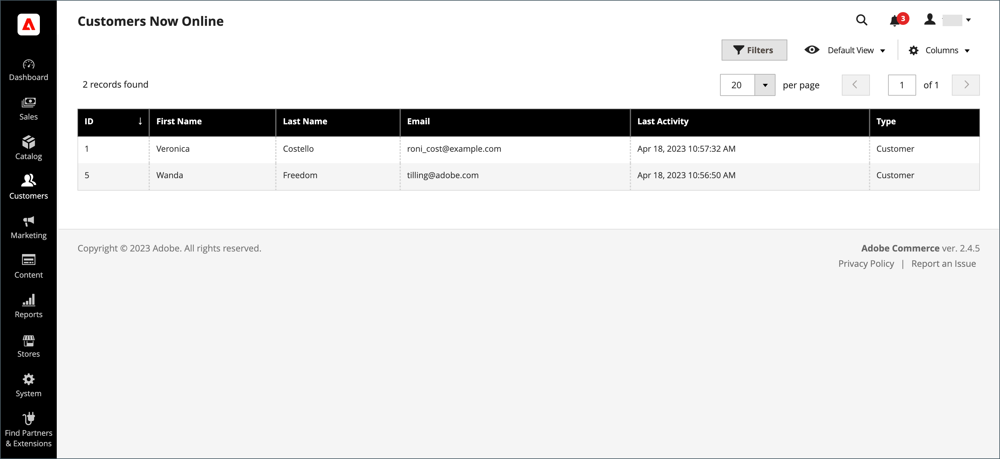

# 이제 고객이 온라인 상태임

[!DNL Customers] 메뉴의 **[!UICONTROL Now Online]** 옵션에는 현재 스토어에서 온라인 상태인 모든 고객과 방문자가 나열됩니다. 고객이 현재 온라인 상태로 표시되는 시간 간격이 구성에 설정되어 있으며, 관리자로부터 [!DNL Customer's] 활동을 볼 수 있는 기간을 결정합니다. 기본적으로 간격은 15분입니다. 이 시간 동안 키보드를 사용하지 않으면 세션이 종료되며 고객은 쇼핑을 계속하려면 계정에 다시 로그인해야 합니다. 카트의 콘텐츠는 나중에 액세스할 수 있도록 저장됩니다.

{width="700" zoomable="yes"}

고객의 온라인 상태는 고객 로그인, 등록 또는 기타 상태 변경 이벤트 시에만 업데이트됩니다. 여기에는 제품 추가, 제거 및 수정과 같은 장바구니 관련 이벤트가 포함됩니다.

>[!NOTE]
>
>페이지 방문만으로는 고객의 온라인 상태가 업데이트되지 않습니다. 이러한 정보를 수집하려면 [Google Analytics을 설정](../merchandising-promotions/google-analytics.md)(단독으로 또는 [Google 태그 관리자](../merchandising-promotions/google-tag-manager.md)와 함께)하거나 Adobe Commerce에서 다른 분석 소프트웨어를 사용하는 것이 좋습니다.

## 현재 온라인 상태인 모든 고객 보기

_관리자_ 사이드바에서 **[!UICONTROL Customers]** > **[!UICONTROL Online Now]**(으)로 이동합니다.

>[!TIP]
>
>온라인 고객의 구매 완료에 대한 자세한 내용은 [쇼핑 지원](../stores-purchase/introduction.md#shopping-assistance)을 참조하세요.

## 시간 간격 구성

1. _관리자_ 사이드바에서 **[!UICONTROL Stores]** > _[!UICONTROL Settings]_>**[!UICONTROL Configuration]**(으)로 이동합니다.

1. 왼쪽 패널에서 **[!UICONTROL Customers]**&#x200B;을(를) 확장하고 **[!UICONTROL Customer Configuration]**&#x200B;을(를) 선택합니다.

1. **[!UICONTROL Online Customers Options]** 섹션을 확장하고 다음을 수행합니다.

   {width="600" zoomable="yes"}

   - **[!UICONTROL Online Minutes Interval]**&#x200B;의 경우 관리자로부터 고객 세션을 표시할 시간(분)을 입력하십시오. 기본 간격 15분을 사용하려면 필드를 비워 둡니다.

   - **[!UICONTROL Customer Data Lifetime]**&#x200B;의 경우 고객이 입력한 저장되지 않은 데이터가 만료될 때까지 남은 시간(분)을 입력하십시오.

1. 완료되면 **[!UICONTROL Save Config]**&#x200B;을(를) 클릭합니다.

## 열 설명

| 열 | 설명 |
| --- | --- |
| **[!UICONTROL ID]** | 등록된 고객의 고객 ID입니다. |
| **[!UICONTROL First Name]** | 등록된 고객의 이름. |
| **[!UICONTROL Last Name]** | 등록된 고객의 성. |
| **[!UICONTROL Email]** | 등록된 고객의 이메일 주소입니다. |
| **[!UICONTROL Last Activity]** | 고객이 스토어에서 마지막으로 활동한 날짜 및 시간입니다. |
| **[!UICONTROL Type]** | 옵션: `Customer` / `Visitor` |
| **[!UICONTROL Last URL]** | 고객이 방문한 마지막 URL입니다. |
| **[!UICONTROL Company]** | 사용자가 속한 회사의 이름입니다. |

{style="table-layout:auto"}
