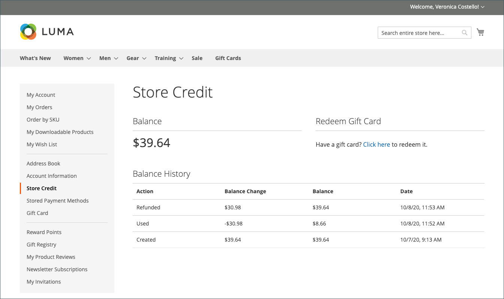
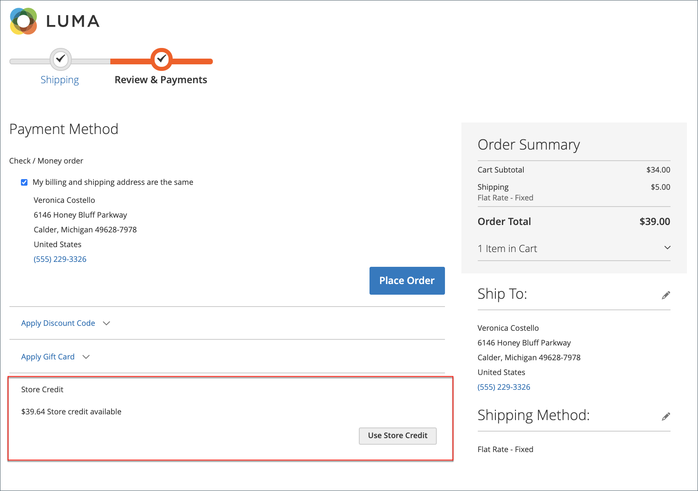

# 고객 계정 대시보드의 환불

{{ee-feature}}

주문에 대해 환불이 발행된 경우 고객은 계정 대시보드에서 해당 주문과 관련된 환불 정보를 볼 수 있습니다. 을 활성화한 경우 [!UICONTROL _고객에게 스토어 크레딧 내역 표시_] 옵션 [크레딧 구성 저장](../customers/credit-configure.md), 고객은 또한 다음에 액세스할 수 있습니다 [스토어 크레딧](../customers/store-credit.md) 기록.

## 상점 첫 화면에서 환불 보기

1. 상점에서 고객은 계정에 로그인합니다.

1. 다음 방법 중 하나를 사용하여 순서를 찾습니다.

   * 목록에서 순서 찾기 **최근 주문** 및 클릭 **[!UICONTROL View]**.
   * 왼쪽 패널에서 **[!UICONTROL My Orders]**. 그런 다음 목록에서 순서를 찾아 **[!UICONTROL View]**.

1. 고객이 클릭 **[!UICONTROL Refunds]** 탭하여 환불 상세내역을 조회합니다.

   {width="700" zoomable="yes"}

## 상점에서 스토어 신용 잔고 및 내역을 조회합니다.

방법 1: **고객 계정 대시보드에서**

1. 상점에서 고객은 계정에 로그인합니다.

1. 환불이 스토어 크레딧에 적용된 경우 다음을 선택합니다. **[!UICONTROL Store Credit]** 왼쪽 패널에서

1. 스토어 크레딧에 대한 환불 금액은 작업 날짜 및 시간과 함께 목록에 표시됩니다.

   {width="700" zoomable="yes"}

   >[!INFO]
   >
   >스토어 신용 페이지에는 고객이 다음을 상환할 수 있는 링크도 제공됩니다. [기프트 카드](../stores-purchase/product-gift-card-workflow.md#check-status-and-balance-of-the-gift-card).

방법 2: **다음에서 _검토 및 결제_ 페이지**

1. 고객이 장바구니에 제품을 추가합니다.

2. 다음으로 진행: _체크아웃_ 페이지를 가리키도록 업데이트하는 중입니다.

3. 를 전달합니다. **[!UICONTROL Shipping]** 단계.

4. 스토어 크레딧을 사용할 수 있는 경우 고객이 클릭 **[!UICONTROL Use Store Credit]**.

   {width="700" zoomable="yes"}

5. 고객이 스토어 크레딧 사용에 대해 마음이 바뀌면 다음을 클릭합니다. **[!UICONTROL Remove]** 다음에서 _주문 요약_ 섹션.

## 관리자의 결제 작업

특정 항목에 대한 결제 작업을 구성할 수 있습니다 [결제 방법](../configuration-reference/sales/payment-methods.md). 각 결제 방법에는 서로 다른 일련의 결제 작업이 있습니다.

| 결제 작업 | 설명 |
|--- |---|
| [!UICONTROL Capture Online] | 송장이 제출되면 시스템은 서드파티 결제 게이트웨이에서 결제를 캡처합니다. 그런 다음 관리자는 대변 메모를 생성하고 송장을 무효화할 수 있습니다. |
| [!UICONTROL Capture Offline] | 송장이 제출되면 시스템에서 지급을 캡처하지 않습니다. 대금을 게이트웨이를 통해 직접 포착하고, Adobe Commerce을 통해 대금을 포착할 수 없다고 가정한다. 그런 다음 관리자는 대변 메모를 생성할 수 있지만 송장을 무효화할 수는 없습니다. (주문이 온라인 지급을 사용했더라도 송장은 기본적으로 오프라인 송장입니다.) |
| [!UICONTROL Not Capture] | 송장이 제출되면 시스템에서 지급을 캡처하지 않습니다. 나중에 Adobe Commerce을 통해 결제 내용이 포착되는 것으로 추정된다. 다음 항목이 있습니다. [!UICONTROL _Capture_] 완료된 송장의 단추. 수집하기 전에 송장을 취소할 수 있습니다. 캡처한 후 대변 메모를 생성하고 송장을 무효화할 수 있습니다. |

{style="table-layout:auto"}

>[!WARNING]
>
>다음 항목 선택 [!UICONTROL _캡처하지 않음_] 나중에 Adobe Commerce을 통해 결제를 캡처할 것이 확실하지 않은 경우 옵션을 선택합니다. 다음을 사용하여 지급이 수집될 때까지 대변 메모를 생성할 수 없습니다. [!UICONTROL _Capture_] 단추를 클릭합니다.
