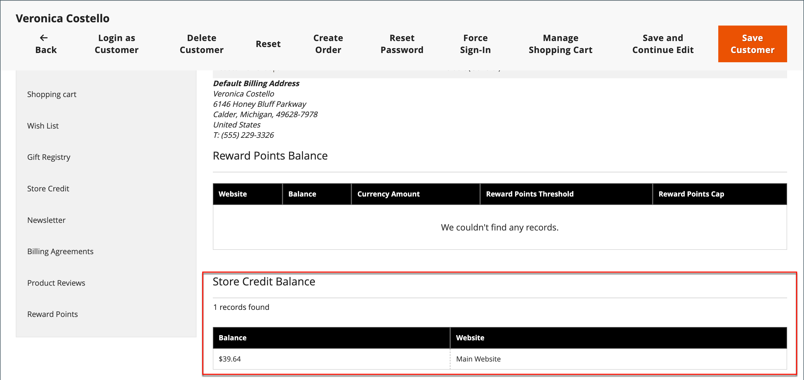
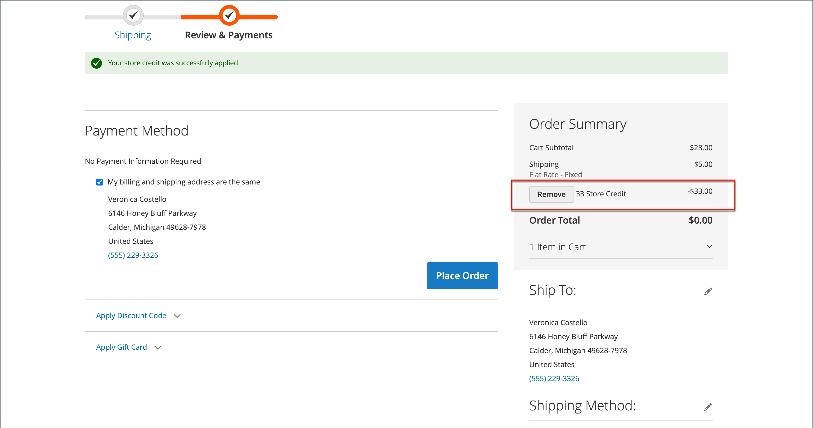

# 스토어 크레딧 적용

{{ee-feature}}

스토어 관리자는 고객 계정에서 신용 잔액과 내역을 조회하고, 구매에 스토어 신용을 적용할 수도 있습니다.

{width="600" zoomable="yes"}

## 신용 잔액 보기

1. 다음에서 _관리자_ 사이드바, 이동 **[!UICONTROL Customers]** > **[!UICONTROL All Customers]**.

1. 그리드에서 고객을 찾습니다.

1. 다음에서 _작업_ 열, 클릭 **[!UICONTROL Edit]**.

1. 스크롤 _[!UICONTROL Customer View]_페이지 및 보기&#x200B;**[!UICONTROL Store Credit Balance]**맨 아래에

{width="600" zoomable="yes"}

## 스토어 신용 잔액 업데이트

1. 다음에서 _관리자_ 사이드바, 이동 **[!UICONTROL Customers]** > _작업_ > **[!UICONTROL All Customers]**.

1. 그리드에서 고객을 찾습니다.

1. 다음에서 _작업_ 열, 클릭 **[!UICONTROL Edit]**.

1. 왼쪽 패널에서 을 선택합니다 **[!UICONTROL Store Credit]**.

1. 잔고와 연결할 웹 사이트(상점)를 선택합니다.

1. 대상 **[!UICONTROL Update Balance]**&#x200B;새 값을 입력합니다.

1. 잔고 갱신에 대해 고객에게 통지하려면 **[!UICONTROL Notify Customer by Email]** 확인란을 선택하고 다음에서 스토어 보기를 선택합니다. **[!UICONTROL Send Email Notification From the Following Store View]**.

1. 입력 **[!UICONTROL Comment]** 변경 내용.

1. 업데이트가 완료되면 **[!UICONTROL Save and Continue Edit]** 또는 **[!UICONTROL Save Customer]**.

업데이트된 잔액은에 표시됩니다. **[!UICONTROL Balance History]**.

## 저장소 관리자로서 주문에 대변 잔액 적용

매장 관리자는 고객을 대신하여 주문 제출을 비롯한 다양한 작업을 수행할 수 있습니다. 다음을 수행하는 경우 [주문 만들기](../stores-purchase/customer-account-create-order.md), 고객에게 지급할 스토어 신용 잔액을 적용할 수 있습니다. 사용 가능한 잔액은 _결제 및 배송 정보_ 섹션. 다음 항목 선택 **[!UICONTROL Use Store Credit]** 체크박스 - 잔고를 적용하거나 주문 합계가 적은 경우 잔고의 일부를 적용합니다.

{width="500" zoomable="yes"}

## 체크아웃 중 스토어 크레딧 적용

지점에 대한 신용 잔액이 있는 경우 고객은 상점에서 주문을 하기 전에 주문 잔액에 매장 신용을 적용할 수 있습니다.

1. 고객이 사용 가능한 스토어 크레딧 금액을 조회합니다.

   다음 기간 동안 _검토 및 결제_ 단계에서 사용 가능한 금액은 _[!UICONTROL Store Credit]_.

1. 금액을 주문에 적용하려면 다음을 클릭합니다. **[!UICONTROL Use Store Credit]**.

   >[!INFO]
   >
   >주문 합계가 다시 계산되고 적용된 스토어 크레딧 금액이 _[!UICONTROL Order Summary]_.

   {width="700" zoomable="yes"}

1. 준비가 되면 클릭 수 **[!UICONTROL Place Order]**.
