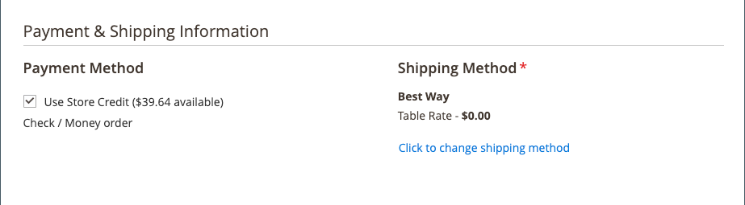

# 스토어 크레딧 적용

{{ee-feature}}

스토어 관리자는 고객 계정에서 신용 잔액과 내역을 조회하고, 구매에 스토어 신용을 적용할 수도 있습니다.

{width="600" zoomable="yes"}

## 신용 잔액 보기

1. _관리자_ 사이드바에서 **[!UICONTROL Customers]** > **[!UICONTROL All Customers]**(으)로 이동합니다.

1. 그리드에서 고객을 찾습니다.

1. _Action_ 열에서 **[!UICONTROL Edit]**&#x200B;을(를) 클릭합니다.

1. _[!UICONTROL Customer View]_페이지를 스크롤하고 하단의&#x200B;**[!UICONTROL Store Credit Balance]**을(를) 봅니다.

{width="600" zoomable="yes"}

## 스토어 신용 잔액 업데이트

1. _관리자_ 사이드바에서 **[!UICONTROL Customers]** > _작업_ > **[!UICONTROL All Customers]**(으)로 이동합니다.

1. 그리드에서 고객을 찾습니다.

1. _Action_ 열에서 **[!UICONTROL Edit]**&#x200B;을(를) 클릭합니다.

1. 왼쪽 패널에서 **[!UICONTROL Store Credit]**&#x200B;을(를) 선택합니다.

1. 잔고와 연결할 웹 사이트(상점)를 선택합니다.

1. **[!UICONTROL Update Balance]**&#x200B;에 대해 새 값을 입력하십시오.

1. 잔고 업데이트에 대해 고객에게 알리려면 **[!UICONTROL Notify Customer by Email]** 확인란을 선택하고 **[!UICONTROL Send Email Notification From the Following Store View]**&#x200B;에서 스토어 보기를 선택합니다.

1. 변경 내용에 대한 **[!UICONTROL Comment]**&#x200B;을(를) 입력하십시오.

1. 업데이트가 완료되면 **[!UICONTROL Save and Continue Edit]** 또는 **[!UICONTROL Save Customer]**&#x200B;을(를) 클릭합니다.

업데이트된 잔액은 **[!UICONTROL Balance History]**&#x200B;에 표시되어야 합니다.

## 저장소 관리자로서 주문에 대변 잔액 적용

매장 관리자는 고객을 대신하여 주문 제출을 비롯한 다양한 작업을 수행할 수 있습니다. [주문 만들기](../stores-purchase/customer-account-create-order.md)를 수행하면 고객이 지불해야 하는 스토어 크레딧 잔액을 적용할 수 있습니다. 사용 가능한 잔액이 _결제 및 배송 정보_ 섹션에 표시됩니다. **[!UICONTROL Use Store Credit]** 확인란을 선택하여 잔액을 적용하거나 주문 합계가 적은 경우 잔액의 일부를 적용합니다.

{width="500" zoomable="yes"}

## 체크아웃 중 스토어 크레딧 적용

지점에 대한 신용 잔액이 있는 경우 고객은 상점에서 주문을 하기 전에 주문 잔액에 매장 신용을 적용할 수 있습니다.

1. 고객이 사용 가능한 스토어 크레딧 금액을 조회합니다.

   _검토 및 결제_ 단계에서 사용 가능한 금액이 _[!UICONTROL Store Credit]_에 표시됩니다.

1. 주문에 금액을 적용하려면 **[!UICONTROL Use Store Credit]**&#x200B;을(를) 클릭합니다.

   >[!INFO]
   >
   >주문 합계가 다시 계산되며 적용된 스토어 크레딧 금액이 _[!UICONTROL Order Summary]_에 나타납니다.

   {width="700" zoomable="yes"}

1. 준비가 되면 **[!UICONTROL Place Order]**&#x200B;을(를) 클릭합니다.
