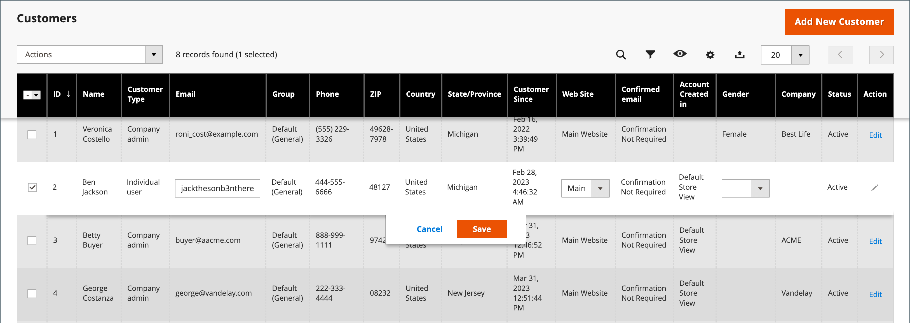

# 고객 프로필 업데이트

_[!UICONTROL Customer Information]_페이지의 왼쪽 패널에는 고객 활동, 주소, 주문 통계, 최근 주문, 장바구니 내용, 제품 검토 및 뉴스레터 구독에 대한 정보가 포함되어 있습니다.

{width="700" zoomable="yes"}

## 고객 계정 편집

방법 1: **_빠른 편집_**

1. 첫 번째 열에서 편집할 고객 계정의 확인란을 선택합니다.

1. **[!UICONTROL Actions]** 열을 `Edit`(으)로 설정합니다.

   >[!INFO]
   >
   >업데이트할 수 있는 각 값의 값이 텍스트 상자에 나타납니다. 선택한 고객 레코드의 일부 값만 그리드에서 편집할 수 있습니다.

   {width="700" zoomable="yes"}

1. 필요에 따라 다음 값 중 하나를 업데이트합니다.

   * **[!UICONTROL Email]**
   * **[!UICONTROL Web Site]**
   * **[!UICONTROL Tax/VAT Number]**
   * **[!UICONTROL Gender]**

1. **[!UICONTROL Save]**&#x200B;을(를) 클릭합니다.

방법 2: **_전체 편집_**

1. 표에서 편집할 고객 레코드를 찾습니다.

1. 맨 오른쪽에 있는 _작업_ 열에서 **[!UICONTROL Edit]**&#x200B;을(를) 클릭합니다.

1. 회사 정보에 필요한 사항을 변경합니다.

   >[!INFO]
   >
   >자세한 내용은 [고객 프로필 업데이트](../customers/update-account.md)를 참조하세요.

1. 완료되면 **[!UICONTROL Save Customer]**&#x200B;을(를) 클릭합니다.

>[!INFO]
>
>저장하기 전에 모든 편집 내용을 실행 취소하려면 맨 위 단추 모음에서 **[!UICONTROL Reset]**&#x200B;을(를) 클릭하여 마지막으로 저장한 버전에 대한 모든 변경 내용을 반환합니다.

## 고객 정보

### [!UICONTROL Customer View]

_고객 보기_ 탭에는 **[!UICONTROL Personal Information]**, **[!UICONTROL Reward Points Balance]** 및 **[!UICONTROL Store Credit Balance]**&#x200B;이(가) 포함된 고객에 대한 정보가 나열됩니다.

### [!UICONTROL Account Information]

[계정 정보](../customers/account-dashboard-account-information.md) 탭에는 고객에 대한 자세한 정보가 있으며, 여기에서 관리자는 개인 정보, 전자 메일, 원격 쇼핑 지원, 생년월일 등을 편집하고 웹 사이트 또는 회사에 고객을 첨부할 수 있습니다.

### [!UICONTROL Addresses]

[주소](../customers/account-dashboard-address-book.md) 탭에는 고객의 기본 청구 및 배송 주소와 고객이 자주 사용하는 추가 주소가 포함됩니다.

### [!UICONTROL Orders]

[주문](../stores-purchase/orders.md) 그리드에 현재 고객 주문 목록이 포함되어 있어 관리자가 진행 상황을 추적할 수 있습니다.

### [!UICONTROL Returns]

{{ee-feature}}

[반환](../stores-purchase/returns.md) 탭에는 현재 반환된 고객 요청이 나열됩니다.

### [!UICONTROL Shopping cart]

[장바구니](../stores-purchase/cart.md) 탭에는 현재 장바구니에 들어 있는 제품이 표시되지만 어떤 이유로 구매가 완료되지 않았습니다.

### [!UICONTROL Wish List]

[위시리스트](../stores-purchase/wishlists.md)에는 고객이 나중에 장바구니에 전송할 수 있는 제품 목록이 표시됩니다.

### [!UICONTROL Gift Registry]

{{ee-feature}}

[선물 레지스트리](../merchandising-promotions/gift-registry-storefront.md) 섹션에는 고객의 현재 선물 등록과 관련 이벤트가 나열됩니다.

### [!UICONTROL Store Credit]

{{ee-feature}}

[크레딧 저장](../customers/store-credit.md) 탭에 고객 계정에 복원된 금액이 표시되면 관리자가 이 값을 관리할 수 있습니다.

### [!UICONTROL Newsletter]

[뉴스레터](../merchandising-promotions/newsletters.md) 탭에는 현재 고객에게 전송된 모든 전자 메일이 표시됩니다.

### [!UICONTROL Billing Agreements]

[청구 계약](../stores-purchase/paypal-billing-agreements.md) 탭에 스토어와 고객 간의 모든 PayPal 청구 계약이 나열됩니다.

### [!UICONTROL Product Reviews]

[제품 리뷰](../catalog/settings-advanced-product-reviews.md) 탭에는 이 고객이 제출한 모든 리뷰가 표시됩니다.

### [!UICONTROL Reward Points]

{{ee-feature}}

[보상 포인트](../merchandising-promotions/rewards-loyalty.md) 섹션에는 고객의 현재 보상 포인트 잔액이 표시됩니다. 관리자는 이 값을 관리할 수 있습니다.

## 단추 막대

| 단추 | 설명 |
|----------|--------------|
| **[!UICONTROL Back]** | 변경 사항을 저장하지 않고 고객 페이지로 돌아갑니다. |
| **[!UICONTROL Login as Customer]** | 판매자가 고객으로 로그인할 수 있도록 허용합니다. |
| **[!UICONTROL Delete Customer]** | 고객 계정을 삭제합니다. |
| **[!UICONTROL Reset]** | 고객 양식에서 저장되지 않은 변경 사항을 이전 값으로 재설정합니다. |
| **[!UICONTROL Create Order]** | [고객 계정과 연결된 주문을 만듭니다](../stores-purchase/customer-account-create-order.md). |
| **[!UICONTROL Reset Password]** | 고객의 암호를 재설정합니다. |
| **[!UICONTROL Force Sign-In]** | 고객 암호와 연결된 토큰을 지우고 관리자에게 계정에 대한 액세스 권한을 제공합니다. |
| **[!UICONTROL Manage Shopping Cart]** | 고객의 장바구니에 대한 액세스를 제공합니다. |
| **[!UICONTROL Save and Continue Edit]** | 변경 사항을 저장하고 고객 계정을 열어 둡니다. |
| **[!UICONTROL Save Customer]** | 변경 사항을 저장하고 고객 계정을 닫습니다. |

{style="table-layout:auto"}
