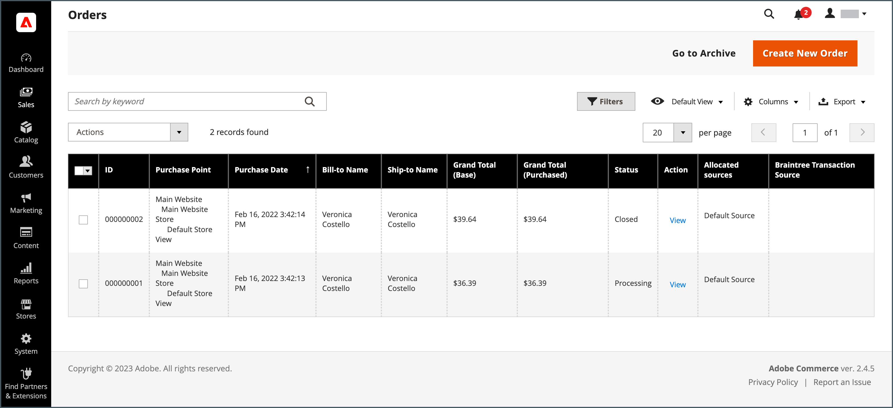

# 관리 그리드 컨트롤

데이터를 관리하는 관리 페이지는 그리드에 레코드 컬렉션을 표시합니다. 각 열의 맨 위에 있는 컨트롤을 사용하여 데이터를 정렬할 수 있습니다. 현재 정렬 순서는 열 머리글에서 오름차순 또는 내림차순 화살표로 표시됩니다. 격자에 표시할 열을 지정하고 다른 위치로 드래그할 수 있습니다. 다른 열 배열을 나중에 사용할 수 있는 보기로 저장할 수도 있습니다. 다음 **[!UICONTROL Action]** 열은 개별 레코드에 적용할 수 있는 작업을 나열합니다. 또한 대부분의 그리드에 대한 현재 보기의 날짜를 [CSV](../systems/data-csv.md) 또는 XML 파일.

{width="700" zoomable="yes"}

## 목록 정렬

1. 열 헤더를 클릭합니다.

   화살표는 현재 순서를 오름차순 또는 내림차순으로 나타냅니다.

1. 페이지 매김 컨트롤을 사용하여 컬렉션에서 추가 페이지를 봅니다.

   {width="300"}

## 목록의 페이지 매기기

1. 설정 **[!UICONTROL Pagination]** 페이지당 보려는 레코드 수를 제어합니다.

1. 클릭 **[!UICONTROL Next]** 및 **[!UICONTROL Previous]** 목록을 페이징하거나 특정 **[!UICONTROL Page Number]**.

## 목록 필터링

1. 클릭 **[!UICONTROL Filters]**.

1. 원하는 레코드를 설명하는 데 필요한 만큼 필터를 완료합니다.

1. 클릭 **[!UICONTROL Apply Filters]**.

   {width="700" zoomable="yes"}

## 데이터 내보내기

1. 내보낼 레코드를 선택합니다.

   >[!NOTE]
   >
   >그리드에서 제품 데이터를 내보낼 수 없습니다. 자세한 내용은 다음을 참조하십시오. [내보내기](../systems/data-export.md).

1. 다음에서 _내보내기_ () 오른쪽 상단의 메뉴에서 다음 파일 형식 중 하나를 선택합니다.

   - `CSV`
   - `Excel XML`

   {width="700" zoomable="yes"}

1. 클릭 **[!UICONTROL Export]**.

1. 브라우저에서 다운로드하는 데 사용되는 위치에서 내보낸 데이터의 다운로드한 파일을 찾습니다.

## 그리드 레이아웃

그리드에서 열 선택 및 순서는 기본 설정에 따라 변경하고 로 저장할 수 있습니다. _보기_. 개별 속성 구성 아래의 그리드에 표시되는 속성을 제어할 수 있습니다. 제품 그리드에 표시되는 속성이 많으면 관리자 로드 시간 및 성능에 영향을 줄 수 있습니다.

{width="700" zoomable="yes"}

### 열 선택 변경

1. 오른쪽 위 모서리에서 _열_ () 제어.

1. 열 선택 사항을 변경합니다.

   - 그리드에 추가할 열의 확인란을 선택합니다.
   - 그리드에서 제거할 열의 확인란을 선택 취소합니다.
   - 기본 격자선 보기를 반환하려면 **[!UICONTROL Reset]**.

사용 가능한 모든 열을 보려면 아래로 스크롤해야 합니다.

### 열 이동

1. 열의 헤더를 클릭하고 을 길게 누릅니다.

1. 열을 새 위치 및 릴리스로 드래그합니다.

### 격자 보기 저장

1. 다음을 클릭합니다. _보기_ () 제어.

1. 클릭 **[!UICONTROL Save Current View]**.

1. 입력 **[!UICONTROL name]** 보기용입니다.

1. 모든 변경 사항을 저장하려면 _화살표_ ().

   이제 뷰 이름이 현재 뷰로 나타납니다.

### 격자 보기 변경

1. 다음을 클릭합니다. _보기_ () 제어.

1. 다음 중 하나를 수행합니다.

   - 다른 뷰를 사용하려면 뷰 이름을 클릭합니다.
   - 뷰 이름을 변경하려면 _편집_ () 아이콘을 클릭하고 이름을 업데이트합니다.
   - 뷰를 삭제하려면 _편집_ () 아이콘을 클릭한 다음 _삭제_ () 아이콘.
