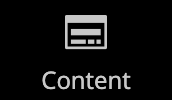
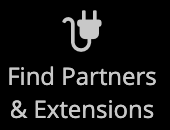

# 관리 사이드바

왼쪽의 사이드바는 _관리자_ 저장소의 기본 메뉴이며 데스크톱 및 모바일 장치 모두에 맞게 디자인되었습니다. 플라이아웃 메뉴는 매일 스토어를 관리하는 데 사용하는 모든 도구에 대한 액세스를 제공합니다.

| 메뉴 아이콘 | 링크 | 설명 |
| --------- | ---- | ----------- |
|  | **[관리자 시작 페이지](../configuration-reference/advanced/admin.md)** | 기본적으로 대시보드인 관리 시작 페이지를 표시합니다. |
|  | **[[!UICONTROL Dashboard]](admin-dashboard.md)** | 대시보드는 스토어의 판매 및 고객 활동에 대한 간략한 개요를 제공하며 일반적으로 관리자에 로그인할 때 나타나는 첫 페이지입니다. |
|  | **[[!UICONTROL Sales]](../stores-purchase/sales-menu.md)** | [!UICONTROL Sales] 메뉴는 처리 주문, 송장, 배송, 대변 메모 및 거래 작업과 관련된 모든 항목을 찾을 수 있는 곳입니다. |
|  | **[[!UICONTROL Catalog]](../catalog/catalog-menu.md)** | [!UICONTROL Catalog] 메뉴는 제품을 만들고 범주를 정의하는 데 사용됩니다. |
|  | **[[!UICONTROL Customers]](../customers/customers-introduction.md)** | [!UICONTROL Customers] 메뉴는 고객 계정을 관리하고 현재 온라인 상태인 고객을 확인할 수 있는 곳입니다. |
|  | **[[!UICONTROL Marketing]](../merchandising-promotions/marketing-menu.md)** | [!UICONTROL Marketing] 메뉴는 카탈로그 및 장바구니 가격 규칙과 쿠폰을 설정하는 곳입니다. 가격 규칙은 특정 조건 세트가 충족될 때 작업을 트리거합니다. |
|  | **[[!UICONTROL Content]](../content-design/content-menu.md)** | [!UICONTROL Content] 메뉴는 스토어의 콘텐츠 요소 및 디자인을 관리하는 곳입니다. 페이지, 블록 및 프론트엔드 앱을 만들고 스토어의 프레젠테이션을 관리하는 방법에 대해 알아봅니다. |
|  | **[[!UICONTROL Reports]](reports-menu.md)** | [!UICONTROL Reports] 메뉴는 판매, 장바구니, 제품, 고객, 태그, 검토, 검색어, 24/7 실시간 성과 모니터링 및 [사이트 전체 분석 도구](https://experienceleague.adobe.com/en/docs/commerce-operations/tools/site-wide-analysis-tool/intro)의 권장 사항 등 스토어의 모든 측면에 대한 통찰력을 제공하는 광범위한 보고서를 제공합니다. |
|  | **[[!UICONTROL Stores]](../stores-purchase/stores-menu.md)** | [!UICONTROL Stores] 메뉴에는 다중 사이트 설치 설정, 세금, 통화, 제품 특성 및 고객 그룹을 포함하여 스토어의 모든 측면을 구성하고 유지 관리하는 도구가 포함되어 있습니다. |
|  | **[[!UICONTROL System]](../systems/system-menu.md)** | [!UICONTROL System] 메뉴에는 다른 응용 프로그램과의 통합을 위해 시스템 작업을 관리하고, 확장을 설치하고, 웹 서비스를 관리하는 도구가 포함되어 있습니다. |
|  | **[[!UICONTROL Find Partners & Extensions]](commerce-marketplace.md)** | [!DNL Commerce Marketplace]에서 스토어의 Adobe Commerce 및 Magento Open Source 솔루션을 찾을 수 있습니다. |

{style="table-layout:auto"}
