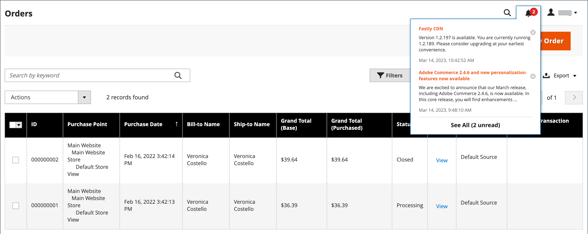
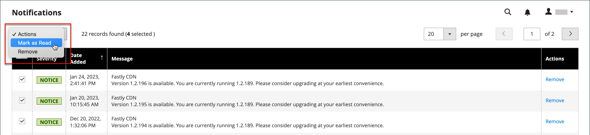

# 관리자 메시지 받은 편지함

스토어는 정기적으로 Adobe에서 메시지를 수신합니다. 메시지는 중요도별로 평가되며 시스템 업데이트, 패치, 새로운 릴리스, 예약된 유지 관리 또는 예정된 이벤트를 의미할 수 있습니다. 헤더의 벨 아이콘은 받은 편지함에서 읽지 않은 메시지 수를 나타냅니다.

{width="700" zoomable="yes"}

_[!UICONTROL Notifications]_&#x200B;페이지에는 날짜별로 순위가 매겨진 모든 메시지가 나열됩니다._[!UICONTROL Action]_ 명령은 개별 메시지를 읽은 것으로 표시하거나 자세한 정보를 보거나 받은 편지함에서 메시지를 제거하는 데 사용할 수 있습니다.

이 구성은 받은 편지함의 업데이트 빈도와 메시지 전달 방식을 결정합니다. 스토어 관리자에게 보안 URL이 있는 경우 HTTPS를 통해 알림이 전달되어야 합니다.

## 새로 들어오는 메시지 보기

1. 헤더의 **[!UICONTROL Notification]** 아이콘을 클릭하고 요약을 읽습니다.

1. 다음 중 하나를 수행합니다.

   - 필요한 경우 메시지를 클릭하여 전체 텍스트를 표시합니다.
   - 메시지를 삭제하려면 메시지 오른쪽에 있는 삭제 아이콘을 클릭합니다.
   - 전체 알림 목록을 표시하려면 **[!UICONTROL See All]**&#x200B;을(를) 클릭합니다.

## 중요 메시지 해결

매우 중요한 메시지에 대해 다음 중 하나를 수행합니다.

- **[!UICONTROL Read Details]**&#x200B;을(를) 클릭합니다.
- 경고 상자를 무시하고 메시지를 활성 상태로 유지하려면 **[!UICONTROL Close]**&#x200B;을(를) 클릭합니다.

## 알림 관리

1. 다음 중 하나를 수행하여 알림 페이지를 엽니다.

   - 머리글에서 **[!UICONTROL Notification]** 아이콘을 클릭합니다. 새 메시지가 하나 이상 표시되면 **[!UICONTROL See All]**&#x200B;을(를) 클릭합니다.

   - _관리자_ 사이드바에서 **[!UICONTROL System]** > _[!UICONTROL Other Settings]_>**[!UICONTROL Notifications]**(으)로 이동합니다.

1. **[!UICONTROL Action]** 열에서 다음 중 하나를 수행합니다.

   - 자세한 내용을 보려면 **[!UICONTROL Read Details]**&#x200B;을(를) 클릭하여 연결된 페이지를 새 창에서 엽니다.

   - 받은 편지함에 메시지를 보관하려면 **[!UICONTROL Mark As Read]**&#x200B;을(를) 클릭하세요.

     {width="700" zoomable="yes"}

   - 메시지를 삭제하려면 **[!UICONTROL Remove]**&#x200B;을(를) 클릭합니다.

1. 여러 메시지에 작업을 적용하려면 다음 중 하나를 수행합니다.

   - 관리할 각 메시지에 대해 첫 번째 열의 확인란을 선택합니다.
   - 여러 메시지를 선택하려면 필요에 따라 **[!UICONTROL Mass Actions]** 컨트롤을 설정하십시오.

1. **[!UICONTROL Actions]** 컨트롤을 다음 중 하나로 설정합니다.

   - `Mark as Read`
   - `Remove`

1. 프로세스를 완료하려면 **[!UICONTROL Submit]**&#x200B;을(를) 클릭하십시오.

## 알림 구성

1. _관리자_ 사이드바에서 **[!UICONTROL Stores]** > _[!UICONTROL Settings]_>**[!UICONTROL Configuration]**(으)로 이동합니다.

1. 왼쪽 탐색 패널에서 **[!UICONTROL Advanced]**&#x200B;을(를) 확장하고 **[!UICONTROL System]**&#x200B;을(를) 선택합니다.

1. **[!UICONTROL Notifications]** 섹션을 확장합니다.

   {width="600"}

1. 저장소 관리자가 [보안 URL](../stores-purchase/store-urls.md)을(를) 통해 실행하는 경우 **[!UICONTROL Use HTTPS to Get Feed]**&#x200B;을(를) `Yes`(으)로 설정하십시오.

1. 받은 편지함이 업데이트되는 빈도를 확인하려면 **[!UICONTROL Update Frequency]**&#x200B;을(를) 설정하십시오.

   간격은 1시간에서 24시간일 수 있습니다.

1. 완료되면 **[!UICONTROL Save Config]**&#x200B;을(를) 클릭합니다.

[!UICONTROL System] 구성 옵션에 대한 자세한 내용은 [_구성 참조 안내서_](../configuration-reference/advanced/system.md)&#x200B;를 참조하십시오.
