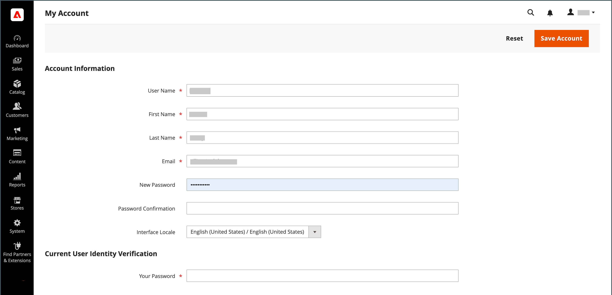
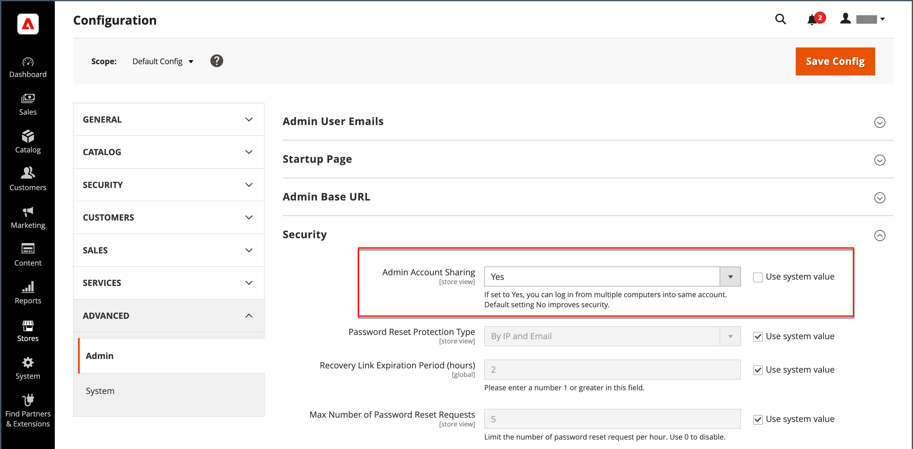

# 관리자 계정

기본 관리자 계정은 설치 중에 처음 설정되었으며 초기 자리 표시자 정보 또는 샘플 데이터 정보를 포함할 수 있습니다. 이 계정의 지정된 소유자는 사용자 이름과 암호를 개인화하고 언제든지 이름, 성 및 이메일 주소를 업데이트할 수 있습니다. 기본적으로 모든 권한을 가진 _슈퍼 사용자_&#x200B;인 이 계정은 일반적으로 비즈니스에 필요한 관리자 사용자 계정을 만듭니다.

- 사용자 추가 또는 편집에 대한 자세한 내용은 [사용자 만들기](../systems/permissions-users-all.md#create-a-user)를 참조하십시오.

- 관리자 및 사용자 역할에 대한 자세한 내용은 [권한](../systems/permissions.md) 및 [사용자 역할](../systems/permissions-user-roles.md)을 참조하십시오.

{{ims-admin-note}}

## 관리자 로그인

[!DNL Commerce] _관리자_&#x200B;는 저장소, 주문 및 고객 데이터에 대한 무단 액세스를 방지하기 위해 여러 계층의 보안 방법으로 보호됩니다. _관리자_&#x200B;에 처음 로그인할 때 사용자 이름과 암호를 입력하고 [이중 인증](../systems/security-two-factor-authentication.md)(2FA)을 설정해야 합니다.

스토어의 구성에 따라 일련의 키보드 문자 입력, 퍼즐 풀기 또는 공통 테마의 일련의 이미지 클릭과 같이 해결해야 하는 [CAPTCHA](../systems/security-google-recaptcha.md) 문제가 있을 수 있습니다. 이러한 테스트는 자동화된 봇이 아닌 사람으로 사용자를 식별하도록 설계되었습니다.

추가 보안을 위해 각 사용자가 액세스할 수 있는 _관리자_&#x200B;의 [권한](../systems/permissions.md)을 가진 부분을 확인하고 [로그인 시도 횟수](../configuration-reference/advanced/admin.md)를 제한할 수 있습니다. 기본적으로 6회 시도하면 계정이 잠기고 사용자는 몇 분 정도 기다린 후 다시 시도해야 합니다. [잠긴 계정](../systems/permissions-users-all.md#locked-users)도 _관리자_&#x200B;에서 다시 설정할 수 있습니다.

>[!NOTE]
>
>_관리자_&#x200B;에 처음 로그인하면 _관리자 사용 데이터 수집 허용_&#x200B;을 묻는 메시지가 표시됩니다. 자세한 내용은 [사용 데이터 수집](admin.md#usage-data-collection)을 참조하세요.

{width="400"}

### 1단계: 이중 인증 설정

스토어의 _관리자_&#x200B;에 로그인하려면 먼저 2단계 인증 솔루션을 설정하고 사용할 준비가 되어 있어야 합니다. 각 솔루션에서 사용하는 인증 프로세스에 대한 자세한 내용은 [이중 인증 사용](../systems/security-two-factor-authentication-use.md)을 참조하세요. 기본적으로 [!DNL Commerce]은(는) [Google Authenticator](https://play.google.com/store/apps/details?id=com.google.android.apps.authenticator2&hl=en_US)를 지원합니다.

스토어에 대해 지원되는 2FA 솔루션을 [!DNL Commerce] 시스템 관리자에게 문의하십시오. 그런 다음 공급자의 지침에 따라 선호하는 2FA 솔루션의 설정을 완료합니다.

### 2단계: 관리자에 로그인

1. _설치 중에 지정된_&#x200B;관리자[!DNL Commerce] URL을 입력하십시오.

   기본 _관리자_ URL은 `https://www.yourdomain.com/your-custom-admin-domain`과(와) 비슷합니다.

   >[!NOTE]
   >
   >이 설명서는 대부분의 예에서 `admin`을(를) 기본 URL로 사용하지만 스토어의 [관리자](../stores-purchase/store-urls.md)에 대해 고유하고 알아맞히기 어려운 _사용자 지정 URL_&#x200B;을(를) 선택하는 것이 좋습니다.

   페이지에 책갈피를 추가하거나 바탕 화면에 바로 가기를 저장하여 쉽게 액세스할 수 있습니다.

1. _관리자_ **[!UICONTROL Username]** 및 **[!UICONTROL Password]**&#x200B;을(를) 입력하십시오.

1. (선택 사항) 스토어에 대해 CAPTCHA가 활성화되어 있으면 화면의 지침에 따라 문제를 해결합니다.

   자세한 내용은 [CAPTCHA](../systems/security-captcha.md) 및 [reCAPTCHA](../systems/security-google-recaptcha.md)을(를) 참조하십시오.

1. **[!UICONTROL Sign in]**&#x200B;을(를) 클릭합니다.

   계정에서 _관리자_&#x200B;에 처음 로그인하는 경우 구성 지침에 대한 링크가 포함된 전자 메일을 받게 됩니다.

### 3단계: 2FA 구성 완료

다음 예제에서는 _관리자_ 계정을 Google Authenticator와 연결하는 방법을 보여 줍니다.

1. QR 코드가 나타나면 다음 방법 중 하나를 사용하여 코드를 캡처하고 Google Authenticator를 _관리자_ 계정과 연결합니다.

   {width="400"}

   - 스마트 폰을 사용하여 QR 코드 캡처

     스마트폰에서 Google Authenticator를 시작합니다. 앱의 오른쪽 상단에서 _더하기 기호_(+)를 탭합니다. 그런 다음 화면 하단에서 **[!UICONTROL Scan Barcode]**&#x200B;을(를) 탭하고 QR 코드를 촬영합니다.

   - 브라우저에서 QR 코드 캡처

     Google Authenticator가 브라우저에 확장으로 설치된 경우 도구 모음에서 **Authenticator** 아이콘을 클릭하고 페이지를 캡처합니다.

   - QR 코드 수동 입력

     QR 코드 아래에 있는 텍스트 문자열을 복사합니다. 스마트폰이나 브라우저를 사용하여 Google Authenticator를 실행하고 더하기 기호(+)를 클릭합니다. **[!UICONTROL Manual Entry]**&#x200B;을(를) 선택합니다. **[!UICONTROL Account]**&#x200B;에서 _관리자_ 계정과 연결된 전자 메일 주소를 입력하고 QR 코드 문자열을 **[!UICONTROL Key]** 필드에 붙여 넣으십시오.

1. 이중 인증을 사용하여 _관리자_&#x200B;에 로그인하려면 **[!UICONTROL Authenticator code]** 필드에 Google Authenticator에서 생성한 6자리 코드를 입력한 다음 **[!UICONTROL Confirm]**&#x200B;을(를) 클릭합니다.

   {width="400"}

## 암호 재설정

계정에 할당된 마지막 4개의 암호 재사용은 허용되지 않습니다.

1. **[!UICONTROL Email Address]**&#x200B;관리자&#x200B;_계정과 연결된_&#x200B;을(를) 입력하십시오.

   {width="400"}

1. **[!UICONTROL Retrieve Password]**&#x200B;을(를) 클릭합니다.

   계정이 이메일 주소와 연결된 경우 암호를 재설정하기 위해 이메일이 전송됩니다.

   >[!NOTE]
   >
   >_관리자_ 암호는 7자 이상이어야 하며 문자와 숫자를 모두 포함해야 합니다. 암호 옵션에 대한 자세한 내용은 [_관리자_ 보안 구성](../systems/security-admin.md)을 참조하십시오.

## 관리자에서 로그아웃

1. 오른쪽 상단 모서리에서 _계정_() 아이콘을 클릭합니다.

1. **[!UICONTROL Sign Out]**&#x200B;을(를) 클릭합니다.

   {width="700" zoomable="yes"}

_[!UICONTROL Sign In]_&#x200B;페이지에 로그아웃되었다는 메시지가 표시됩니다. 컴퓨터를 무인 상태로 둘 때마다_&#x200B;관리자&#x200B;_에서 로그아웃합니다.

## 계정 정보 편집

1. _계정_() 아이콘을 클릭합니다.

1. **[!UICONTROL Account Setting]**&#x200B;을(를) 클릭합니다.

   {width="700" zoomable="yes"}

1. 계정 정보에 필요한 사항을 변경합니다.

   로그인 자격 증명을 변경하는 경우 보안 위치에 저장해야 합니다.

1. 현재 계정 암호를 입력합니다.

1. **[!UICONTROL Save Account]**&#x200B;을(를) 클릭합니다.

## 여러 관리자 로그인 허용

관리자는 주문, 고객, 제품, 배송 및 결제 기능을 관리할 수 있는 액세스 권한을 제공합니다. 기본 구성은 보안 모범 사례로서 관리자 사용자 계정에 대한 여러 로그인을 허용하지 않도록 설정되어 있습니다. 그러나 이 설정을 변경하여 관리자가 비즈니스 워크플로를 수용하도록 여러 장치에서 로그인할 수 있도록 할 수 있습니다.

1. _관리자_ 사이드바에서 **[!UICONTROL Stores]** > _[!UICONTROL Settings]_>**[!UICONTROL Configuration]**(으)로 이동합니다.

1. 왼쪽 탐색 패널에서 **[!UICONTROL Advanced]**&#x200B;을(를) 확장하고 **[!UICONTROL Admin]**&#x200B;을(를) 선택합니다.

1. 확장 선택기&#x200B;**[!UICONTROL Security]**&#x200B;를 확장합니다.

1. **관리자 계정 공유**&#x200B;에 대해 `Yes`을(를) 선택하십시오.

   {width="700" zoomable="yes"}

1. **[!UICONTROL Save Config]**&#x200B;을(를) 클릭합니다.

## 관리자 사용자 로그인 이름을 대소문자를 구분하도록 설정

1. _관리자_ 사이드바에서 **[!UICONTROL Stores]** > _[!UICONTROL Settings]_>**[!UICONTROL Configuration]**(으)로 이동합니다.

1. 왼쪽 탐색 패널에서 **[!UICONTROL Advanced]**&#x200B;을(를) 확장하고 **[!UICONTROL Admin]**&#x200B;을(를) 선택합니다.

1. 확장 선택기&#x200B;**[!UICONTROL Security]**&#x200B;를 확장합니다.

1. **[!UICONTROL Login is Case Sensitive]** 필드를 `Yes`(으)로 설정합니다.

1. **[!UICONTROL Save Config]**&#x200B;을(를) 클릭합니다.

## 관리자에 대한 보안 액세스 유지

관리자의 보안을 보장하려면 관리자 액세스 권한이 있는 사용자 및 역할에 대해 정기적인 감사를 수행하십시오.

또한 [관리 기본 URL 구성을 업데이트](https://experienceleague.adobe.com/ko/docs/commerce-admin/config/advanced/admin#admin-base-url)하여 기본 `/admin` 끝점을 사용자 지정 경로로 변경하는 것이 좋습니다. 사용자 지정 경로를 구성하면 다음과 같은 보안 이점이 있습니다.

**향상된 보안**: 기본 &quot;관리자&quot; 경로는 널리 알려져 있으며 악의적인 행위자가 무차별 강제 공격을 시도하는 경우가 많습니다. 고유한 사용자 지정 값으로 변경함으로써 무단 액세스 시도 위험을 크게 줄일 수 있습니다.

**취약성 감소**: 자동화된 봇은 취약성을 활용하기 위해 &quot;admin&quot;과 같은 일반적인 경로를 자주 검색합니다. 사용자 지정 경로를 사용하면 이러한 봇이 관리자 로그인 페이지를 찾기 어려워져 공격 가능성이 줄어듭니다.

**개인 정보 보호 개선**: 사용자 지정 관리자 경로는 추가 계층의 무명 계층을 추가하므로 잠재적 공격자가 관리자 로그인 페이지를 식별하고 타깃팅하는 것이 더 어려워집니다.

**모범 사례 준수**: 관리 경로 사용자 지정과 같은 다음 보안 모범 사례는 전자 상거래 사이트 및 고객 데이터를 보호하는 사전 예방적 접근 방식을 보여 줍니다.

>[!NOTE]
>
>위반이 의심되는 경우 알 수 없는 모든 관리자 사용자를 제거하고 모든 관리자 암호를 재설정하고 [보안 작업 계획](https://experienceleague.adobe.com/ko/docs/commerce-admin/systems/security/security)을 검토하여 추가 단계를 검토하십시오.
