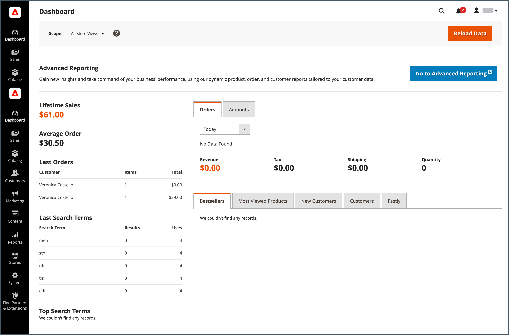

# Commerce 관리자와 Experience Cloud 통합 구성

Commerce Admin 통합 경험 및 Commerce 이벤트 확장을 사용하도록 Commerce 애플리케이션을 구성하여 Commerce Admin과 Experience Cloud 통합을 시작합니다.


## 사전 요구 사항

- [Adobe IMS 인증](../getting-started/adobe-ims-config.md)을 사용하도록 Adobe Commerce을 구성해야 합니다.
- 계정 프로비저닝 및 권한—관리자는 Experience Cloud 통합을 구성하려면 다음 리소스에 액세스할 수 있는 [Adobe 비즈니스 프로필](https://helpx.adobe.com/kr/enterprise/kb/introducing-adobe-profiles.html#:~:text=Adobe%20profiles%20help%20you%20manage,under%20the%20same%20email%20address)이 있어야 합니다.
   - [Adobe Admin Console](https://helpx.adobe.com/kr/enterprise/admin-guide.html) - 조직의 Adobe 사용자 및 개발자 계정을 추가하고 관리합니다.
   - [Adobe Developer Console](https://developer.adobe.com/developer-console/docs/guides/getting-started/)—개발자 또는 시스템 관리자 액세스 권한을 사용하여 App Builder 프로젝트를 만들고 연결 자격 증명과 프로젝트 구성을 생성하여 Adobe I/O Events 서비스를 사용할 수 있습니다.
   - [클라우드 인프라 프로젝트의 Commerce](https://experienceleague.adobe.com/docs/commerce-cloud-service/start/onboarding.html?lang=ko#get-started-with-the-project-web-interface) - 필요한 모듈을 설치하고 Adobe Commerce CLI를 사용하여 Commerce 애플리케이션 서버를 구성합니다.
   - [Commerce 관리자](https://experienceleague.adobe.com/docs/commerce-admin/start/guide-overview.html?lang=ko) - 저장소 구성을 업데이트하고 Commerce 사용자 계정을 관리합니다.

## 구성 개요

다음 작업을 완료하여 통합을 활성화합니다.

1. [Commerce 환경 및 응용 프로그램 구성을 확인하십시오](#check-the-commerce-environment-and-application-configuration).

1. [Commerce 관리자 통합 경험 확장 사용](#enable-the-commerce-admin-unified-experience-extension).

1. [Commerce용 Adobe I/O Events 설정](#set-up-adobe-io-events).

1. [통합을 테스트합니다](#test-the-integration).

## Commerce 환경 및 애플리케이션 구성 확인

Experience Cloud 통합을 구성하기 전에 프로젝트와 Commerce 애플리케이션이 요구 사항을 충족하는지 확인하십시오.

1. 로컬 워크스테이션에서 Commerce 프로젝트의 프로젝트 디렉터리로 변경합니다.

1. Experience Cloud과 통합할 인스턴스에 대한 환경 분기를 확인하십시오.

1. Adobe IMS가 활성화되어 있는지 확인합니다.

   - 환경에 대한 [SSH 액세스 URL](https://experienceleague.adobe.com/docs/commerce-cloud-service/user-guide/develop/secure-connections.html?lang=ko)을(를) 사용하여 Commerce 응용 프로그램 서버에 연결합니다.

   - 명령줄에서 Adobe Commerce CLI를 사용하여 IMS 모듈 상태를 확인합니다.

     ```bash
     bin/magento admin:adobe-ims:status
     ```

   모듈이 활성화되어 있지 않으면 [IMS 통합 프로젝트에 대한 조직 및 자격 증명을 사용하여 모듈을 활성화](../getting-started/adobe-ims-config.md#step-3-enable-the-adminadobeims-module)하십시오.

1. 관리자 사용자가 Adobe ID을 사용하여 Commerce 관리자에 로그인할 수 있는지 확인합니다.

   - Commerce 관리자 URL로 이동합니다.

   - 로그인한 경우 로그아웃합니다.

   - 관리자 사용자가 Adobe ID을 사용하여 로그인하도록 리디렉션됩니다.

     {width="600" zoomable="yes"}

1. 로컬 워크스테이션의 클라우드 프로젝트 디렉터리에서 Commerce Admin Unified Experience 확장이 설치되어 있는지 확인합니다.

   ```bash
   composer show *unified-experience*
   ```

   확장이 설치되어 있으면 Composer는 확장 이름과 설명을 반환합니다.

   ```
   magento/module-unified-experience <version> Commerce module responsible for integration with Adobe Experience Cloud
   ```

   확장이 설치되지 않은 경우 작성기를 사용하여 설치합니다. 그런 다음 변경 사항을 커밋하고 클라우드 환경을 재배포합니다.

   ```
   composer require magento/module-unified-experience
   composer update
   ```

## Commerce 관리자 통합 경험 활성화

Commerce 관리자 통합 경험 확장을 활성화한 다음 Experience Cloud을 통해 로그인합니다.

>[!NOTE]
>
>이 지침은 Commerce Cloud 프로젝트 관리자가 Adobe Commerce CLI를 사용하여 확장을 활성화하는 방법을 보여 줍니다. Commerce 관리자 사용자는 [Commerce 저장소 구성 설정](admin-unified-experience-integration-manage.md#from-the-commerce-admin)을 업데이트하여 확장을 사용하도록 설정할 수도 있습니다.

1. 로컬 워크스테이션에 있는 클라우드 프로젝트 환경의 루트 디렉터리에서 [magento-cloud CLI 도구](https://experienceleague.adobe.com/docs/commerce-cloud-service/user-guide/dev-tools/cloud-cli/cloud-cli-overview.html?lang=ko)를 사용하여 Commerce 애플리케이션 서버에 로그인합니다.

   ```bash
   magento-cloud ssh
   ```

1. Adobe Commerce CLI를 사용하여 `magento/module-unified-experience` 확장을 사용하도록 설정합니다.

   ```bash
   bin/magento config:set admin/unified_experience/enabled 1
   Admin Unified Experience integration is enabled
   ```

1. 캐시를 지웁니다.

   ```bash
   bin/magento cache:clean
   ```

## Commerce용 Adobe I/O Events 설정

Experience Cloud 통합이 활성화되면 Adobe I/O Events 서비스는 Commerce 이벤트 데이터를 Experience Cloud으로 전송하여 Commerce 프로젝트에 대한 관리자 액세스를 관리합니다. 서비스 설정을 사용하려면 Adobe I/O Events for Commerce 확장(`magento/commerce-eventing`)을 사용하도록 설정하고 관리자에서 Adobe I/O Events 서비스를 구성해야 합니다.

### Commerce 이벤트 활성화

Commerce 이벤트 확장(`magento/commerce-eventing`)을 사용하여 Commerce 애플리케이션에서 Adobe I/O Events 서비스로 사용자 지정 이벤트 데이터를 보냅니다.

>[!NOTE]
>
>Commerce 2.4.6 이상의 경우 Commerce Events 확장이 기본적으로 설치됩니다. Commerce 2.4.5를 사용하는 Commerce 프로젝트의 경우 먼저 작성기를 사용하여 [확장을 설치](https://developer.adobe.com/commerce/extensibility/events/installation/#install-adobe-io-modules-on-commerce)한 다음 활성화합니다.

1. 로컬 Commerce 프로젝트 개발 환경에서 `.magento.env.yaml` 파일에 다음 구성을 추가합니다.

   ```yaml
   stage:
     global:
       ENABLE_EVENTING: true
     deploy:
       CRON_CONSUMERS_RUNNER:
         cron_run: true
         max_messages: 0
         consumers: []
   ```

1. 업데이트된 `.magento.env.yaml file`을(를) 클라우드 환경에 추가, 커밋 및 배포합니다.

>[!TIP]
>
>`.magento.env.yaml` 파일을 사용하여 환경 변수를 구성하고 관리하는 방법에 대한 자세한 내용은 [배포를 위한 환경 변수 구성](https://experienceleague.adobe.com/docs/commerce-cloud-service/user-guide/configure/env/configure-env-yaml.html?lang=ko)을 참조하십시오.

### Commerce 이벤트 통합 구성

다음 작업을 완료하여 Commerce 이벤트 통합을 구성합니다. 자세한 지침은 [Commerce용 Adobe I/O Events](https://developer.adobe.com/commerce/extensibility/events/project-setup/) 개발자 설명서를 참조하십시오.

1. Commerce 인스턴스에서 이벤트 데이터를 받으려면 [App Builder 프로젝트를 만듭니다](https://developer.adobe.com/commerce/extensibility/events/project-setup/).

   Commerce 관리에서 통합을 구성하려면 App Builder 프로젝트의 자격 증명과 구성 데이터가 필요합니다.

1. Adobe I/O Events을 사용하도록 Adobe Commerce을 구성합니다.

   - [Adobe I/O Events 서비스에 대한 저장소 구성 설정을 업데이트합니다](https://developer.adobe.com/commerce/extensibility/events/configure-commerce/#begin-configuring-events-on-commerce).

   - [Commerce 이벤트를 보내도록 이벤트 공급자를 구성](https://developer.adobe.com/commerce/extensibility/events/configure-commerce/#create-an-event-provider-and-complete-the-commerce-configuration).

1. [App Builder 인스턴스에서 이벤트 데이터를 받도록 Commerce 프로젝트를 업데이트합니다](https://developer.adobe.com/commerce/extensibility/events/configure-commerce/#subscribe-and-register-events).

   Commerce 인스턴스의 이벤트를 등록하거나 구독하지 마십시오. Commerce 애플리케이션에 대한 이벤트 공급자를 구성할 때 이벤트 등록이 App Builder 프로젝트에 푸시됩니다.

   이벤트 공급자를 App Builder 프로젝트에 연결한 후 `observer.uex_commerce_instance_update` 이벤트를 구독하고 변경 내용을 저장하십시오.

1. 연결을 설정하려면 이벤트 공급자를 통해 소비자에게 이벤트를 보냅니다.

   - 로컬 클라우드 프로젝트 디렉터리의 명령줄에서 [SSH를 사용하여 Commerce 응용 프로그램 서버에 연결](https://experienceleague.adobe.com/docs/commerce-cloud-service/user-guide/develop/secure-connections.html?lang=ko#connect-to-a-remote-environment)합니다.

     ```bash
     magento-cloud ssh
     ```

   - Adobe Commerce CLI를 사용하여 Admin Unified Experience 확장 의 상태를 확인하여 이벤트 데이터를 보냅니다.

     ```bash
     bin/magento bin/magento admin:uex:status
     ```

### 통합 테스트

Commerce 관리자가 Experience Cloud에 로그인하여 사용 가능한 Commerce 프로젝트를 확인하고 각 프로젝트에 대한 관리 및 상점 첫 화면에 액세스할 수 있는지 확인합니다.

1. Experience Cloud 인스턴스와 연결된 Adobe ID 및 조직을 사용하여 [Commerce에 로그인](https://experiencecloud.adobe.com/library).

   {width="600" zoomable="yes"}

1. **[!UICONTROL Commerce]**&#x200B;을(를) 선택하여 사용 가능한 Commerce 프로젝트를 봅니다.

   Experience Cloud용 {width="600" zoomable="yes"}

1. **[!UICONTROL Open]**&#x200B;을(를) 선택하여 인스턴스에 대한 관리자를 엽니다.

   {width="600" zoomable="yes"}

1. 예상대로 관리 작업을 수행할 수 있는지 확인합니다.

   Commerce 관리자의 워크플로우는 동일한 프로세스를 따라야 합니다. Experience Cloud 통합을 사용하도록 설정한 후 워크플로 변경 또는 오류가 발생하는 경우 Commerce 시스템 관리자에게 문의하거나 [Adobe 지원 티켓을 제출](https://experienceleague.adobe.com/docs/commerce-knowledge-base/kb/help-center-guide/magento-help-center-user-guide.html?lang=ko#submit-ticket)하십시오.

Experience Cloud 통합을 구성한 후 관리자 계정이 Experience Cloud을 통해 Commerce 프로젝트에 액세스할 수 있도록 올바르게 프로비저닝되었는지 확인하십시오. [관리자 관리](/help/getting-started/admin-unified-experience-integration-manage.md#manage-admin-user-accounts)를 참조하십시오.
