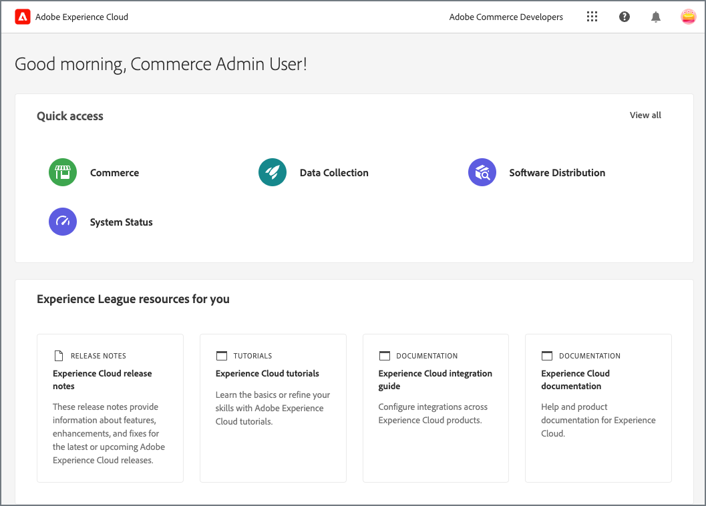
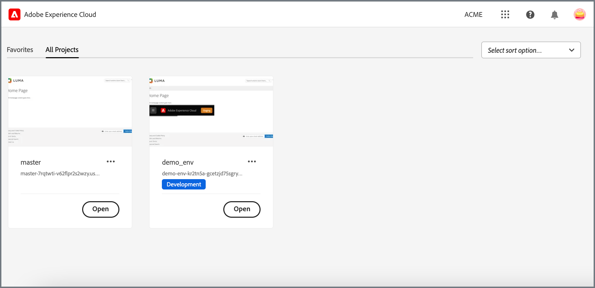

# Commerce용 Adobe Experience Cloud 통합

<table style="border:1px solid red">
<tr><td> Adobe Commerce의 전용 기능(<a href="https://experienceleague.adobe.com/docs/commerce-admin/user-guides/home.html#product-editions">자세히 알아보기</a>)</td></tr>
</table>

Admin Unified Experience 확장을 활성화하여 Adobe Commerce 프로젝트를 Experience Cloud과 통합합니다. 통합이 활성화되면 관리자는 Adobe Experience Cloud에서 Commerce 프로젝트에 액세스할 수 있습니다.

{width="700" zoomable="yes"}

## 사용 가능한 Commerce 프로젝트 보기

관리자는 Experience Cloud 홈 페이지에서 **[!UICONTROL Commerce]**&#x200B;을(를) 선택하여 액세스 권한이 있는 Commerce 프로젝트를 볼 수 있습니다.

Experience Cloud의 {width="700" zoomable="yes"}

관리자는 [!DNL Commerce Projects] 작업 영역에서 각 프로젝트에 대한 관리자 및 상점 방문을 열고 추가 정보를 볼 수 있습니다.

- **Commerce 상점 홈 페이지의 스냅샷**—상점 홈 페이지의 스냅샷. 프로젝트에 여러 웹 사이트가 있는 경우 스냅샷에 기본 사이트의 홈 페이지가 표시됩니다.

- **[프로젝트 이름](https://experienceleague.adobe.com/docs/commerce-cloud-service/user-guide/architecture/pro-develop-deploy-workflow.html)**—인스턴스의 클라우드 프로젝트 환경을 식별합니다. 클라우드 프로젝트의 프로젝트 이름은 기본적으로 [Git 분기 이름](https://experienceleague.adobe.com/docs/commerce-cloud-service/user-guide/project/console-branches.html)입니다. [통합 경험 저장소 구성 설정](admin-unified-experience-integration-manage.md#manage-the-integration-from-the-admin)에서 프로젝트 이름을 변경하거나 업데이트하십시오.

- **[Storefront URL](../stores-purchase/store-urls.md)** - 기본 웹 사이트의 기본 URL을 표시합니다.

- **[환경 유형](https://experienceleague.adobe.com/docs/commerce-cloud-service/user-guide/architecture/pro-develop-deploy-workflow.html)**—개발 또는 스테이징 환경에 배포된 Commerce 인스턴스가 [!UICONTROL Development] 또는 [!UICONTROL Staging] 레이블로 식별됩니다. 레이블이 없는 인스턴스는 프로덕션 환경에 배포됩니다.

- **Commerce 관리자 액세스** - **[!UICONTROL Open]**&#x200B;을(를) 클릭하여 관리자를 엽니다.

- **Storefront 액세스**—옵션 메뉴에서 **[!UICONTROL Open storefront]**&#x200B;을(를) 선택하여 Storefront를 엽니다.

- **프로젝트 선택을 위한 빠른 액세스**—옵션 메뉴에서 **[!UICONTROL Add to Favorites]**&#x200B;을(를) 선택하여 [!UICONTROL Favorites] 탭에 프로젝트를 추가합니다.

## 인증 흐름

Experience Cloud 통합이 활성화되면 관리자는 다음 워크플로를 사용하여 Commerce 프로젝트를 인증하고 액세스합니다.

1. Experience Cloud 로그인 페이지를 통해 로그인합니다.

   {width="600" zoomable="yes"}

   관리자는 Commerce 인스턴스와 연결된 조직의 Adobe 비즈니스 프로필로 Experience Cloud에 로그인해야 합니다. [Adobe 프로필 관리](https://helpx.adobe.com/enterprise/using/manage-adobe-profiles.html)를 참조하세요.

1. Experience Cloud 홈 페이지에서 **[!UICONTROL Open]**&#x200B;을(를) 선택하여 [!UICONTROL Commerce Projects workspace]을(를) 엽니다.

1. **[!UICONTROL Open]**&#x200B;을(를) 선택하여 프로젝트 관리자에 액세스합니다.

1. Adobe Commerce 로그인 페이지에서 **[!UICONTROL Sign in with Adobe ID]**&#x200B;을(를) 선택하여 인증을 완료하고 관리자를 엽니다.

   {width="600" zoomable="yes"}

>[!NOTE]
>
>Experience Cloud 통합이 활성화되거나 비활성화될 때 인증 워크플로가 영향을 받는 방법에 대한 자세한 내용은 [Experience Cloud 통합 관리](admin-unified-experience-integration-manage.md)를 참조하십시오.

## 요구 사항

- Adobe Commerce 2.4.5 이상
- 클라우드 인프라의 Adobe Commerce
- Adobe Commerce 확장

   - Commerce 관리자 통합 경험 확장(`magento/module-unified-experience`)

     Commerce 인스턴스에서 모듈을 사용할 수 없는 경우 Composer를 사용하여 설치할 수 있습니다.

   - [Adobe I/O 이벤트 서비스](https://developer.adobe.com/commerce/extensibility/events/) - Experience Cloud에서 Commerce 프로젝트에 대한 관리자 액세스를 관리하기 위해 이벤트 데이터를 보내는 데 필요합니다.

     Commerce과의 Adobe I/O 이벤트 통합은 Adobe Commerce 2.4.4 이상 버전에서 사용할 수 있는 Commerce 이벤트 확장(`magento/commerce-eventing`)에서 사용하도록 설정합니다.

## 통합 활성화

[Commerce 관리자와 Experience Cloud 통합을 구성](admin-unified-experience-integration-configure.md)하는 지침에 따라 통합을 사용하도록 설정하십시오.

>[!TIP]
>
>Commerce 인스턴스에서 Experience Cloud 통합을 이미 사용하도록 설정한 경우 구성 변경 또는 업데이트, 관리자 액세스 관리 및 문제 해결에 대한 자세한 내용은 [Experience Cloud 통합 관리](admin-unified-experience-integration-manage.md)를 참조하십시오.
