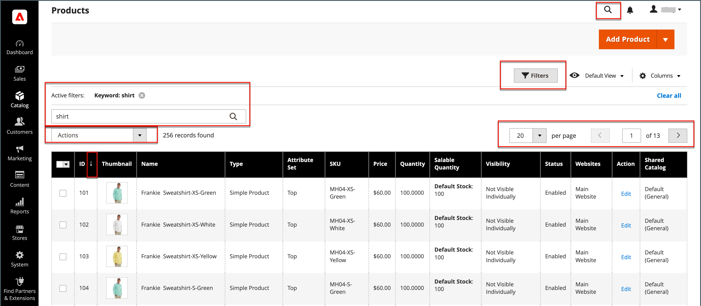
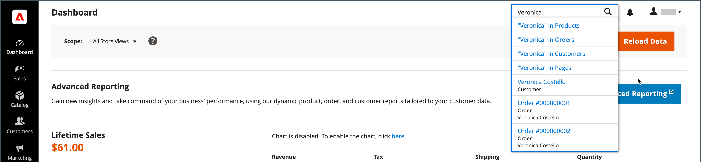

# 관리 도구 및 작업 공간

관리 작업 영역에서는 스토어를 실행하는 데 사용되는 모든 도구, 데이터 및 콘텐츠에 액세스할 수 있습니다. 구성에서 기본 시작 페이지를 설정할 수 있습니다. 많은 관리 페이지에는 검색, 정렬, 필터링, 선택 및 적용 작업을 위한 도구 세트가 있으며 섹션에 대한 데이터를 나열하는 그리드가 있습니다. 기본적으로 [대시보드](admin-dashboard.md) 는 관리자의 시작 페이지입니다. 그러나 로그인할 때 시작 페이지로 표시할 다른 페이지를 선택할 수 있습니다. 관리 사이드바에서 로고를 클릭하여 관리 시작 페이지로 돌아갈 수 있습니다.

{zoomable=&quot;yes&quot;}

## 작업 영역 컨트롤

| 제어 | 설명 |
|--- |--- |
| [!UICONTROL Global Search] | 오른쪽 상단의 검색 아이콘을 사용하여 제품, 고객 및 주문 레코드 등 데이터베이스에서 원하는 값을 찾을 수 있습니다. |
| [!UICONTROL Grid Search] | 그리드 위의 검색 상자를 사용하여 레코드에서 찾은 주요 단어를 기반으로 그리드 표시를 빠르게 필터링할 수 있습니다. |
| [!UICONTROL Sort] | 각 열의 머리글을 사용하여 목록을 오름차순 또는 내림차순으로 정렬할 수 있습니다. |
| [!UICONTROL Filters] | 그리드에 나타나는 레코드를 결정하는 검색 매개 변수 집합을 정의합니다. 또한 일부 열의 헤더에 있는 필터를 사용하여 목록을 특정 값으로 제한할 수 있습니다. 일부 필터에는 목록 상자에서 선택할 수 있는 추가 옵션이 있습니다. |
| [!UICONTROL Default View] | 그리드의 기본 열 레이아웃을 결정합니다. |
| [!UICONTROL Columns] | 선택 항목을 결정합니다. [열](admin-grid-controls.md) 그리드에 있는 순서대로 정렬합니다. 열 레이아웃을 변경하여 다음과 같이 저장할 수 있습니다 _보기_. 기본적으로 일부 열만 격자에 포함됩니다. |
| [!UICONTROL Paginate] | 페이지 매김 컨트롤은 추가 결과 페이지를 보는 데 사용됩니다. |
| [!UICONTROL Actions] | Actions 컨트롤은 선택한 모든 레코드에 작업을 적용합니다. |
| [!UICONTROL Select] | Select 컨트롤은 작업의 대상이 될 여러 레코드를 선택하는 데 사용됩니다. 옵션: `Select All` / `Deselect All` |

{style="table-layout:auto"}

## 작업 공간 검색

데이터베이스에서 레코드를 찾으려면 머리글에서 돋보기 아이콘을 사용합니다. _관리자_. 결과에는 고객, 제품, 주문 또는 관련 속성이 포함될 수 있습니다. 예를 들어 고객명을 입력하면 고객 레코드와 해당 이름과 연관된 주문이 결과에 포함될 수 있습니다.

{width="700" zoomable="yes"}

1. 헤더에서 _검색_ () 아이콘을 클릭하여 검색 상자를 엽니다.

1. 다음 중 하나를 수행합니다.

   - 일치하는 항목을 찾으려면 찾을 내용의 처음 몇 글자를 입력하십시오.
   - 정확히 일치하는 단어를 찾으려면 찾으려는 단어 또는 여러 단어를 입력합니다.

1. 표시된 검색 결과에서 임의의 항목을 클릭하여 레코드를 엽니다.

## 관리자 시작 페이지 변경

다음 [대시보드](admin-workspace.md#the-dashboard) 다른 시작 페이지를 구성할 수 있지만 관리자의 기본 시작 페이지입니다.

1. 다음에서 _관리자_ 사이드바, 이동 **[!UICONTROL Stores]** > _[!UICONTROL Settings]_>**[!UICONTROL Configuration]**.

1. 아래의 왼쪽 탐색 패널에서 **[!UICONTROL Advanced]**, 선택 **[!UICONTROL Admin]**.

1. 확장  다음 **[!UICONTROL Startup Page]** 섹션.

   {width="600"}

1. 설정 **[!UICONTROL Startup Page]** 책임자에 로그인한 후 가장 먼저 표시할 페이지로 이동합니다.

   모든 관리 옵션의 자세한 목록은 다음을 참조하십시오. [관리자](../configuration-reference/advanced/admin.md) 다음에서 _구성 참조_.

1. 완료되면 다음을 클릭하십시오. **[!UICONTROL Save Config]**.
