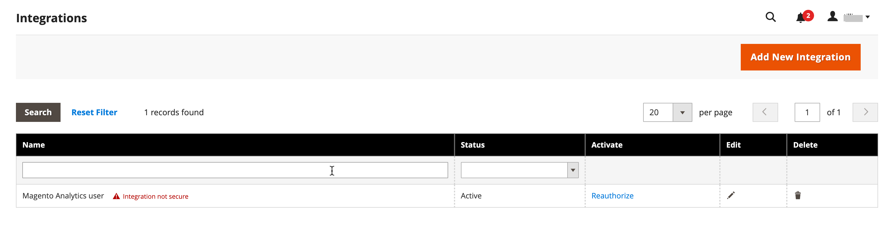
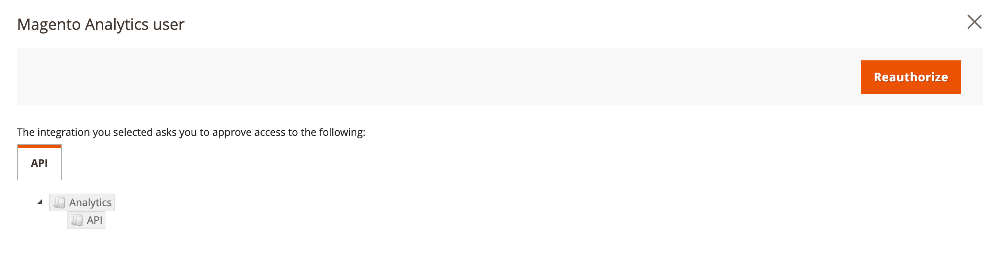

# [!DNL Commerce Intelligence] 도구

Commerce Intelligence 도구를 사용하여 건전한 비즈니스 의사 결정을 내리는 데 사용되는 통찰력을 얻으십시오.

## [!DNL Commerce Intelligence] account

를 활성화할 때 [!DNL Commerce Intelligence] Adobe을 통해 약 70개의 보고서가 있는 5개의 대시보드에 액세스할 수 있습니다. 이러한 보고서는 데이터에 대한 통찰력을 제공하고 &quot;매월 주문이 어떻게 증가하고 있습니까?&quot;, &quot;가장 충성스러운 고객은 누구입니까?&quot;, &quot;내 쿠폰 전략이 작동하고 있습니까?&quot;와 같은 질문에 답변하기 위해 설계되었습니다. 이 도구 세트에 대한 자세한 내용은 [Commerce Intelligence 사용 안내서][1].

## [!DNL Advanced Reporting]

[!DNL Advanced Reporting] Adobe Commerce 및 Magento Open Source에 포함되어 있습니다. 이 기능을 사용하면 비즈니스 요구 사항에 맞는 개인화된 대시보드를 사용하여 제품, 주문 및 고객 데이터를 기반으로 하는 동적 보고서 세트에 액세스할 수 있습니다. While [!DNL Advanced Reporting] 사용 [!DNL Commerce Intelligence] analytics의 경우 사용하기 위해 Commerce Intelligence 계정이 필요하지 않습니다 [!DNL Advanced Reporting].

자세한 내용은 [[!DNL Advanced Reporting]][2]개발자 설명서의 {:target=&quot;_blank&quot;} 항목.

>[!NOTE]
>
>[!DNL Commerce Intelligence] 계정은 기본 제공 보고를 사용하지만 [!DNL Advanced Reporting] 기능.

{width="700"}

### 요구 사항

* 웹 사이트는 공개 웹 서버에서 실행해야 합니다.

* 도메인에 유효한 보안(SSL) 인증서가 있어야 합니다.

* [!DNL Commerce] 은(는) 오류 없이 성공적으로 설치 또는 업그레이드되었어야 합니다.

* 다음에서 [!DNL Commerce] 다음에 대한 구성 [URL 저장](../stores-purchase/store-urls.md), **[!UICONTROL Base URL (Secure)]** 스토어 보기에 대한 설정은 보안 URL을 가리켜야 합니다. For example: `https://yourdomain.com`.

* 다음에서 [!DNL Commerce] 스토어 URL 구성, **[!UICONTROL Use Secure URLs on Storefront]** 및 **[!UICONTROL Use Secure URLs in Admin]** 은(는) 로 설정되어야 합니다. `Yes`.

* [[!DNL Commerce] crontab][3] 이(가) 만들어지고 크론 작업이 설치된 서버에서 실행 중입니다.

>[!NOTE]
>
>[!DNL Advanced Reporting] 은(는) 다음에만 사용할 수 있습니다. [!DNL Commerce] 단일 을 지속적으로 사용한 설치 [기본 통화](../stores-purchase/currency-configuration.md).


### 1단계: 활성화 [!DNL Advanced Reporting]

다음에서 [!DNL Commerce] 구성, [[!DNL Advanced Reporting]](../configuration-reference/general/advanced-reporting.md) 은 기본적으로 활성화되어 있으며 cron이 이면 자동으로 시작됩니다. [구성됨](../configuration-reference/advanced/system.md) 실행 중입니다. 가입을 설정하려면 성공할 때까지 다음 24시간 동안 각 시간이 시작될 때 시작됩니다. 구독이 성공적으로 설정될 때까지 구독 상태가 &quot;보류 중&quot;입니다.

1. 다음에서 _관리자_ 사이드바, 이동 **[!UICONTROL Stores]** > _[!UICONTROL Settings]_>**[!UICONTROL Configuration]**.

1. 왼쪽 탐색 패널에서 **[!UICONTROL General]** 확장됨, 선택 **[!UICONTROL Advanced Reporting]** 다음을 수행합니다.

   * 다음을 확인합니다. **[!UICONTROL Advanced Reporting Service]** 이(가) (으)로 설정됨 `Enable` (기본 설정).

   * 설정 **[!UICONTROL Time of day to send data]** 24시간 시계에 따라 서비스가 스토어에서 업데이트된 데이터를 받기를 원하는 시간, 분 및 초로 이동합니다. 기본적으로 데이터는 오전 2시에 전송됩니다.

   * 아래 **[!UICONTROL Industry Data]**, 을(를) 선택합니다. **[!UICONTROL Industry]** 귀사의 비즈니스를 가장 잘 설명합니다.

   {width="400"}

1. 완료되면 다음을 클릭하십시오. **[!UICONTROL Save Config]**.

1. 메시지가 표시되면 **[[!UICONTROL Cache Management]](../systems/cache-management.md)** 페이지 맨 위에 있는 메시지에서 유효하지 않은 캐시를 새로 고칩니다.

1. 밤새 기다리거나 다음 예정된 업데이트 시간이 경과할 때까지 기다리십시오. 그런 다음 구독 상태를 확인합니다. 상태가 여전히 인 경우 _보류 중_&#x200B;를 설치한 후 모든 요구 사항이 충족되는지 확인하십시오.

### 2단계: 액세스 [!DNL Advanced Reporting]

1. 다음 중 하나를 수행합니다.

   * 다음에서 _관리자_ 사이드바, 선택 **[!UICONTROL Dashboard]**. 그런 다음 을 클릭합니다. **[!UICONTROL Go to Advanced Reporting]**.
   * 다음에서 _관리자_ 사이드바, 이동 **[!UICONTROL Reports]** > _[!UICONTROL Business Intelligence]_>**[!UICONTROL Advanced Reporting]**.

   다음 [!DNL Advanced Reporting] 대시보드는 주문, 고객 및 제품에 대한 빠른 요약을 제공합니다. 아래로 스크롤하여 전체 대시보드를 확인합니다.

1. 데이터를 더 잘 보려면 **[!UICONTROL Filters]** 오른쪽 상단에서 보고서에 포함할 기간 및 스토어 보기를 볼 수 있습니다. 그런 다음 다음을 수행합니다.

   * 자세한 내용을 보려면 데이터 포인트 위로 마우스를 가져갑니다.
   * 모든 대시보드 보고서를 보려면 각 탭을 클릭합니다.

   {width="600" zoomable="yes"}

## 액세스 [!DNL Advanced Reporting] 데이터 리소스

고급 보고 대시보드의 오른쪽 위 모서리에서 을(를) 클릭합니다. **[!UICONTROL Additional Resources]**.

{width="600" zoomable="yes"}

## 문제 해결

404 &quot;페이지를 찾을 수 없음&quot; 메시지가 표시되면 스토어가 요구 사항을 충족하는지 확인하십시오. [!DNL Advanced Reporting]. 그런 다음 지침에 따라 통합이 설치되었는지 확인합니다.

### 통합이 활성화되었는지 확인

1. 다음에서 _관리자_ 사이드바, 이동 **[!UICONTROL System]** > _[!UICONTROL Extensions]_>**[!UICONTROL Integration]**.

1. 다음을 확인합니다 **[!UICONTROL Magento Analytics user]** 통합이 목록 및 **[!UICONTROL Status]** 은(는) `Active`.

1. 사용자를 다시 설정하려면 **[!UICONTROL Reauthorize]** 다음을 수행합니다.

   {width="600"}

   * 메시지가 표시되면 **[!UICONTROL Reauthorize]** API 리소스에 대한 액세스를 승인합니다.

     {width="600"}

   * 확장에 대한 통합 토큰 목록이 완료되었는지 확인합니다. 그런 다음 을 클릭합니다. **완료**.

     {width="600"}

1. 통합을 나타내는 메시지를 찾습니다 `Magento Analytics user` 이(가) 재인증되었습니다.

1. 밤새 또는 다음 예정된 업데이트 시간 이후까지 기다리십시오.

### 단일 기준 통화 확인

[!DNL Advanced Reporting] 은(는) 다음에만 사용할 수 있습니다. [!DNL Commerce] 하나만 사용한 설치 [기본 통화](../stores-purchase/currency-configuration.md) 설치 이후. 그 결과 내역(history)에서 모든 주문은 동일한 기본 통화를 사용합니다. [!DNL Advanced Reporting] 이(가) 언제든지 기준 통화를 변경했으며 내역에 다른 기준 통화로 처리된 주문이 있는 경우 작동하지 않습니다.

스토어에 여러 기본 통화가 있는지 확인하려면 다음을 쿼리할 수 있습니다. [!DNL Commerce] 다음 MySQL 예제를 사용하여 명령줄에서 데이터베이스를 가져옵니다. 데이터 구조와 일치하도록 테이블 이름을 변경해야 할 수 있습니다.

```sql
select distinct base_currency_code from sales_order;
```

### 데이터 불일치

다음 사항을 알고 있는 경우 `Data last updated...` 캡션은 오늘의 날짜가 아닌 어제 날짜를 표시합니다. 고급 보고 업데이트에서는 최대 하루의 지연이 있을 수 있습니다. 이 지연은 예상보다 큰 큐 크기 때문입니다.

## 대시보드 보고서

**[!UICONTROL Orders]**

| 필드 | 설명 |
|--- |--- |
| [!UICONTROL Revenue] | 정의된 기간 동안 스토어 보기에서 받은 모든 매출을 표시합니다. |
| [!UICONTROL Orders] | 정의된 기간 동안 스토어 보기를 통해 수행한 모든 주문을 표시합니다. |
| [!UICONTROL AOV] | 정의된 기간 동안 스토어 보기를 통해 수행된 평균 주문 값을 표시합니다. |
| [!UICONTROL Refunds] | 정의된 기간 동안 스토어 보기를 통해 처리된 모든 환불을 표시합니다. |
| [!UICONTROL Tax Collected] | 정의된 기간 동안 스토어 보기를 통해 수집된 모든 세금을 표시합니다. |
| [!UICONTROL Shipping Collected] | 정의된 기간 동안 스토어 보기를 통해 수집된 모든 배송 비용을 표시합니다. |
| [!UICONTROL Orders by Status] | 정의된 기간 동안 스토어 조회수에 대한 상태별 주문 수를 표시합니다. |
| [!UICONTROL Orders by Status] | 상태별 주문 수의 요약을 나열합니다. |
| [!UICONTROL Coupon Usage] | 정의된 기간 동안 스토어 보기를 통해 상환된 모든 쿠폰 코드와 각 사용자에 대한 사용자 수를 나열합니다. |
| [!UICONTROL Orders and Revenue by Billing Region] | 정의된 기간 동안 스토어 조회용 지역별 주문 및 매출 수를 나열합니다. |
| [!UICONTROL Tax Collected by Billing Region] | 정의된 기간 동안 저장소 보기에 대해 지역별로 수집된 세액을 나열합니다. |
| [!UICONTROL Shipping Fees Collected by Shipping Region] | 정의된 기간 동안 스토어 조회용으로 지역별로 수집된 배송 비용을 나열합니다. |

{style="table-layout:auto"}

**[!UICONTROL Customers]**

| 필드 | 설명 |
|--- |--- |
| [!UICONTROL Unique Customers] | 정의된 기간 동안 스토어 보기와 연결된 고유한 고객 계정 수를 표시합니다. |
| [!UICONTROL New Registered Accounts] | 정의된 기간 동안 스토어 보기에 등록된 새 고객 계정 수를 표시합니다. |
| [!UICONTROL Top Coupon Users] | 고객 ID별로 최상위 쿠폰 사용자를 나열하고 정의된 기간 동안 스토어 보기를 위해 쿠폰으로 주문한 주문 수를 표시합니다. |
| [!UICONTROL Customer KPI Table] | 정의된 기간 동안 스토어 보기에 대한 고객 ID별 주문 수, 매출 및 평균 주문 값을 나열합니다. |

{style="table-layout:auto"}

**[!UICONTROL Products]**

| 필드 | 설명 |
|--- |--- |
| [!UICONTROL Quantity of Products Sold] | 정의된 기간 동안 스토어 보기를 통해 판매된 제품 수를 표시합니다. |
| [!UICONTROL Products Added to Wishlists] | 정의된 기간 동안 스토어 보기를 통해 위시리스트에 추가된 모든 제품을 나열합니다. |
| [!UICONTROL Best Selling Products by Quantity] | 정의된 기간 동안 스토어 보기를 통해 가장 많이 판매된 제품 및 판매 수량을 나열합니다. |
| [!UICONTROL Best Selling Products by Revenue] | 정의된 기간 동안 스토어 보기를 통해 제품을 판매하여 생성된 매출 및 베스트셀러 제품을 나열합니다. |

{style="table-layout:auto"}


[1]: https://experienceleague.adobe.com/docs/commerce-business-intelligence/mbi/guide-overview.html
[2]: https://developer.adobe.com/commerce/php/development/advanced-reporting/
[3]: https://experienceleague.adobe.com/docs/commerce-operations/configuration-guide/cli/configure-cron-jobs.html
