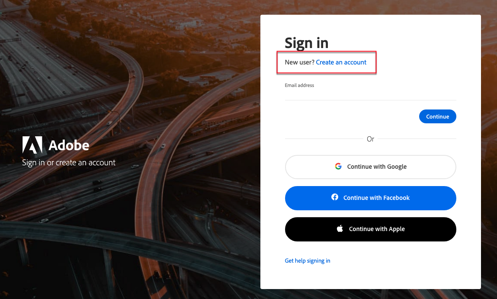
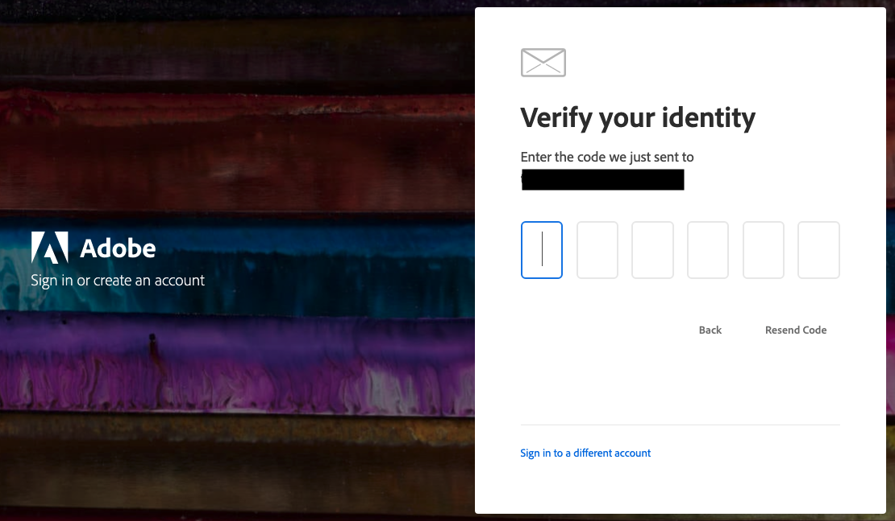

# [!DNL Commerce] 계정에 액세스

[!DNL Commerce] 웹 사이트에서 [!DNL Commerce] 계정에 액세스할 수 있습니다. [!DNL Commerce] 계정의 대시보드에서 구입한 제품 및 서비스와 관련된 정보와 연락처 및 청구 정보를 찾을 수 있습니다. 일부 정보는 라이선스 소유자에게만 표시됩니다.

![내 [!DNL Commerce] 계정](./assets/home-acct.png){width="700"}

[!DNL Commerce] 계정 로그인은 저장소 관리자 로그인과 별개입니다. 일반적으로 각각에 대해 서로 다른 자격 증명을 사용하며 각 시스템에 대한 액세스는 독립적으로 관리됩니다.

그러나 Adobe Commerce 및 Adobe Business 제품에 대한 로그인을 간소화하려는 사용자는 스토어 관리자에 로그인하도록 Adobe ID을 구성할 수 있습니다. [Commerce용 IMS 통합 안내서](https://experienceleague.adobe.com/en/docs/commerce-admin/start/admin/ims/adobe-ims-config)의 *Adobe ID과 Commerce Admin 통합 구성*.

>[!NOTE]
>
>계정을 만든 후에는 TFA(2단계 인증)를 사용하여 [계정을 보호](commerce-account-secure.md)하는 것이 좋습니다.

## [!DNL Commerce] 계정에 로그인

Commerce 계정에 액세스하려면 Adobe ID이 필요합니다. 이미 [!DNL Commerce] 계정이 있지만 2022년 8월 이후 계정에 로그인하지 않은 경우 로그인 프로세스 중에 Adobe ID을 만들어야 합니다.

>[!WARNING]
>
>기존 Commerce 계정 MAGEID와 연결된 이메일 주소를 사용하여 Adobe ID을 만듭니다. 다른 새 이메일 주소를 사용하면 새 MAGEID가 만들어집니다.

1. [[!DNL Commerce] 사이트](https://account.magento.com/customer/account/login/)&#x200B;(으)로 이동합니다.

1. **[!UICONTROL Sign in with Adobe ID]**&#x200B;을(를) 클릭합니다.

   {width="700"}

1. 전자 메일 주소를 입력하고 **[!UICONTROL Continue]**&#x200B;을(를) 클릭합니다.

   >[!TIP]
   >
   >기존 Commerce 계정 MAGEID와 연결된 이메일 주소를 사용한 경우 로그인 프로세스에서 자동으로 해당 주소를 Adobe ID에 연결합니다.

## [!DNL Commerce] 계정 만들기

누구나 무료 [!DNL Commerce] 계정을 만들 수 있습니다. 사용하는 이메일 주소는 하나의 Commerce 계정에만 연결할 수 있습니다.

>[!NOTE]
>
>Adobe ID을 사용하여 Commerce 계정을 만들고 액세스합니다.
>- Commerce 계정이 없는 경우 가입 프로세스 중에 만들 수 있습니다.
>- 이미 Commerce 계정이 있지만 Adobe ID이 없는 경우 [Commerce 계정에 로그인](#log-in-to-your-dnl-commerce-account)을 참조하세요.

1. [[!DNL Commerce] 사이트](https://account.magento.com/customer/account/login/)&#x200B;(으)로 이동합니다.

1. **[!UICONTROL Sign in with Adobe ID]**&#x200B;을(를) 클릭합니다.

1. Adobe ID이 없으면 **[!UICONTROL Create an account]**&#x200B;을(를) 클릭합니다. 그렇지 않으면 7단계로 건너뜁니다.

   {width="700"}

1. 등록 양식을 작성하십시오.

   {width="700"}

1. **[!UICONTROL Create account]**&#x200B;을(를) 클릭합니다.

1. 전자 메일 주소로 전송된 인증 코드를 입력합니다.

   {width="700"}

1. Adobe ID이 만들어지고 확인되면 https://account.magento.com/으로 돌아갑니다. MAGE ID가 생성되고 Adobe ID에 자동으로 연결됩니다.

## 암호 재설정

1. [[!DNL Commerce] 사이트](https://account.magento.com/customer/account/login/)&#x200B;(으)로 이동합니다.

1. **[!UICONTROL Sign in with Adobe ID]**&#x200B;을(를) 클릭합니다.

1. **[!UICONTROL Get help signing in]**&#x200B;을(를) 클릭합니다.

   {width="700"}

1. **[!UICONTROL Reset your password]**&#x200B;을(를) 클릭합니다.

   {width="700"}

1. 이메일 주소를 입력합니다.

1. **[!UICONTROL Continue]**&#x200B;을(를) 클릭합니다.
