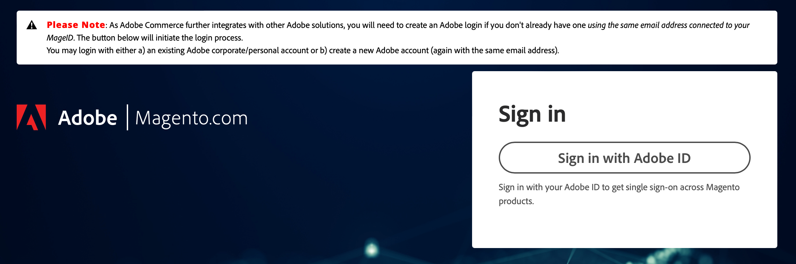

# [!DNL Commerce] 계정에 액세스

[!DNL Commerce] 계정은 클라우드 인프라 또는 온프레미스에 배포된 Adobe Commerce 프로젝트용 Adobe Commerce 서비스를 관리하기 위한 중앙 액세스 지점입니다. 계정 대시보드에서 구독을 보고, Commerce 서비스 API 키를 관리하고, 과거 청구 정보를 검토하고, 조직의 다른 사용자와 공동 작업을 수행할 수 있습니다.

[첫 번째 티켓을 제출](https://experienceleague.adobe.com/en/docs/commerce-knowledge-base/kb/help-center-guide/magento-help-center-user-guide#support-case)하거나 특정 상점 내에서 작업하는 대신 Adobe Commerce 관계를 관리해야 하는 경우 [!DNL Commerce] 계정을 만들거나 액세스하는 것부터 시작하십시오.

[첫 번째 지원 티켓을 제출](https://experienceleague.adobe.com/en/docs/commerce-knowledge-base/kb/help-center-guide/magento-help-center-user-guide#support-case)하거나 특정 상점 외부에서 Adobe Commerce 관계를 처리해야 하는 경우 [!DNL Commerce] 계정을 만들거나 액세스해 보세요.

[!DNL Commerce] 웹 사이트에서 [!DNL Commerce] 계정에 액세스할 수 있습니다. 계정 대시보드에서 구입한 제품 및 서비스와 관련된 정보를 보고 다른 사용자에게 [공유 액세스](https://experienceleague.adobe.com/en/docs/support-resources/adobe-support-tools-guide/adobe-commerce-support/adobe-commerce-help-center-user-guide#provide-shared-access)를 제공할 수 있습니다. Commerce 서비스 API 키와 같은 일부 정보는 라이선스 소유자에게만 표시됩니다.

>[!NOTE]
>
>**[!UICONTROL Billing History]** 계정 페이지의 [!DNL Commerce] 섹션에는 청구 시스템 업데이트 전에 생성된 송장만 표시됩니다.
>
>새 송장이 나열되지 않으면 새 시스템으로 전환되어 이 페이지에서 액세스할 수 없습니다.

![내 [!DNL Commerce] 계정](./assets/home-acct.png){width="700"}

[!DNL Commerce] 계정 로그인은 저장소 관리자 로그인과 별개입니다. 일반적으로 각각에 대해 서로 다른 자격 증명을 사용하며 각 시스템에 대한 액세스는 독립적으로 관리됩니다.

그러나 Adobe Commerce 및 Adobe Business 제품에 대한 로그인을 간소화하려는 사용자는 스토어 관리자에 로그인하도록 Adobe ID을 구성할 수 있습니다. [Commerce용 IMS 통합 안내서](https://experienceleague.adobe.com/en/docs/commerce-admin/start/admin/ims/adobe-ims-config)의 *Adobe ID과 Commerce Admin 통합 구성*.

>[!NOTE]
>
>계정을 만든 후에는 TFA(2단계 인증)를 사용하여 [계정을 보호](commerce-account-secure.md)하는 것이 좋습니다.

## [!DNL Commerce] 계정에 로그인

[!DNL Commerce] 계정에 액세스하려면 Adobe ID이 필요합니다. 기존 [!DNL Commerce] 계정이 있지만 2022년 8월 이후 로그인하지 않은 경우 로그인 프로세스 중에 Adobe ID을 만들어야 합니다. 이 단계를 완료해야 계정에 로그인할 수 있습니다.

>[!WARNING]
>
>Adobe Commerce [지원 사례](https://experienceleague.adobe.com/en/docs/support-resources/adobe-support-tools-guide/adobe-commerce-support/adobe-commerce-help-center-user-guide#support-case)를 제출할 때 Commerce 조직을 찾을 수 없는 경우 일반적으로 다음 중 하나를 의미합니다. 계정 소유자가 Adobe ID을 만들지 않았거나 Adobe ID이 있지만 Commerce 계정에 연결되어 있지 않습니다.

1. [[!DNL Commerce]](https://account.magento.com/customer/account/login/) 사이트로 이동합니다.

1. **[!UICONTROL Sign in with Adobe ID]**&#x200B;을(를) 클릭합니다.

   {width="700"}

1. 전자 메일 주소를 입력하고 **[!UICONTROL Continue]**&#x200B;을(를) 클릭합니다.

   >[!TIP]
   >
   >기존 Commerce 계정 MAGEID와 연결된 이메일 주소를 사용한 경우 로그인 프로세스에서 자동으로 해당 주소를 Adobe ID에 연결합니다.

## [!DNL Commerce] 계정 만들기

누구나 무료 [!DNL Commerce] 계정을 만들 수 있습니다. 사용하는 이메일 주소는 하나의 Commerce 계정에만 연결할 수 있습니다.

>[!NOTE]
>
>Adobe ID을 사용하여 Commerce 계정을 만들고 액세스합니다.
>- Commerce 계정이 없는 경우 가입 프로세스 중에 만들 수 있습니다.
>- 이미 Commerce 계정이 있지만 Adobe ID이 없는 경우 [Commerce 계정에 로그인](#log-in-to-your-dnl-commerce-account)을 참조하세요.

1. [[!DNL Commerce] 사이트](https://account.magento.com/customer/account/login/)&#x200B;(으)로 이동합니다.

1. **[!UICONTROL Sign in with Adobe ID]**&#x200B;을(를) 클릭합니다.

1. Adobe ID이 없으면 **[!UICONTROL Create an account]**&#x200B;을(를) 클릭합니다. 그렇지 않으면 7단계로 건너뜁니다.

   {width="700"}

1. 등록 양식을 작성하십시오.

   {width="700"}

1. **[!UICONTROL Create account]**&#x200B;을(를) 클릭합니다.

1. 전자 메일 주소로 전송된 인증 코드를 입력합니다.

   {width="700"}

1. Adobe ID이 만들어지고 확인되면 https://account.magento.com/으로 돌아갑니다. MAGE ID가 생성되고 Adobe ID에 자동으로 연결됩니다.

## 암호 재설정

1. [[!DNL Commerce] 사이트](https://account.magento.com/customer/account/login/)&#x200B;(으)로 이동합니다.

1. **[!UICONTROL Sign in with Adobe ID]**&#x200B;을(를) 클릭합니다.

1. **[!UICONTROL Get help signing in]**&#x200B;을(를) 클릭합니다.

   {width="700"}

1. **[!UICONTROL Reset your password]**&#x200B;을(를) 클릭합니다.

   {width="700"}

1. 이메일 주소를 입력합니다.

1. **[!UICONTROL Continue]**&#x200B;을(를) 클릭합니다.

## Commerce 계정에 대한 공유 액세스 제공

공유 액세스를 사용하면 개인 로그인을 사용하지 않고도 동료, 파트너 또는 관리자와 같은 신뢰할 수 있는 사용자에게 사용자를 대신하여 Adobe Commerce 관계를 관리할 수 있는 권한을 부여할 수 있습니다. 여기에는 다른 사용자가 지원 사례를 열고 추적할 수 있는 것이 포함됩니다.

공유 계정 설정에 대한 자세한 단계는 Adobe Commerce 시작 안내서의 [Commerce 계정 공유](https://experienceleague.adobe.com/en/docs/commerce-admin/start/commerce-account/commerce-account-share?lang=en) 섹션을 참조하십시오.

Commerce 지원 사례를 제출하는 방법에 대한 자세한 지침은 [Adobe Commerce 도움말 센터 사용 안내서](https://experienceleague.adobe.com/en/docs/support-resources/adobe-support-tools-guide/adobe-commerce-support/adobe-commerce-help-center-user-guide#support-case)를 참조하십시오.
