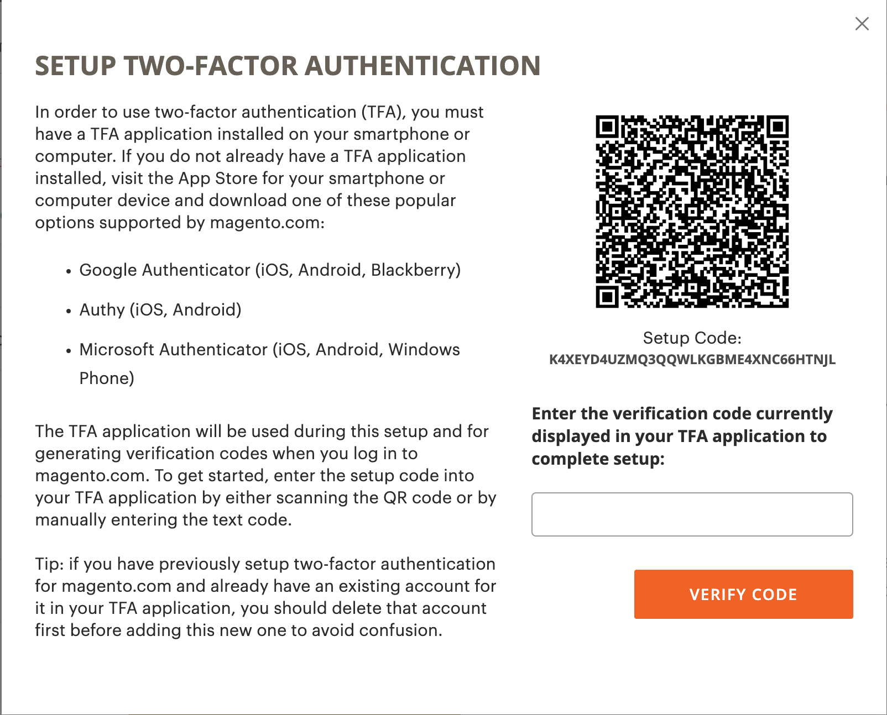
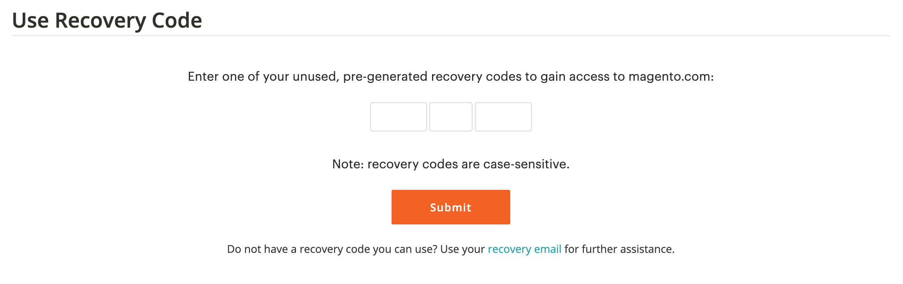
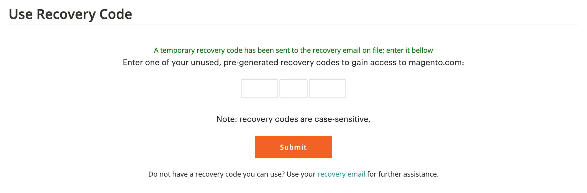

# [!DNL Commerce] 계정 보안 설정

이중 인증(TFA 또는 2FA)은 승인되지 않은 액세스로부터 [!DNL Commerce] 계정을 더 잘 보호하기 위한 보안 추가 계층입니다. 로그인 프로세스를 완료하려면 TFA에는 표준 사용자 이름 및 암호 자격 증명과 함께 _초 요소_&#x200B;가 필요합니다. 이 두 번째 요소는 모바일 장치에 설치된 TFA 응용 프로그램에서 연속적으로 생성되고 [!DNL Commerce] 계정과 쌍을 이루는 임시 확인 코드 형식을 사용합니다.

TFA를 활성화하면 계정 보안이 강화됩니다. 사용자 이름과 암호 자격 증명(첫 번째 요소)과 개인 디바이스의 TFA 애플리케이션의 유효한 인증 코드(두 번째 요소)가 모두 있어야 권한이 없는 사용자가 로그인할 수 있습니다.

>[!NOTE]
>
>스토어의 _관리자_&#x200B;를 보호하는 2단계 인증에는 별도의 설정이 있습니다. 자세한 내용은 [이중 인증](../systems/security-two-factor-authentication.md)을 참조하세요.

## 시작하기 전에

TFA를 사용하려면 개인 장치(예: 스마트폰, 태블릿, 컴퓨터)에 TFA 애플리케이션이 설치되어 있어야 합니다. 여러 가지 옵션이 있지만 인기 있는 옵션 및 무료 옵션은 다음과 같습니다.

- Google Authenticator(iOS, Android™, BlackBerry®)

- 작성(iOS, Android™)

- Microsoft® Authenticator(iOS, Android™, Windows Phone)

## 이중 인증 활성화

1. [[!DNL Commerce] 계정](https://account.magento.com/customer/account/login){:target="_blank"}에 로그인합니다.

1. 왼쪽 탐색 창에서 **[!UICONTROL Account Settings]**&#x200B;을(를) 선택한 다음 **[!UICONTROL Two-factor Authentication]**&#x200B;을(를) 선택합니다.

   {width="600" zoomable="yes"}

1. 2단계 인증 설정 프로세스를 시작하려면 **[!UICONTROL Enable]**&#x200B;을(를) 선택하십시오.

1. 전자 메일로 보낸 **[!UICONTROL Verification Code]**&#x200B;을(를) 입력하고 계속하려면 **[!UICONTROL Verify Code]**&#x200B;을(를) 선택하십시오.

   {width="400"}

1. 개인 장치에 다운로드하여 설치한 2단계 인증 응용 프로그램을 엽니다.

1. [!UICONTROL SETUP TWO-FACTOR AUTHENTICATION] 양식에서 **[!UICONTROL Setup Code]**&#x200B;을(를) 사용하여 TFA 애플리케이션에 Adobe Commerce을 추가합니다.

   {width="400"}

   TFA 애플리케이션을 사용하여 QR 코드를 스캔하거나 수동으로 입력하여 코드를 추가할 수 있습니다. 이 코드를 사용하면 TFA 응용 프로그램을 [!DNL Commerce] 계정과 쌍으로 만들고 권한이 TFA 앱을 생성하여 보안 계정 액세스를 위한 인증 코드를 생성할 수 있습니다.

1. 설정을 완료합니다.

   - [!UICONTROL SETUP TWO FACTOR-AUTHENTICATION] 폼에서 2단계 인증 응용 프로그램의 인증 코드를 입력하십시오.

   - **[!UICONTROL Verify Code]**&#x200B;을(를) 선택합니다.

   >[!NOTE]
   >
   >보안을 위해 TFA 애플리케이션의 인증 코드는 지속적으로 만료되고 재생성됩니다. **_항상_** 현재 표시된 코드를 사용합니다.

1. 안전하고 액세스할 수 있는 위치에 표시된 **[!UICONTROL Recovery Codes]**&#x200B;을(를) 저장합니다.

   {width="400"}

   [!DNL Commerce] 계정에 로그인할 때 확인 코드를 제공할 수 없는 경우 복구 코드를 사용하여 계정에 다시 액세스해야 합니다.

   각 복구 코드는 한 번만 사용할 수 있지만 새 복구 코드를 [생성](#generate-new-recovery-codes)할 수 있습니다. 복구 코드는 대/소문자를 구분합니다.

1. 확인 확인란을 선택하고 계속하려면 **[!UICONTROL Submit]**&#x200B;을(를) 선택하십시오.

1. 계정에 대한 액세스 권한을 복구하려면 **[!UICONTROL Recovery Email]**&#x200B;을(를) 입력하십시오.

   2단계 인증 응용 프로그램에서 확인 코드를 생성할 수 없고 미리 생성된 미사용 복구 코드에 대한 액세스 권한이 없는 경우 이 이메일 주소가 필요합니다.

   24시간마다 한 번씩 임시 복구 코드를 생성하여 지정된 복구 이메일 주소로 전송할 수 있습니다. 이 코드를 사용하여 계정에 다시 액세스하십시오.

   >[!IMPORTANT]
   >
   >복구 이메일 계정에 대한 액세스 권한을 유지하십시오. 그렇지 않으면 해당 계정에 전송된 임시 복구 코드를 사용할 수 없습니다.

   {width="400"}

1. 확인 확인란을 선택하고 **[!UICONTROL Submit]**&#x200B;을(를) 선택하여 2단계 인증 설정 프로세스를 완료합니다.

   - [!DNL Commerce] 계정과 연결된 전자 메일 주소로 알림이 전송되어 2단계 인증을 사용하도록 설정했는지 확인합니다.

   - 구성을 확인하기 위해 복구 이메일 계정으로 알림이 전송됩니다.

>[!TIP]
>
>개인 장치를 분실하거나 새 장치를 받는 경우 [2단계 인증 앱을 변경](#change-your-two-factor-authentication-application)하고 새 복구 코드를 생성할 수 있습니다.

## 확인 코드를 사용하여 로그인

1. [!DNL Commerce] [계정 로그인](https://account.magento.com/customer/account/login){:target="_blank"}(으)로 이동합니다.

1. 사용자 이름과 암호 자격 증명을 입력한 다음 **[!UICONTROL Login]**&#x200B;을(를) 선택합니다.

1. 메시지가 표시되면 2단계 인증 응용 프로그램에 표시되는 **[!UICONTROL Verification Code]**&#x200B;을(를) 입력하십시오.

   {width="600"}

1. 로그인 프로세스를 완료하려면 **[!UICONTROL Submit]**&#x200B;을(를) 선택하십시오.

## 복구 코드를 사용하여 로그인

1. [!DNL Commerce] [계정 로그인](https://account.magento.com/customer/account/login){:target="_blank"}(으)로 이동합니다.

1. 사용자 이름과 암호 자격 증명을 입력한 다음 **[!UICONTROL Login]**&#x200B;을(를) 선택합니다.

1. 확인 코드 프롬프트를 무시하려면 **[!UICONTROL Use recovery code]**&#x200B;을(를) 선택하십시오.

1. 메시지가 표시되면 사용하지 않은 **[!UICONTROL Recovery Code]**&#x200B;을(를) 입력하십시오.

   {width="600"}

1. 로그인 프로세스를 완료하려면 **[!UICONTROL Submit]**&#x200B;을(를) 선택하십시오.

## 복구 이메일을 사용하여 로그인

1. [[!DNL Commerce] 계정](https://account.magento.com/customer/account/login){:target="_blank"}에 로그인합니다.

1. 사용자 이름과 암호 자격 증명을 입력한 다음 **[!UICONTROL Login]**&#x200B;을(를) 선택합니다.

1. 확인 코드 프롬프트를 무시하려면 **[!UICONTROL Use recovery code]**&#x200B;을(를) 선택하십시오.

1. 이메일을 통해 임시 복구 코드를 받으려면 **[!UICONTROL recovery email]** 링크를 선택하십시오.

   {width="600"}

1. 복구 이메일 계정을 열어 임시 코드를 가져온 다음 지정된 필드에 코드를 입력합니다.

1. 로그인 프로세스를 완료하려면 **[!UICONTROL Submit]**&#x200B;을(를) 선택하십시오.

임시 복구 코드를 사용하여 계정에 액세스한 후 [새 복구 코드를 생성](#generate-new-recovery-codes)하고 저장하여 추가 계정 액세스 문제를 방지합니다.

## 복구 코드 보기

1. [!DNL Commerce] [계정 로그인](https://account.magento.com/customer/account/login){:target="_blank"}(으)로 이동합니다.

1. 사용자 이름과 암호 자격 증명을 입력한 다음 **[!UICONTROL Login]**&#x200B;을(를) 선택합니다.

1. 앞에서 설명한 2단계 인증 방법 중 하나를 사용하여 로그인 프로세스를 완료합니다.

1. 왼쪽 탐색 창에서 **[!UICONTROL Account Settings]**&#x200B;을(를) 선택한 다음 **[!UICONTROL Two-factor Authentication]**&#x200B;을(를) 선택합니다.

   {width="600" zoomable="yes"}

1. 미리 생성된 복구 코드를 보려면 **복구 코드 보기**&#x200B;를 선택하십시오.

1. 전자 메일로 보낸 **[!UICONTROL Verification Code]**&#x200B;을(를) 입력하고 계속하려면 **[!UICONTROL Verify Code]**&#x200B;을(를) 선택하십시오.

   {width="400"}

1. 안전하고 액세스할 수 있는 위치에 제공된 **복구 코드**&#x200B;를 저장합니다.

   [!DNL Commerce] 계정에 로그인하기 위한 확인 코드를 제공할 수 없는 경우 복구 코드를 사용하면 계정에 다시 액세스할 수 있습니다.

   각 복구 코드는 일회성이지만 항상 새 코드를 [생성](#generate-new-recovery-codes)할 수 있습니다. 복구 코드는 대/소문자를 구분합니다.

   {width="400"}

1. 확인 확인란을 선택하고 **[!UICONTROL Submit]**&#x200B;을(를) 선택하여 대화 상자를 닫습니다.

## 새 복구 코드 생성

1. [!DNL Commerce] [계정 로그인](https://account.magento.com/customer/account/login){:target="_blank"}(으)로 이동합니다.

1. 사용자 이름과 암호 자격 증명을 입력한 다음 **[!UICONTROL Login]**&#x200B;을(를) 선택합니다.

1. 앞에서 설명한 2단계 인증 방법 중 하나를 사용하여 로그인 프로세스를 완료합니다.

1. 왼쪽 탐색 창에서 **[!UICONTROL Account Settings]**&#x200B;을(를) 선택한 다음 **[!UICONTROL Two-factor Authentication]**&#x200B;을(를) 선택합니다.

1. 미리 생성된 새 복구 코드를 생성하려면 **새 복구 코드 생성**&#x200B;을 선택하십시오.

1. 전자 메일로 보낸 **[!UICONTROL Verification Code]**&#x200B;을(를) 입력하고 계속하려면 **[!UICONTROL Verify Code]**&#x200B;을(를) 선택하십시오.

1. 안전하고 액세스할 수 있는 위치에 제공된 **복구 코드**&#x200B;를 저장합니다.

   [!DNL Commerce] 계정에 로그인할 때 확인 코드를 제공할 수 없는 경우 복구 코드를 사용하면 계정에 다시 액세스할 수 있습니다.

   이전에 생성된 모든 복구 코드는 이제 유효하지 않게 렌더링되므로 삭제해야 합니다(현재 생성된 복구 코드 세트만 작동함). 복구 코드는 대/소문자를 구분합니다.

1. 확인 확인란을 선택하고 **[!UICONTROL Submit]**&#x200B;을(를) 선택하여 대화 상자를 닫습니다.

## 복구 이메일 변경

1. [!DNL Commerce] [계정 로그인](https://account.magento.com/customer/account/login){:target="_blank"}(으)로 이동합니다.

1. 사용자 이름과 암호 자격 증명을 입력한 다음 **[!UICONTROL Login]**&#x200B;을(를) 선택합니다.

1. 앞에서 설명한 2단계 인증 방법 중 하나를 사용하여 로그인 프로세스를 완료합니다.

1. 왼쪽 탐색 창에서 **[!UICONTROL Account Settings]**&#x200B;을(를) 선택한 다음 **[!UICONTROL Two-factor Authentication]**&#x200B;을(를) 선택합니다.

1. **복구 전자 메일 변경**&#x200B;을(를) 선택하여 계정에 대한 파일의 복구 전자 메일을 변경합니다.

1. 전자 메일로 보낸 **[!UICONTROL Verification Code]**&#x200B;을(를) 입력하고 계속하려면 **[!UICONTROL Verify Code]**&#x200B;을(를) 선택하십시오.

1. 계정에 대한 액세스 권한을 복구하려면 **복구 전자 메일**&#x200B;을 입력하세요.

   2단계 인증 응용 프로그램에서 확인 코드를 생성할 수 없고 미리 생성된 미사용 복구 코드에 대한 액세스 권한이 없는 경우 이 이메일 주소가 필요합니다.

   24시간마다 한 번씩 임시 복구 코드를 생성하여 지정된 복구 이메일 주소로 전송할 수 있습니다. 이 코드를 사용하여 계정에 다시 액세스할 수 있습니다.

   >[!IMPORTANT]
   >
   >복구 이메일 계정에 대한 액세스 권한을 유지하십시오. 그렇지 않으면 해당 계정에 전송된 임시 복구 코드를 사용할 수 없습니다.

1. 확인 확인란을 선택하고 **[!UICONTROL Submit]**&#x200B;을(를) 선택하여 대화 상자를 닫습니다.

   시스템은 특정 이메일 주소가 임시 복구 코드를 받기 위한 복구 이메일로 파일에 있는지 확인하기 위해 지정한 복구 이메일에 이메일 알림을 보냅니다.

## 2단계 인증 애플리케이션 변경

1. [!DNL Commerce] [계정 로그인](https://account.magento.com/customer/account/login){:target="_blank"}(으)로 이동합니다.

1. 사용자 이름과 암호 자격 증명을 입력한 다음 **[!UICONTROL Login]**&#x200B;을(를) 선택합니다.

1. 앞에서 설명한 2단계 인증 방법 중 하나를 사용하여 로그인 프로세스를 완료합니다.

1. 왼쪽 탐색 창에서 **[!UICONTROL Account Settings]**&#x200B;을(를) 선택한 다음 **[!UICONTROL Two-factor Authentication]**&#x200B;을(를) 선택합니다.

1. 다른 TFA 응용 프로그램을 magento.com 계정과 함께 사용하려면 **TFA 응용 프로그램 변경**&#x200B;을 선택하십시오.

1. 전자 메일로 보낸 **[!UICONTROL Verification Code]**&#x200B;을(를) 입력하고 계속하려면 **[!UICONTROL Verify Code]**&#x200B;을(를) 선택하십시오.

1. 개인 장치에서 2단계 인증 응용 프로그램을 엽니다.

1. 2단계 인증 응용 프로그램에 **설정 코드**&#x200B;를 입력하십시오.

   TFA 애플리케이션을 사용하여 QR 코드를 스캔하거나 수동으로 입력하여 코드를 추가할 수 있습니다. 이 코드는 TFA 응용 프로그램을 [!DNL Commerce] 계정과 페어링하고 TFA 앱에 대한 권한을 활성화하여 보안 계정 액세스를 위한 인증 코드를 생성합니다.

   >[!NOTE]
   >
   >보안을 위해 TFA 애플리케이션의 인증 코드는 지속적으로 만료되고 재생성됩니다. **_항상_** 현재 표시된 코드를 사용합니다.

1. 이제 TFA 응용 프로그램을 [!DNL Commerce] 계정과 함께 사용하여 TFA 응용 프로그램에 표시된 **[!UICONTROL Verification Code]**&#x200B;을(를) 입력하고 **[!UICONTROL Verify Code]**&#x200B;을(를) 선택하여 계속합니다.

1. 안전하고 액세스할 수 있는 위치에 제공된 **복구 코드**&#x200B;를 저장합니다.

   [!DNL Commerce] 계정에 로그인할 때 확인 코드를 제공할 수 없는 경우 계정에 다시 액세스하는 유일한 방법은 복구 코드를 사용하는 것입니다.

   각 복구 코드는 일회성이지만 항상 새 코드를 [생성](#generate-new-recovery-codes)할 수 있습니다. 복구 코드는 대/소문자를 구분합니다. 복구 코드는 대/소문자를 구분합니다.

1. 확인하려는 확인란을 선택하고 계속하려면 **[!UICONTROL Submit]**&#x200B;을(를) 선택하십시오.

1. 계정에 대한 액세스 권한을 복구하려면 **복구 전자 메일**&#x200B;을 입력하세요.

   2단계 인증 응용 프로그램에서 확인 코드를 생성할 수 없고 미리 생성된 미사용 복구 코드에 대한 액세스 권한이 없는 경우 이 이메일 주소가 필요합니다.

   24시간마다 한 번씩 임시 복구 코드를 생성하여 지정된 복구 이메일 주소로 전송할 수 있습니다. 이 코드를 사용하여 계정에 다시 액세스하십시오.

   >[!IMPORTANT]
   >
   >복구 이메일 계정에 대한 액세스 권한을 유지하십시오. 그렇지 않으면 해당 계정에 전송된 임시 복구 코드를 사용할 수 없습니다.

1. 확인 확인란을 선택하고 **[!UICONTROL Submit]**&#x200B;을(를) 선택하여 2단계 인증 설정 프로세스를 완료합니다.

   특정 이메일 주소가 임시 복구 코드를 받기 위한 복구 이메일로 파일에 있는지 확인하기 위해 지정한 복구 이메일로 이메일 알림이 전송됩니다.

## 이중 인증 비활성화

>[!IMPORTANT]
>
>조직 보안 정책에 Adobe Commerce 계정에 대한 다단계 인증이 필요한 경우 2단계 인증을 비활성화할 수 없습니다.

1. [!DNL Commerce] [계정 로그인](https://account.magento.com/customer/account/login){:target="_blank"}(으)로 이동합니다.

1. 사용자 이름과 암호 자격 증명을 입력한 다음 **[!UICONTROL Login]**&#x200B;을(를) 선택합니다.

1. 앞에서 설명한 2단계 인증 방법 중 하나를 사용하여 로그인 프로세스를 완료합니다.

1. 왼쪽 탐색 창에서 **[!UICONTROL Account Settings]**&#x200B;을(를) 선택하고 아래의 **[!UICONTROL Two-factor Authentication]**&#x200B;을(를) 선택합니다.

1. TFA 비활성화 프로세스를 시작하려면 **[!UICONTROL Disable]**&#x200B;을(를) 선택하십시오.

1. 전자 메일로 보낸 **[!UICONTROL Verification Code]**&#x200B;을(를) 입력하고 계속하려면 **[!UICONTROL Verify Code]**&#x200B;을(를) 선택하십시오.

1. 확인 확인란을 선택하고 **[!UICONTROL Submit]**&#x200B;을(를) 선택하여 2단계 인증에 대한 비활성화를 완료합니다.

   시스템에서 [!DNL Commerce] 계정에서 TFA가 비활성화되었음을 나타내는 전자 메일 확인을 보냅니다.

   {width="400"}
