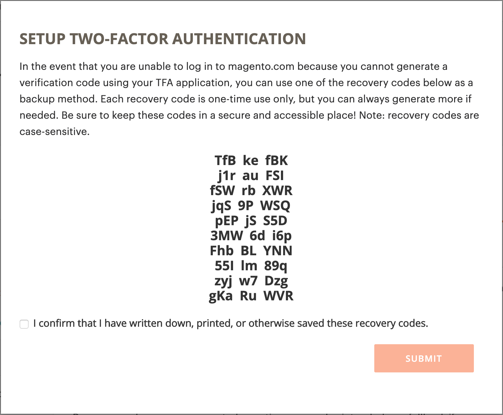

# 보안 유지 [!DNL Commerce] account

2단계 인증(TFA 또는 2FA)은 보안을 강화하기 위한 추가 계층입니다. [!DNL Commerce] 승인되지 않은 액세스로부터 가져온 계정입니다. 로그인 프로세스를 완료하려면 TFA에 _제 인자_ 표준 사용자 이름 및 암호 자격 증명 외에도 사용할 수 있습니다. 이 두 번째 요소는 모바일 장치에 설치된 TFA 응용 프로그램에서 연속적으로 생성되고 사용자와 쌍을 이루는 임시 확인 코드 형태를 취합니다 [!DNL Commerce] 계정입니다.

TFA를 활성화하면 계정 보안이 강화됩니다. 사용자 이름과 암호 자격 증명(첫 번째 요소)과 개인 디바이스의 TFA 애플리케이션의 유효한 인증 코드(두 번째 요소)가 모두 있어야 권한이 없는 사용자가 로그인할 수 있습니다.

>[!NOTE]
>
>다음을 보호하는 이중 인증 _관리자_ 의 스토어에는 별도의 설정이 있습니다. 자세한 내용은 다음을 참조하십시오. [이중 인증](../systems/security-two-factor-authentication.md).

## 시작하기 전에

TFA를 사용하려면 개인 장치(예: 스마트폰, 태블릿, 컴퓨터)에 TFA 애플리케이션이 설치되어 있어야 합니다. 여러 가지 옵션이 있지만 인기 있는 옵션 및 무료 옵션은 다음과 같습니다.

- Google Authenticator(iOS, Android™, BlackBerry®)

- 인증(iOS, Android™)

- Microsoft® Authenticator(iOS, Android™, Windows Phone)

## 이중 인증 활성화

1. 에 로그인 [[!DNL Commerce] account][1]{:target=&quot;_blank&quot;}.

1. 왼쪽 탐색 창에서 다음을 선택합니다. **[!UICONTROL Account Settings]**&#x200B;을 선택한 다음 을 선택합니다 **[!UICONTROL Two-factor Authentication]**.

   {width="600" zoomable="yes"}

1. 선택 **[!UICONTROL Enable]** 2단계 인증 설정 프로세스를 시작합니다.

1. 다음을 입력합니다. **[!UICONTROL Verification Code]** 을(를) 이메일로 보내고 을(를) 선택합니다. **[!UICONTROL Verify Code]** 계속합니다.

   {width="400"}

1. 개인 장치에 다운로드하여 설치한 2단계 인증 응용 프로그램을 엽니다.

1. 다음에서 [!UICONTROL SETUP TWO-FACTOR AUTHENTICATION] 양식, 사용 **[!UICONTROL Setup Code]** TFA 애플리케이션에 Adobe Commerce을 추가하는 방법

   {width="400"}

   TFA 애플리케이션을 사용하여 QR 코드를 스캔하거나 수동으로 입력하여 코드를 추가할 수 있습니다. 이 코드는 TFA 애플리케이션과 [!DNL Commerce] 계정 및 권한으로 TFA 앱을 생성하여 보안 계정 액세스를 위한 인증 코드를 생성할 수 있습니다.

1. 설정을 완료합니다.

   - 다음에서 [!UICONTROL SETUP TWO FACTOR-AUTHENTICATION] 양식에서 2단계 인증 응용 프로그램의 인증 코드를 입력합니다.

   - 선택 **[!UICONTROL Verify Code]**.

   >[!NOTE]
   >
   >보안을 위해 TFA 애플리케이션의 인증 코드는 지속적으로 만료되고 재생성됩니다. **_항상_** 현재 표시된 코드를 사용합니다.

1. 저장 **[!UICONTROL Recovery Codes]** 안전하고 접근이 용이한 장소에 있다.

   {width="400"}

   에 로그인할 때 확인 코드를 제공할 수 없는 경우 [!DNL Commerce] 계정, 계정 액세스를 다시 얻으려면 복구 코드를 사용해야 합니다.

   각 복구 코드는 한 번만 사용할 수 있지만 [생성](#generate-new-recovery-codes) 새 항목. 복구 코드는 대/소문자를 구분합니다.

1. 확인 확인란을 선택하고 을 선택합니다. **[!UICONTROL Submit]** 계속합니다.

1. 계정에 대한 액세스 권한을 복구하려면 다음을 입력하십시오. **[!UICONTROL Recovery Email]**.

   2단계 인증 응용 프로그램에서 확인 코드를 생성할 수 없고 미리 생성된 미사용 복구 코드에 대한 액세스 권한이 없는 경우 이 이메일 주소가 필요합니다.

   24시간마다 한 번씩 임시 복구 코드를 생성하여 지정된 복구 이메일 주소로 전송할 수 있습니다. 이 코드를 사용하여 계정에 다시 액세스하십시오.

   >[!IMPORTANT]
   >
   >복구 이메일 계정에 대한 액세스 권한을 유지하십시오. 그렇지 않으면 해당 계정에 전송된 임시 복구 코드를 사용할 수 없습니다.

   {width="400"}

1. 확인 확인란을 선택하고 을 선택합니다. **[!UICONTROL Submit]** 2단계 인증 설정 프로세스를 완료합니다.

   - 알림이 사용자와 연계된 이메일 주소로 전송됩니다. [!DNL Commerce] 2단계 인증을 성공적으로 활성화했는지 확인하는 계정입니다.

   - 구성을 확인하기 위해 복구 이메일 계정으로 알림이 전송됩니다.

>[!TIP]
>
>개인 장치를 분실하거나 새 장치를 구입하는 경우 다음을 수행할 수 있습니다. [2단계 인증 앱 변경](#change-your-two-factor-authentication-application) 새 복구 코드를 생성합니다.

## 확인 코드를 사용하여 로그인

1. 로 이동 [!DNL Commerce] [계정 로그인][1]{:target=&quot;_blank&quot;}.

1. 사용자 이름 및 암호 자격 증명을 입력한 다음 을(를) 선택합니다. **[!UICONTROL Login]**.

1. 다음을 입력합니다. **[!UICONTROL Verification Code]** 메시지가 표시되면 2단계 인증 애플리케이션에 표시됩니다.

   {width="600"}

1. 선택 **[!UICONTROL Submit]** 로그인 프로세스를 완료합니다.

## 복구 코드를 사용하여 로그인

1. 로 이동 [!DNL Commerce] [계정 로그인][1]{:target=&quot;_blank&quot;}.

1. 사용자 이름 및 암호 자격 증명을 입력한 다음 을(를) 선택합니다. **[!UICONTROL Login]**.

1. 선택 **[!UICONTROL Use recovery code]** 확인 코드 프롬프트를 무시합니다.

1. 사용하지 않는 항목 입력 **[!UICONTROL Recovery Code]** 메시지가 표시되면

   {width="600"}

1. 선택 **[!UICONTROL Submit]** 로그인 프로세스를 완료합니다.

## 복구 이메일을 사용하여 로그인

1. 에 로그인 [[!DNL Commerce] account][1]{:target=&quot;_blank&quot;}.

1. 사용자 이름 및 암호 자격 증명을 입력한 다음 을(를) 선택합니다. **[!UICONTROL Login]**.

1. 선택 **[!UICONTROL Use recovery code]** 확인 코드 프롬프트를 무시합니다.

1. 이메일을 통해 임시 복구 코드를 받으려면 **[!UICONTROL recovery email]** 링크를 클릭합니다.

   {width="600"}

1. 복구 이메일 계정을 열어 임시 코드를 가져온 다음 지정된 필드에 코드를 입력합니다.

1. 선택 **[!UICONTROL Submit]** 로그인 프로세스를 완료합니다.

임시 복구 코드를 사용하여 계정에 액세스한 후 [새 복구 코드 생성](#generate-new-recovery-codes) 계정 액세스 문제가 발생하지 않도록 저장하십시오.

## 복구 코드 보기

1. 로 이동 [!DNL Commerce] [계정 로그인][1]{:target=&quot;_blank&quot;}.

1. 사용자 이름 및 암호 자격 증명을 입력한 다음 을(를) 선택합니다. **[!UICONTROL Login]**.

1. 앞에서 설명한 2단계 인증 방법 중 하나를 사용하여 로그인 프로세스를 완료합니다.

1. 왼쪽 탐색 창에서 다음을 선택합니다. **[!UICONTROL Account Settings]**&#x200B;을 선택한 다음 을 선택합니다 **[!UICONTROL Two-factor Authentication]**.

   {width="600" zoomable="yes"}

1. 미리 생성된 복구 코드를 보려면 **복구 코드 보기**.

1. 다음을 입력합니다. **[!UICONTROL Verification Code]** 을(를) 이메일로 보내고 을(를) 선택합니다. **[!UICONTROL Verify Code]** 계속합니다.

   {width="400"}

1. 저장 **복구 코드** 안전하고 접근이 용이한 장소에 있다.

   에 로그인하기 위한 인증 코드를 제공할 수 없는 경우 [!DNL Commerce] 계정, 복구 코드를 사용하는 것이 계정 액세스를 다시 얻을 수있는 유일한 방법입니다.

   각 복구 코드는 일회성만 사용하지만, 언제든지 [생성](#generate-new-recovery-codes) 새 항목. 복구 코드는 대/소문자를 구분합니다.

   {width="400"}

1. 확인 확인란을 선택하고 을 선택합니다. **[!UICONTROL Submit]** 대화 상자를 닫습니다.

## 새 복구 코드 생성

1. 로 이동 [!DNL Commerce] [계정 로그인][1]{:target=&quot;_blank&quot;}.

1. 사용자 이름 및 암호 자격 증명을 입력한 다음 을(를) 선택합니다. **[!UICONTROL Login]**.

1. 앞에서 설명한 2단계 인증 방법 중 하나를 사용하여 로그인 프로세스를 완료합니다.

1. 왼쪽 탐색 창에서 다음을 선택합니다. **[!UICONTROL Account Settings]**&#x200B;을 선택한 다음 을 선택합니다 **[!UICONTROL Two-factor Authentication]**.

1. 미리 생성된 새 복구 코드를 생성하려면 다음을 선택합니다. **새 복구 코드 생성**.

1. 다음을 입력합니다. **[!UICONTROL Verification Code]** 을(를) 이메일로 보내고 을(를) 선택합니다. **[!UICONTROL Verify Code]** 계속합니다.

1. 저장 **복구 코드** 안전하고 접근이 용이한 장소에 있다.

   에 로그인할 때 확인 코드를 제공할 수 없는 경우 [!DNL Commerce] 계정, 복구 코드를 사용하는 것이 계정 액세스를 다시 얻을 수있는 유일한 방법입니다.

   이전에 생성된 모든 복구 코드는 이제 유효하지 않게 렌더링되므로 삭제해야 합니다(현재 생성된 복구 코드 세트만 작동함). 복구 코드는 대/소문자를 구분합니다.

1. 확인 확인란을 선택하고 을 선택합니다. **[!UICONTROL Submit]** 대화 상자를 닫습니다.

## 복구 이메일 변경

1. 로 이동 [!DNL Commerce] [계정 로그인][1]{:target=&quot;_blank&quot;}.

1. 사용자 이름 및 암호 자격 증명을 입력한 다음 을(를) 선택합니다. **[!UICONTROL Login]**.

1. 앞에서 설명한 2단계 인증 방법 중 하나를 사용하여 로그인 프로세스를 완료합니다.

1. 왼쪽 탐색 창에서 다음을 선택합니다. **[!UICONTROL Account Settings]**&#x200B;을 선택한 다음 을 선택합니다 **[!UICONTROL Two-factor Authentication]**.

1. 선택 **복구 이메일 변경** 계정에 대한 파일의 복구 이메일을 변경합니다.

1. 다음을 입력합니다. **[!UICONTROL Verification Code]** 을(를) 이메일로 보내고 을(를) 선택합니다. **[!UICONTROL Verify Code]** 계속합니다.

1. 계정에 대한 액세스 권한을 복구할 수 있도록 하려면 **복구 이메일**.

   2단계 인증 응용 프로그램에서 확인 코드를 생성할 수 없고 미리 생성된 미사용 복구 코드에 대한 액세스 권한이 없는 경우 이 이메일 주소가 필요합니다.

   24시간마다 한 번씩 임시 복구 코드를 생성하여 지정된 복구 이메일 주소로 전송할 수 있습니다. 이 코드를 사용하여 계정에 다시 액세스할 수 있습니다.

   >[!IMPORTANT]
   >
   >복구 이메일 계정에 대한 액세스 권한을 유지하십시오. 그렇지 않으면 해당 계정에 전송된 임시 복구 코드를 사용할 수 없습니다.

1. 확인 확인란을 선택하고 을 선택합니다. **[!UICONTROL Submit]** 대화 상자를 닫습니다.

   시스템은 특정 이메일 주소가 임시 복구 코드를 받기 위한 복구 이메일로 파일에 있는지 확인하기 위해 지정한 복구 이메일에 이메일 알림을 보냅니다.

## 2단계 인증 애플리케이션 변경

1. 로 이동 [!DNL Commerce] [계정 로그인][1]{:target=&quot;_blank&quot;}.

1. 사용자 이름 및 암호 자격 증명을 입력한 다음 을(를) 선택합니다. **[!UICONTROL Login]**.

1. 앞에서 설명한 2단계 인증 방법 중 하나를 사용하여 로그인 프로세스를 완료합니다.

1. 왼쪽 탐색 창에서 다음을 선택합니다. **[!UICONTROL Account Settings]**&#x200B;을 선택한 다음 을 선택합니다 **[!UICONTROL Two-factor Authentication]**.

1. 선택 **TFA 애플리케이션 변경** magento.com 계정으로 다른 TFA 애플리케이션을 사용하는 방법

1. 다음을 입력합니다. **[!UICONTROL Verification Code]** 을(를) 이메일로 보내고 을(를) 선택합니다. **[!UICONTROL Verify Code]** 계속합니다.

1. 개인 장치에서 2단계 인증 응용 프로그램을 엽니다.

1. 다음을 입력합니다. **설정 코드** 2단계 인증 애플리케이션에 로그인합니다.

   TFA 애플리케이션을 사용하여 QR 코드를 스캔하거나 수동으로 입력하여 코드를 추가할 수 있습니다. 이 코드는 TFA 애플리케이션과 [!DNL Commerce] 계정 및 TFA 앱에 대한 사용 권한을 활성화하여 보안 계정 액세스를 위한 인증 코드를 생성합니다.

   >[!NOTE]
   >
   >보안을 위해 TFA 애플리케이션의 인증 코드는 지속적으로 만료되고 재생성됩니다. **_항상_** 현재 표시된 코드를 사용합니다.

1. 이제 TFA 애플리케이션을 사용하시면 [!DNL Commerce] 계정, 다음을 입력합니다. **[!UICONTROL Verification Code]** 귀하의 TFA 응용 프로그램에 표시 하 고 선택 **[!UICONTROL Verify Code]** 계속합니다.

1. 저장 **복구 코드** 안전하고 접근이 용이한 장소에 있다.

   에 로그인할 때 확인 코드를 제공할 수 없는 경우 [!DNL Commerce] 계정, 계정 액세스를 다시 가져 오는 유일한 방법은 복구 코드를 사용하는 것입니다.

   각 복구 코드는 일회성만 사용하지만, 언제든지 [생성](#generate-new-recovery-codes) 새 항목. 복구 코드는 대/소문자를 구분합니다. 복구 코드는 대/소문자를 구분합니다.

1. 확인란을 선택하여 확인하고 선택합니다. **[!UICONTROL Submit]** 계속합니다.

1. 계정에 대한 액세스 권한을 복구할 수 있도록 하려면 **복구 이메일**.

   2단계 인증 응용 프로그램에서 확인 코드를 생성할 수 없고 미리 생성된 미사용 복구 코드에 대한 액세스 권한이 없는 경우 이 이메일 주소가 필요합니다.

   24시간마다 한 번씩 임시 복구 코드를 생성하여 지정된 복구 이메일 주소로 전송할 수 있습니다. 이 코드를 사용하여 계정에 다시 액세스하십시오.

   >[!IMPORTANT]
   >
   >복구 이메일 계정에 대한 액세스 권한을 유지하십시오. 그렇지 않으면 해당 계정에 전송된 임시 복구 코드를 사용할 수 없습니다.

1. 확인 확인란을 선택하고 을 선택합니다. **[!UICONTROL Submit]** 2단계 인증 설정 프로세스를 완료합니다.

   특정 이메일 주소가 임시 복구 코드를 받기 위한 복구 이메일로 파일에 있는지 확인하기 위해 지정한 복구 이메일로 이메일 알림이 전송됩니다.

## 이중 인증 비활성화

>[!IMPORTANT]
>
>조직 보안 정책에 Adobe Commerce 계정에 대한 다단계 인증이 필요한 경우 2단계 인증을 비활성화할 수 없습니다.

1. 로 이동 [!DNL Commerce] [계정 로그인][1]{:target=&quot;_blank&quot;}.

1. 사용자 이름 및 암호 자격 증명을 입력한 다음 을(를) 선택합니다. **[!UICONTROL Login]**.

1. 앞에서 설명한 2단계 인증 방법 중 하나를 사용하여 로그인 프로세스를 완료합니다.

1. 왼쪽 탐색 창에서 다음을 선택합니다. **[!UICONTROL Account Settings]** 및 선택 **[!UICONTROL Two-factor Authentication]** 밑에.

1. 선택 **[!UICONTROL Disable]** 를 클릭하여 TFA 비활성화 프로세스를 시작합니다.

1. 다음을 입력합니다. **[!UICONTROL Verification Code]** 을(를) 이메일로 보내고 을(를) 선택합니다. **[!UICONTROL Verify Code]** 계속합니다.

1. 확인 확인란을 선택하고 을 선택합니다. **[!UICONTROL Submit]** 2단계 인증에 대한 비활성화를 완료합니다.

   시스템에서 TFA가 비활성화되었음을 나타내는 확인 이메일을 보냅니다. [!DNL Commerce] 계정입니다.

   {width="400"}

[1]: https://account.magento.com/customer/account/login
