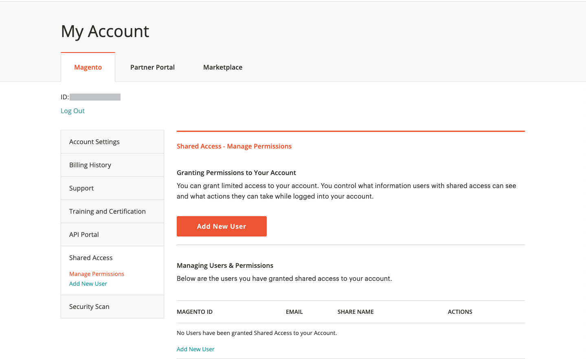

# 공유 [!DNL Commerce] account

사용자 [!DNL Commerce] 계정에는 사이트 관리에 도움이 되는 신뢰할 수 있는 직원과 서비스 공급자가 사용할 수 있는 정보가 포함되어 있습니다. 주 계정 소유자로서 귀하는 다른 사용자에게 제한된 액세스 권한을 부여할 수 있습니다 [!DNL Commerce] 계정 보유자입니다. 공유 액세스는 취소할 수 있지만 한 사용자에서 다른 사용자로 전송할 수 없습니다.

다음 [!DNL Commerce] 지원 팀은 계정에 대한 액세스 권한이 없어 공유 액세스를 설정할 수 없습니다. 적절한 권한이 있는 기본 계정 소유자만 공유 액세스를 설정할 수 있습니다. 계정이 공유되면 청구 내역이나 신용카드 정보와 같은 모든 중요한 정보는 보호되며 다른 사용자와 언제든지 공유되지 않습니다.

>[!NOTE]
>
>공유 액세스 권한이 있는 사용자가 수행한 모든 작업은 기본 계정 소유자의 단독 책임입니다. Adobe은 귀하의 계정에 대한 액세스 권한을 공유한 사용자가 수행한 모든 작업에 대해 책임을 지지 않습니다.

{width="600" zoomable="yes"}

## 공유 계정 설정

1. 시작하기 전에 [!DNL Commerce] 계정 **새 공유 액세스 피부여자**:

   - 사용자는 account.adobe.com에서 계정에 이미 등록하고 account.magento.com을 통해 로그인해야 합니다.
   - 다음 `Account ID` 의 왼쪽 위 모서리에 표시됩니다. _[!UICONTROL Magento]_탭, 바로 위&#x200B;**로그아웃**링크를 클릭합니다.
   - 다음 `Email` 계정과 연결된 주소.

1. 에 로그인 [[!DNL Commerce] account](commerce-account-create.md).

1. 왼쪽 탐색 패널에서 을 클릭합니다. **[!UICONTROL Shared Access]**.

1. 클릭 **[!UICONTROL Add New User]**.

   {width="600" zoomable="yes"}

1. 아래 [!UICONTROL _New User Information]_, 다음 작업을 수행하십시오.

   - 다음을 입력합니다. **[!UICONTROL Account ID]** 새 사용자의 [!DNL Commerce] 계정입니다.
   - 다음을 입력합니다. **[!UICONTROL Email]** 새 사용자의 주소와 연결된 주소 [!DNL Commerce] 계정입니다.

   {width="600"}

1. 아래 _[!UICONTROL Shared Information]_를 사용하여 다음을 수행합니다.

   - 공유 계정을 식별하려면 **[!UICONTROL Share Name]**. 이 이름은 내부 참조용이며 귀하와 귀하의 계정을 공유하는 사람에게만 표시됩니다. (다음으로 시작하는 공유 이름을 입력하지 마십시오.) `CLOUD SHARED ACCESS FROM MAG XYX`.)
   - 개인 연락처 정보를 새 사용자와 공유하려면 다음을 입력하십시오. **[!UICONTROL Your Email]** 및 **[!UICONTROL Your Phone]**.

1. 아래 _[!UICONTROL Grant Account Permissions]_, 각 의 확인란을 선택합니다. [!DNL Commerce] 공유할 제품 및 서비스입니다.

   {width="600"}

1. 완료되면 다음을 클릭하십시오. **[!UICONTROL Create Shared Access]**.

   새 사용자 정보가 _[!UICONTROL Manage Permissions]_공유 계정 액세스에 대한 지침이 포함된 전자 메일 초대장이 새 사용자에게 전송됩니다.

   {width="600" zoomable="yes"}

## 공유 계정 액세스

다음은 공유 계정에 대한 초대를 받는 공유 사용자의 관점에서 작성됩니다.

1. 공유 계정에 대한 초대를 받으면 이메일의 지침에 따라 자신의 계정에 로그인합니다 [!DNL Commerce] 계정입니다.

   계정의 왼쪽 탐색 패널에 새 항목이 있습니다. _[!UICONTROL Shared with me]_탭. 다음_[!UICONTROL Switch Accounts]_ 오른쪽 위 모서리의 컨트롤에는 다음 옵션이 있습니다. `My Account` 공유 계정 이름.

   {width="600" zoomable="yes"}

1. 공유 계정에 대한 액세스 권한을 얻으려면 다음을 설정하십시오. **[!UICONTROL Switch Accounts]** 공유 계정 이름.

   {width="600" zoomable="yes"}

   공유 계정에 환영 메시지와 연락처 정보가 표시됩니다. 왼쪽 탐색 패널에는 사용할 권한이 있는 항목만 포함됩니다.

1. 공유 계정을 도움말 센터에 연결하려면 **[!UICONTROL Support]** 공유 계정의 왼쪽 탐색 패널에서 을 수행합니다.

   {width="600" zoomable="yes"}

   다음을 사용할 수 있습니다. [Adobe Commerce 도움말 센터](https://experienceleague.adobe.com/docs/commerce-knowledge-base/kb/overview.html) 공유 계정에서 문서 및 문제 해결 정보를 검색하고, 알려진 문제에 대한 패치를 찾고, 지원 티켓을 만듭니다.

   >[!NOTE]
   >
   >공유 액세스 권한을 받은 후 사용자는 [[!DNL Commerce] account](https://account.magento.com/customer/account/login), 다음으로 이동 _공유 액세스_&#x200B;을(를) 클릭하고 **[!UICONTROL Support]** 탭. 이 작업은 맨 처음에만 필요하며 [Adobe Commerce 지원 기술 자료](https://experienceleague.adobe.com/docs/commerce-knowledge-base/kb/overview.html) 을(를) 통해 제대로 구성되었습니다. `SSO` 호출합니다.

1. 자신의 계정으로 돌아가려면 **뒤로** 브라우저 컨트롤 및 설정에서 **[!UICONTROL Switch Accounts]** 끝 `My Account`.

## 공유 액세스 취소

1. 상거래 계정에 로그인합니다.

1. 왼쪽 탐색 패널에서 을 클릭합니다. **[!UICONTROL Shared Access]**.

1. 다음에서 해지할 계정 찾기 _[!UICONTROL Managing Users & Permissions]_및 클릭&#x200B;**[!UICONTROL Delete]**.

   >[!NOTE]
   >
   > If  **[!UICONTROL Delete]** 이(가) 표시되지 않으면 **[!UICONTROL Share Name]** 시작 문자 `Cloud Shared Access from MAG XYZ` - 일반적으로, [이러한 계정](https://experienceleague.adobe.com/docs/commerce-knowledge-base/kb/help-center-guide/magento-help-center-user-guide.html?lang=en#remove-cloud-shared-access-users) 삭제할 수 없습니다.

1. 확인을 묻는 메시지가 나타나면 **[!UICONTROL Delete User]**.

>[!NOTE]
>
>의 공유 이름을 가진 사용자는 삭제할 수 없습니다. _MAG의 클라우드 공유 액세스[XYZ]_ 이 인터페이스에서 다음을 수행합니다. 자세한 내용은 다음을 참조하십시오. [Cloud 프로젝트를 통해 공유 액세스 권한이 부여된 사용자를 삭제하는 방법](https://experienceleague.adobe.com/docs/commerce-knowledge-base/kb/help-center-guide/magento-help-center-user-guide.html?lang=en#remove-cloud-shared-access-users).
