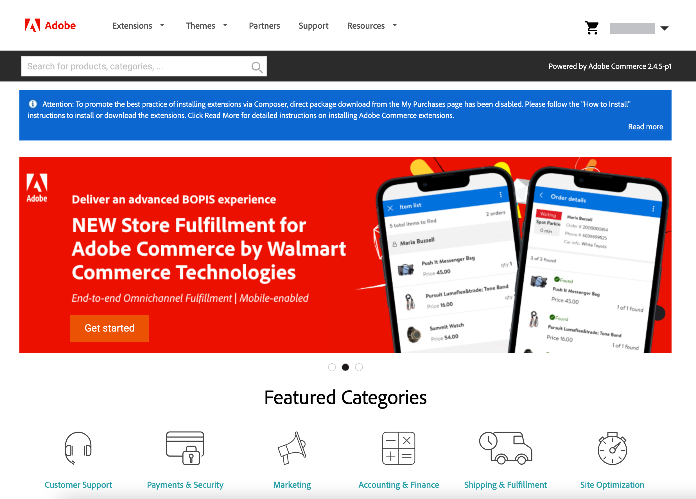

# Adobe Commerce 마켓플레이스

[Adobe Commerce 마켓플레이스][1] 은 판매자에게 엄선된 솔루션을 제공하고 자격을 갖춘 개발자에게 번창하는 비즈니스를 구축할 수 있는 도구, 플랫폼 및 주요 위치를 제공하는 애플리케이션 스토어입니다. [!DNL Commerce Marketplace] 은 무료로 사용할 수 있는 다양한 확장 프로그램을 제공하며, 다른 확장 프로그램은 판매합니다. 구매는 신용 카드로 결제하거나 [PayPal][2].

사용 가능한 모든 확장 [!DNL Commerce Marketplace] 광범위한 검토를 통과했습니다. 다음 [확장 품질 프로그램][3] (EQP) 조합 [!DNL Commerce] Commerce Marketplace의 모든 확장이 코딩 표준 및 모범 사례를 충족하도록 하는 전문 지식, 개발 지침 및 확인 도구입니다. 검토 프로세스에는 자동화된 검사와 수동 QA 검토가 모두 포함됩니다. 이 과정에서 각 확장의 구조와 코드를 검사하고 바이러스/맬웨어 감염의 증거 및 표절 징후를 검사합니다. 검토에는 심층 기술 검사와 관리자가 실시하는 온전성 검사가 포함됩니다. [!DNL Commerce] 설명서, 코딩 구조, 성능, 확장성, 보안 및 과의 호환성에 중점을 둔 엔지니어 [!DNL Commerce] 코어.

다른 소스에서 확장을 구입할 수 있지만에서 사용할 수 있는 확장만 [!DNL Commerce Marketplace] 는 Extension Quality Program 내에서 광범위한 기술 및 마케팅 검토를 통해 검증됩니다.

## 앱 리소스

개발자는 전통적으로 PHP를 사용하여 Adobe Commerce에 기능, 서비스 및 통합을 추가하기 위해 처리 중인 확장을 개발했습니다. 확장과 달리 프로세스 외부 확장성으로 앱을 만들면 호환성 문제를 방지할 수 있습니다.

다음 리소스는 새 채택자가 앱에 익숙해질 수 있는 시작점을 제공합니다.

### Commerce 리소스

- [Adobe Commerce에 대한 I/O 이벤트 설정](https://developer.adobe.com/commerce/extensibility/events/)
- [Adobe Commerce에 대한 이벤트 구성](https://developer.adobe.com/commerce/extensibility/events/configure-commerce/)
- [관리 UI SDK 설정](https://developer.adobe.com/commerce/extensibility/admin-ui-sdk/)
- [확장을 앱으로 변환](https://developer.adobe.com/commerce/extensibility/app-development/#how-do-i-port-an-extension-into-an-app)

### App Builder 리소스

- [Commerce App Builder 개요](https://developer.adobe.com/commerce/extensibility/app-development/)
- [Adobe Developer App Builder용 API Mesh 설정](https://developer.adobe.com/graphql-mesh-gateway/gateway/getting-started/)
- [App Builder 앱 배포](https://developer.adobe.com/app-builder/docs/guides/deployment/)
- [App Builder 앱용 CI/CD](https://developer.adobe.com/app-builder/docs/guides/deployment/ci_cd_for_firefly_apps/)
- App Builder/Developer Console 시작하기
   - [App Builder 시작하기](https://developer.adobe.com/app-builder/docs/getting_started/)
   - [프로젝트 및 작업 공간 이해](https://developer.adobe.com/app-builder/docs/resources/videos/exploring/projects-and-workspaces/)

## [!DNL Marketplace] 자격 증명

에서 구입한 확장을 설치하기 전에 [!DNL Commerce Marketplace], 다음에 로그인 [!DNL Commerce] 계정 을 설정하고 활성 액세스 키가 있는지 확인하십시오. 다음에 로그인할 수 있습니다. [!DNL Commerce] 머리글의 계정 [[!DNL Marketplace]][1] 또는 [Magento.com][6].

액세스 키는 을(를) 동기화하는 데 사용되는 공개 및 비공개 키 세트입니다. [!DNL Commerce] 를 사용한 설치 [!DNL Commerce] 계정을 만들고 자격 증명을 확인합니다. 계정이 동기화된 후에는 Commerce Marketplace 또는 업그레이드에서 확장 또는 모듈을 설치할 때마다 개인 키를 입력해야 합니다. [!DNL Commerce] 설치.

다양한 용도로 여러 액세스 키를 만들고 필요에 따라 활성화하거나 비활성화할 수 있습니다. 그러나 를 설치하는 데 사용한 것과 동일한 액세스 키를 사용해야 합니다. [!DNL Commerce] 소프트웨어. 예를 들어 Magento Open Source 액세스 키를 사용하여 Adobe Commerce을 업데이트하거나 업그레이드할 수 없으며, 반대로 할 수도 없습니다. 다른 사용자 또는 의 액세스 키에 속한 액세스 키도 사용할 수 없습니다. [공유 계정](commerce-account-share.md).

### 액세스 키 만들기

1. 다음에 로그인 [!DNL Commerce] 계정입니다.

1. 다음에서 _[!UICONTROL My Account]_페이지에서&#x200B;**[!UICONTROL Marketplace]**탭.

1. 이름 옆의 오른쪽 위 모서리에서 아래쪽 화살표를 클릭하고 을 선택합니다 **[!UICONTROL My Profile]**.

   ![사용자 [!DNL Marketplace] 프로필](./assets/marketplace-profile.png){width="600"}

1. 다음에서 _[!UICONTROL Marketplace]_아래의 탭_[!UICONTROL My Products]_, 클릭 **[!UICONTROL Access Keys]**&#x200B;을 클릭하고 다음 중 하나를 수행합니다.

   - Marketplace 구매를 위한 액세스 키 세트가 이미 있는지 확인하십시오. 다양한 용도로 여러 액세스 키 세트를 만들 수 있습니다.

   {width="600"}

   - 클릭 **[!UICONTROL Create a New Access Key]**. 새 키 쌍의 이름을 입력하고 를 클릭합니다 **[!UICONTROL OK]**. 유효한 문자에는 대/소문자 문자와 공백 대신 하이픈이 포함됩니다.

1. 완료되면 다음을 클릭하십시오. **[!UICONTROL OK]**.

   새 액세스 키가 활성화되고 목록에 나타납니다.

   다음 사항에 주목합니다. _복사_ 각 공개 및 개인 키 뒤에 연결합니다. 다음 단계에서는 이러한 값을 복사하여 붙여넣어 저장소를 Commerce Marketplace과 동기화합니다.

## 설치 프로세스

>[!IMPORTANT]
>
>Adobe Commerce 및 Magento Open Source 2.4.0부터 웹 설치 마법사가 제거되므로 다음 작업을 수행하려면 명령줄을 사용해야 합니다. [설치](https://experienceleague.adobe.com/docs/commerce-operations/installation-guide/advanced.html) 또는 [업그레이드](https://experienceleague.adobe.com/docs/commerce-operations/upgrade-guide/implementation/perform-upgrade.html) 인스턴스. 이 요구 사항에는 다음도 포함됩니다 [모듈](https://experienceleague.adobe.com/docs/commerce-operations/upgrade-guide/modules/upgrade.html) 및 [확장](https://experienceleague.adobe.com/docs/commerce-operations/installation-guide/tutorials/extensions.html).

에 대한 설치 프로세스 [!DNL Marketplace] 다음에 대한 구매는 다릅니다. _온-프레미스_ 에 호스팅되는 설치보다 Commerce 설치 [Adobe 클라우드 아키텍처][4].

{width="600"}

## 지원

확장 설치 또는 사용에 대한 도움이 필요한 경우 확장과 함께 제공되는 설명서를 먼저 살펴보십시오. 질문에 대한 답변을 찾을 수 없는 경우 확장 목록에 있는 연락처 정보를 사용하여 개발자에게 직접 문의하십시오. Marketplace에서 구입한 제품이 사용자의 요구 사항을 충족하지 못하는 경우 다음을 수행할 수 있습니다. [환불 요청](#refund-requests) 구입일로부터 25일 이내. Adobe은 모든 환불 요청을 검토하고 (승인된 경우) 적절한 환불을 발행합니다. Commerce Marketplace 관련 문제는 다음으로 문의하십시오. [지원](mailto:commercemarketplacesupport@adobe.com).

### 체크아웃 문제

계정 프로필의 주소 필드는 Marketplace 구매 시스템에서 확인 목적으로 작성해야 합니다.

1. Marketplace 계정 프로필에 주소 필드를 추가합니다.
1. 업데이트된 프로필을 저장합니다.
1. 체크아웃을 계속합니다.

### 로그인 문제

로그인 문제는 일반적으로 MAGEID와 계정 데이터베이스의 이메일 주소 간 불일치와 관련되어 있습니다. 지원이 필요하면 Marketplace 지원에 문의하십시오.

>[!INFO]
>
>앱 및 확장 구매는 다음이 될 수 없습니다. [전송됨](#purchase-transfers) 새 계정으로 이동합니다.

### 오픈 소스 질문

Marketplace 지원 팀이 관련 문제를 해결합니다. [commercemarketplace.adobe.com/](https://commercemarketplace.adobe.com/) 및 [commercedeveloper.adobe.com/](https://commercedeveloper.adobe.com/) sites만 해당. Magento Open Source에 대한 질문이 있을 경우 [커뮤니티 포럼](https://community.magento.com/) 또는 [파트너에게 문의](https://business.adobe.com/products/magento/partners.html) 누가 Magento Open Source을 도울 수 있습니까?

### 환불 요청

마켓플레이스 구매 시 환불을 요청하려면 계정에 로그인하고 다음 단계를 수행하십시오.

1. 클릭 [!UICONTROL **내 프로필**] > [!UICONTROL **구매 내역**].
1. 구매를 찾은 다음 을(를) 클릭합니다 [!UICONTROL **환불 요청**].
1. 환불 주문 양식을 작성하십시오.

환불 요청이 생성되면 마켓플레이스 지원에서 정보를 요청합니다. 환불 옵션은 구매일로부터 25일 동안 사용할 수 있습니다. 다음을 참조하십시오. [Marketplace 고객 계약](https://www.adobe.com/legal/terms/enterprise-licensing/magento-legacy-terms.html).

### 주문 송장

다음에서 주문 송장을 다운로드할 수 있습니다. [!UICONTROL **구매 내역**] Marketplace 계정에서 인보이스는 현재 Marketplace 요구 사항이 아니기 때문에 판매자의 부가가치세 또는 주소를 제공하지 않는다.

Marketplace 구매를 위한 주문 송장을 다운로드하려면 Marketplace 계정에 로그인하고 다음 단계를 수행합니다.

1. 클릭 [!UICONTROL **내 프로필**] > [!UICONTROL **구매 내역**].
1. 구매를 찾습니다.
1. 주문 오른쪽 상단의 프린터 아이콘을 클릭합니다.

### 구매 이전

Marketplace 지원 팀에서는 다른 계정으로 구매를 전송할 수 없습니다. 설치 및 배포 문제를 방지하려면 기본 Commerce 계정에서 모든 앱 및 확장을 구매해야 합니다. Adobe Commerce은 하나의 고유 식별자를 사용할 수 있습니다. Composer가 설치에 사용되므로 다음 중 한 세트만 [액세스 키](#create-an-access-key) 기본 계정에 연결된 을(를) 사용할 수 있습니다. 사용 가능한 유일한 솔루션은 [환불 요청](#refund-requests) Marketplace 구매 계정에서(Adobe Commerce 환불 정책에 의해 허용되는 경우).

다음을 수행할 수 있습니다. [공유](commerce-account-share.md) 기본 계정을 통한 Commerce 인스턴스. 공유 액세스는 기본 계정의 하위 계정에 특별한 권한을 부여합니다. 공유 액세스 포인트는 기본 계정에서 생성됩니다. 기본 계정은 Commerce 권한 계정, 주 판매자 계정 또는 조직 내에서 공유되는 계정일 수 있습니다.

이러한 특수 권한은 Adobe Commerce에 기본 권한과 동일한 수준의 액세스 권한을 부여하지만, Adobe Commerce Marketplace 또는 개발자 포털로 이월되지 않습니다. 즉, 마켓플레이스의 하위 계정에서 확장을 구입하는 것은 기본 계정과 공유할 수 없습니다. 공유 액세스는 단방향 거리입니다(기본 계정에서 하위 계정으로). 하위 계정이 기본으로 다시 공유하려고 할 때는 작동하지 않습니다.

[1]: https://marketplace.magento.com/
[2]: https://www.paypal.com/us/home
[3]: https://developer.adobe.com/commerce/marketplace/guides/sellers/extension-quality-program/
[4]: https://www.adobe.com/commerce/magento/enterprise.html
[6]: https://business.adobe.com/products/magento/magento-commerce.html
