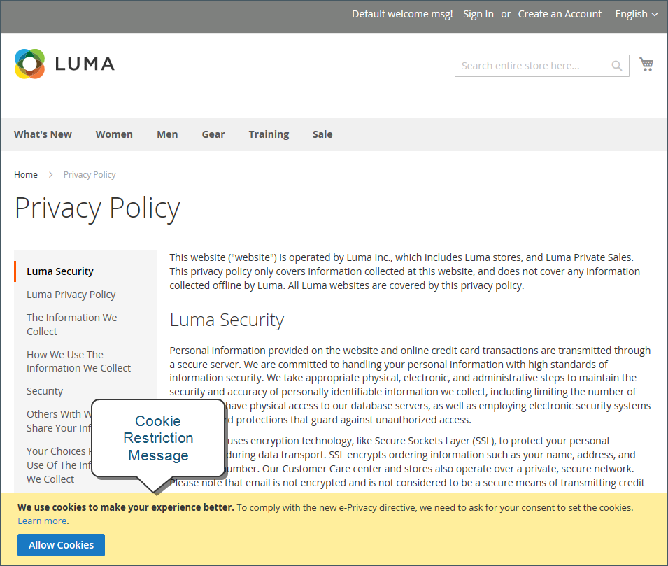

# 쿠키 법률 준수

쿠키는 사이트를 방문하는 각 방문자의 컴퓨터에 저장되고 정보를 위한 임시 저장 위치로 사용되는 작은 파일입니다. 쿠키에 저장된 정보는 쇼핑 경험을 개인화하고, 방문자를 장바구니에 연결하며, 트래픽 패턴을 측정하고, 프로모션의 효과를 개선하는 데 사용됩니다. Adobe Commerce 및 Magento Open Source은 쿠키 사용에 관한 여러 국가의 법률에 발맞추기 위해 상인에게 고객 동의를 얻는 방법 선택을 제공합니다. Adobe Commerce 및 Magento Open Source의 기본 쿠키 목록은 [쿠키 참조](#default-cookies)를 참조하십시오.

>[!NOTE]
>
>[일반 데이터 보호 규정](compliance-gdpr.md)을 준수하도록 기본 [Google 개인 정보 설정](../merchandising-promotions/google-tools.md#google-privacy-settings)을(를) 수정하는 경우 Google Analytics 쿠키 사용에 대한 사용자 동의를 얻을 필요는 없습니다.

## 쿠키 제한 모드

쿠키 제한 모드가 활성화되면 스토어 방문자는 모든 기능을 갖춘 작업에 쿠키가 필요하다는 알림을 받게 됩니다. 테마에 따라 메시지가 머리글 위, 바닥글 아래 또는 페이지의 다른 곳에 표시될 수 있습니다. 이 메시지는 자세한 내용을 보기 위해 개인정보 처리방침으로 연결되며, 방문자가 허용 단추를 클릭하여 동의할 것을 권장합니다. 동의가 부여되면 메시지가 사라집니다.

[개인정보 처리방침](privacy-policy.md))에는 스토어 이름과 연락처 정보가 포함되어야 하며, 스토어에서 사용하는 각 쿠키의 용도를 설명해야 합니다. 자세한 내용은 [쿠키 참조](#default-cookies)를 참조하세요.

>[!NOTE]
>
>개인정보 처리방침의 URL 키를 변경하는 경우, 트래픽을 새 URL 키로 리디렉션하기 위해 사용자 지정 URL 재작성도 생성해야 합니다. 그렇지 않으면 쿠키 제한 모드 메시지의 링크가 `404 Page Not Found`을(를) 반환합니다.

{width="600"}

### 1단계: 쿠키 제한 모드 활성화

1. _관리자_ 사이드바에서 **[!UICONTROL Stores]** > _[!UICONTROL Settings]_>**[!UICONTROL Configuration]**(으)로 이동합니다.

1. **[!UICONTROL General]** 아래의 왼쪽 탐색 패널에서 **[!UICONTROL Web]**&#x200B;을(를) 선택합니다.

1. **[!UICONTROL Default Cookie Settings]** 섹션을 확장하고 다음을 수행합니다.

   {width="600"}

   - **[!UICONTROL Cookie Lifetime]**&#x200B;을(를) 초 단위로 입력하십시오.

   - 쿠키를 다른 폴더에서 사용할 수 있도록 하려면 **[!UICONTROL Cookie Path]**&#x200B;을(를) 입력하십시오. 사이트의 어디에서나 쿠키를 사용할 수 있도록 하려면 슬래시(`/`)를 입력하십시오. 이 값은 쿠키 경로만 포함할 수 있으며 **_cannot_**&#x200B;에는 다른 쿠키 매개 변수가 포함될 수 없습니다.

   - 하위 도메인에서 쿠키를 사용할 수 있도록 하려면 **[!UICONTROL Cookie Domain]** 필드(`subdomain.yourdomain.com`)에 하위 도메인 이름을 입력하십시오. 모든 하위 도메인에서 쿠키를 사용할 수 있도록 하려면 도메인 이름 앞에 마침표(`.yourdomain.com`)를 입력하십시오. 이 값은 쿠키 도메인만 포함할 수 있으며 **_cannot_**&#x200B;에는 다른 쿠키 매개 변수가 포함될 수 없습니다.

   - JavaScript과 같은 스크립팅 언어가 쿠키에 액세스하지 못하도록 하려면 **HTTP만 사용**&#x200B;이 `Yes`(으)로 설정되어 있는지 확인하십시오.

   - **[!UICONTROL Cookie Restriction Mode]**&#x200B;을(를) `Yes`(으)로 설정합니다.

     필요한 경우 확인란의 선택을 취소하고 **[!UICONTROL OK]**&#x200B;을(를) 클릭하여 범위 전환을 확인합니다.

1. 완료되면 **[!UICONTROL Save Config]**&#x200B;을(를) 클릭합니다.

1. 캐시를 업데이트하라는 메시지가 표시되면 시스템 메시지에서 **[!UICONTROL Cache Management]** 링크를 클릭하고 각각의 잘못된 캐시를 새로 고칩니다.

### 2단계: 개인정보 처리방침 업데이트

회사에서 수집하는 정보와 사용 방법을 반영하도록 [개인정보 처리방침](privacy-policy.md)을 업데이트하세요.

## 기본 쿠키

Adobe Commerce 및 Magento Open Source의 기본 쿠키는 판매자가 [GDPR](compliance-gdpr.md)과 같은 개인 정보 보호 규정의 요구 사항을 충족하는 데 도움이 되도록 제외/비제외로 분류됩니다. 판매자는 이 정보를 지침으로 사용하고 포괄적인 개인 정보 보호 규정 준수 전략의 일환으로 개인 정보 보호 및 쿠키 정책을 업데이트하기 위해 법률 고문과 상담해야 합니다.

[!DNL Commerce]이(가) 온-프레미스 및 클라우드 설치를 위해 &quot;즉시 사용 가능한&quot; 쿠키를 사용합니다. 이러한 쿠키는 고객이 명시적으로 요청한 기능에 필요할 수 있습니다. 세션 쿠키의 수명에 대한 자세한 내용은 [세션 수명](../customers/customer-online-options.md)을 참조하세요.

이러한 쿠키 중 일부는 필요에 따라 활성화/비활성화를 포함한 구성 옵션을 제공할 수 있습니다.

### 요청된 기능 쿠키(예외)

#### `add_to_cart`

(Adobe Commerce만 해당) 장바구니에서 제거된 제품 SKU, 이름, 가격 및 수량을 캡처합니다. Google Analytics은 제품이 장바구니에 추가된 시기를 알 수 있습니다.

#### `guest-view`

게스트 주문을 게스트에 연결합니다(게스트 계정이 없기 때문).

#### `login_redirect`

로그인 및 사용자 등록이 완료되면 사용자를 라우팅하기 위해 리디렉션 URL을 저장합니다. 사용자가 로그인하기 전에 있었던 페이지를 저장합니다(로그인 후 돌아갈 위치 확인).

#### `mage-banners-cache-storage`

(Adobe Commerce만 해당) 배너 콘텐츠를 로컬에 저장하여 성능을 개선합니다. 배너 콘텐츠는 판매자가 웹 사이트에 표시하는 모든 콘텐츠입니다.

#### `mage-messages`

쿠키 동의 메시지 및 다양한 오류 메시지와 같이 사용자에게 표시되는 오류 메시지 및 기타 알림을 추적합니다. 메시지가 쇼핑객에게 표시된 후 쿠키에서 삭제됩니다. 이 쿠키를 비활성화하는 옵션은 없습니다. 이는 오류 메시지와 같은 일회성 정보가 사용자에게 전달되는 방식입니다.

#### `product_data_storage`(로컬 저장소)

최근에 본 항목 및 &quot;제품 비교&quot; 기능을 사용하는 데 사용되는 제품 데이터에 대한 구성을 저장합니다. 사용자의 특정 설정을 저장합니다(예: 최근에 제품을 보았거나 비교한 제품인 경우).

#### `recently_compared_product`(로컬 저장소)

최근에 비교한 제품의 제품 ID를 저장합니다.

#### `recently_compared_product_previous`(로컬 저장소)

쉽게 탐색할 수 있도록 이전에 비교한 제품의 제품 ID를 저장합니다.

#### `recently_viewed_product`(로컬 저장소)

쉽게 탐색할 수 있도록 최근에 본 제품의 제품 ID를 저장합니다.

#### `recently_viewed_product_previous`(로컬 저장소)

쉽게 탐색할 수 있도록 최근에 본 제품의 제품 ID를 저장합니다.

#### `remove_from_cart`

(Adobe Commerce만 해당) 제품을 장바구니에서 제거한 시기를 Google Analytics에서 알 수 있습니다.

#### `stf`

SendFriend([친구에게 이메일 보내기](../stores-purchase/email-a-friend.md)) 모듈에서 메시지를 보내는 시간을 기록합니다. 쇼핑객이 제품에 대한 링크를 보내면 이 쿠키는 타임스탬프를 기록하고 카운트를 유지합니다.

#### `X-Magento-Vary`

캐시에서 새 페이지 버전을 제공해야 하는 시기를 나타냅니다. 웹 사이트 성능을 지원합니다.

#### `form_key`

요청이 실제 소스에서 온 것인지 아니면 잘못된 액터에서 온 것인지를 확인하는 데 도움이 되어 CSRF(크로스 사이트 요청 위조) 공격을 방지하기 위해 임의로 생성된 값을 유지하는 보안 메커니즘입니다. CSRF 공격을 방지하는 업계 표준 방법입니다.

#### `mage-cache-sessid`

세션 만료 후 브라우저에서 로컬 저장소를 정리할 시기를 결정하는 데 유용합니다. 로컬 저장소를 정리해야 하는지 여부를 확인하는 데 사용됩니다. 이 쿠키가 없으면 로컬 저장소 정리가 트리거됩니다.

#### `mage-cache-storage`

전자 상거래 기능을 활성화하는 방문자별 콘텐츠의 로컬 저장소입니다. 기본적으로 사용되지 않지만, 사용 중인 경우 체크아웃을 신속하게 처리하는 데 사용되므로 누군가가 나갔다가 돌아올 때 기본 사용자 정보를 사용할 수 있습니다.

#### `mage-cache-storage-section-invalidation`

무효화 및 제거해야 하는 페이지의 섹션과 관련된 정보를 저장합니다.

#### `persistent_shopping_cart`

영구 장바구니의 키 ID를 저장하여 익명 구매자에 대한 장바구니 복원을 가능하게 합니다.

#### `private_content_version`

고객 콘텐츠가 있는 페이지에 임의의 고유 번호 및 시간을 추가하여 서버에서 캐시되지 않도록 합니다. 이 변수는 PHP에서 JavaScript as a cookie로 JavaScript에서 로컬 저장소로 설정됩니다.

#### `section_data_ids`

위시리스트 표시 및 체크아웃 정보와 같이 고객이 시작한 작업과 관련된 고객별 정보를 저장합니다.

#### `store`

쇼핑객이 선택한 특정 매장 보기/로케일을 추적합니다.

#### `mage-banners-cache-storage`

배너 기능을 위한 (Adobe Commerce 전용) 로컬 저장소입니다. 배너는 쇼핑객에게 표시되는 모든 정보를 일반 웹 사이트 자산으로 의미합니다.

#### `PHPSESSID`

상점 첫 화면에서 사용자 세션을 추적합니다. 이것은 최종 제품을 사용하는 쇼핑객입니다.

#### `admin`

관리측에서 사용자 세션을 추적합니다.

#### `loggedOutReasonCode`

관리자 사용자가 특정 암호 시도 실패 횟수 후에 잠길 때 설정합니다.

#### `section_data_clean`

사용자가 스토어 보기를 전환할 때 설정됩니다. 이 쿠키가 있으면 JavaScript이 페이지의 특정 섹션을 다시 로드하여 올바른 스토어 보기를 반영합니다.

#### `lang`

Admin Analytics 모듈에서 간접적으로 설정합니다. 상점의 관리 영역에서만 사용됩니다. 쇼핑객에게는 해당되지 않습니다.

#### `s_fid`

Admin Analytics 모듈에서 간접적으로 설정합니다. 대체 고유 방문자 ID 시간/날짜 스탬프입니다. 타사 쿠키 제한 사항으로 인해 표준 `s_vi` 쿠키를 사용할 수 없는 경우 고유 방문자를 식별하는 데 사용됩니다. 상점의 관리 영역에서만 사용됩니다. 쇼핑객에게는 해당되지 않습니다.

#### `s_cc`

Admin Analytics 모듈에서 간접적으로 설정합니다. 쿠키가 활성화되어 있는지 확인하기 위해 JavaScript 코드로 설정하고 읽습니다. 상점의 관리 영역에서만 사용됩니다. 쇼핑객에게는 해당되지 않습니다.

#### `apt.sid`

Admin Analytics 모듈에서 간접적으로 사용하는 Gainsight PX 라이브러리로 설정됩니다. 이 쿠키의 목적은 제품의 최상위 도메인에서 지속적인 세션 ID 추적을 허용하는 것이며 활성 세션에 대한 참조 ID로 사용됩니다. 상점의 관리 영역에서만 사용됩니다. 쇼핑객에게는 해당되지 않습니다.

#### `apt.uid`

Admin Analytics 모듈에서 간접적으로 사용하는 Gainsight PX 라이브러리로 설정됩니다. 이 쿠키의 목적은 제품의 최상위 도메인에서 지속적인 ID 추적을 허용하는 것이며 사용자 엔티티에 대한 참조 ID로 사용됩니다. 상점의 관리 영역에서만 사용됩니다. 쇼핑객에게는 해당되지 않습니다.

#### `s_sq`

Admin Analytics 모듈에서 간접적으로 설정합니다. 방문자가 클릭하는 위치와 클릭하는 내용에 대한 데이터를 수집하는 ClickMap 기능에서 사용됩니다. 클릭할 때마다 정보를 저장합니다. 상점의 관리 영역에서만 사용됩니다. 쇼핑객에게는 해당되지 않습니다.

#### `pagebuilder_modal_dismissed`

페이지 빌더 모듈에서 설정합니다. 관리자가 이전에 특정 작업을 명시적으로 해제한 경우 관리자에게 확인하도록 요청하는 후속 프롬프트가 열리지 않도록 하는 플래그를 포함합니다. 상점의 관리 영역에서만 사용됩니다. 쇼핑객에게는 해당되지 않습니다.

#### `pagebuilder_template_apply_confirm`

페이지 빌더 모듈에서 설정합니다. 관리자가 이전에 특정 작업을 명시적으로 해제한 경우 관리자에게 확인하도록 요청하는 후속 프롬프트가 열리지 않도록 하는 플래그를 포함합니다. 상점의 관리 영역에서만 사용됩니다. 쇼핑객에게는 해당되지 않습니다.

#### `accordion-{VARIABLE}-{VARIABLE}`

저장소의 관리 영역에서만 탭 기능 구현의 일부로 사용됩니다. 쇼핑객에게는 해당되지 않습니다.

## 제품 추천 쿠키

(Adobe Commerce만 해당) Adobe Commerce 고객을 위한 제품 권장 사항에서 다음 쿠키를 사용합니다. 이 쿠키는 [DataServices 모듈](https://experienceleague.adobe.com/en/docs/commerce/product-recommendations/getting-started/install-configure)과 함께 설치됩니다.

- `mg_dnt`: 사이트에서 쿠키 동의를 관리할 사용자 지정 코드가 있는 경우 [Adobe Commerce 데이터 수집을 제한](https://experienceleague.adobe.com/en/docs/commerce/product-recommendations/developer/setting-cookie)할 수 있습니다.
- `user_allowed_save_cookie`: [쿠키 제한 모드](#cookie-restriction-mode)에 사용됩니다.
- `authentication_flag`: 쇼핑객이 로그인했는지 또는 로그아웃했는지 여부를 나타냅니다. 이 쿠키는 `dataservices_customer_id` 쿠키와 동시에 업데이트됩니다.
- `dataservices_customer_id`: 쇼핑객이 로그인했는지 또는 로그아웃했는지 여부를 나타냅니다. 이 쿠키에는 시스템에 있는 고객의 고유 ID가 포함되어 있습니다.
- `dataservices_customer_group`: 고객의 그룹을 나타냅니다. 이 쿠키는 고객 그룹 ID의 [sha1](https://en.wikipedia.org/wiki/SHA-1) 체크섬으로 저장됩니다.
- `dataservices_cart_id`: 쇼핑객의 장바구니 작업을 식별합니다. 이 쿠키에는 시스템에 있는 고객의 고유한 장바구니 ID가 포함되어 있습니다.
- `dataservices_product_context`: 구매자의 제품 상호 작용을 식별합니다. 이 쿠키에는 시스템에 있는 고객의 고유한 견적 ID가 포함되어 있습니다.

## 추가 쿠키

(Adobe Commerce만 해당) Adobe Commerce 고객에 대해 다음 쿠키가 설정됩니다. 이 쿠키는 [DataServices 모듈](https://experienceleague.adobe.com/en/docs/commerce/product-recommendations/getting-started/install-configure)과 함께 설치됩니다.

- `mg`: Snowploy JavaScript 추적기에서 설정합니다. 자세한 내용은 [Snowploy 설명서](https://docs.snowplow.io/docs/sources/trackers/javascript-trackers/web-tracker/tracker-setup/initialization-options/)에서 확인할 수 있습니다.
- `com.adobe.alloy.getTld`: 현재 웹 페이지의 호스트 이름을 고려할 때 이 도메인은 https://publicsuffix.org에 설명된 &quot;공용 접미사&quot;가 아닌 최상위 도메인입니다. 기본적으로 이 도메인은 쿠키를 허용할 수 있는 가장 상위 도메인입니다. 이 쿠키는 [Alloy Web SDK](https://github.com/adobe/alloy)의 일부입니다.

[1]: https://developers.google.com/analytics/devguides/collection/analyticsjs/cookie-usage
[2]: https://support.google.com/adwords/answer/7521212
