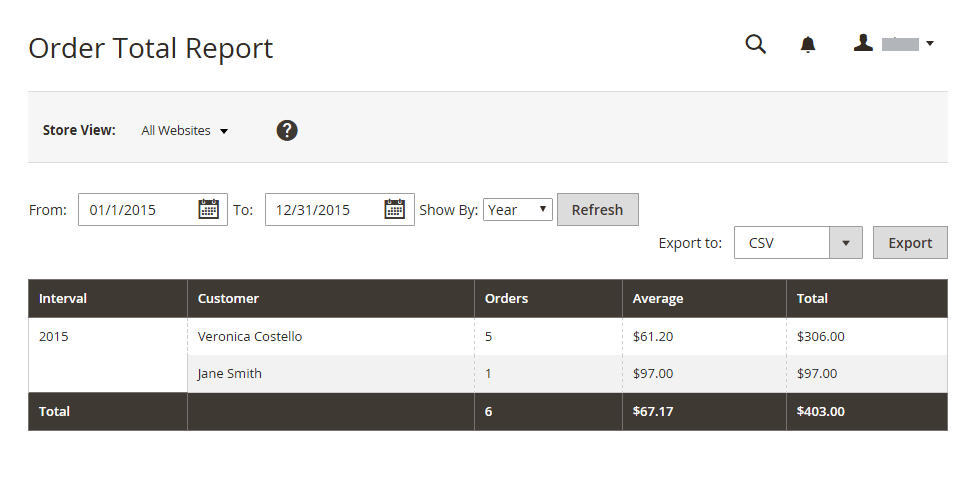
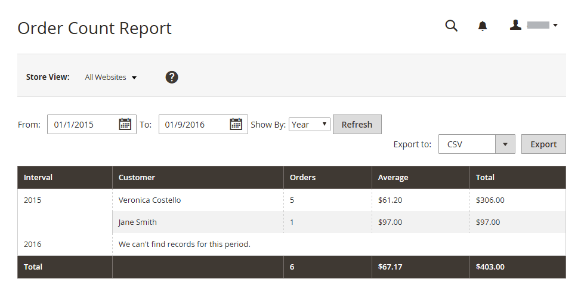
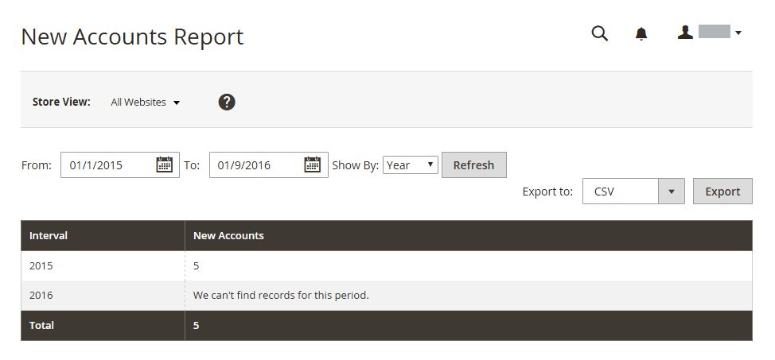

# 고객 보고서

고객 보고서는 지정된 기간 또는 날짜 범위 동안 insight을 고객 활동에 제공합니다.

## [!UICONTROL Order Total Report]

[!UICONTROL Order Total Report]은(는) 지정된 시간 간격 또는 날짜 범위에 대한 고객 주문을 표시합니다. 이 보고서에는 고객당 주문 수, 평균 주문 금액 및 총 금액이 포함됩니다.

_관리자_ 사이드바에서 **[!UICONTROL Reports]** > _[!UICONTROL Customers]_>**[!UICONTROL Order Total]**(으)로 이동합니다.

{width="600"}

### Workspace 컨트롤

| 제어 | 설명 |
|--- |--- |
| [!UICONTROL From / To] | 시작 및 종료 날짜를 기준으로 주문 검색을 정의하는 데 사용됩니다. |
| [!UICONTROL Show By] | 주문 레코드 분할의 세부기간을 정의합니다. 옵션: `Month` / `Day` / `Year` |
| [!UICONTROL Refresh] | 지정된 필터로 그리드를 업데이트합니다. |
| [!UICONTROL Export] | 선택한 레코드를 CSV 또는 Excel XML 파일로 내보냅니다. |
| [!UICONTROL Scope] | 보고서가 생성되는 사이트 또는 저장소를 설정하는 데 사용됩니다. |

{style="table-layout:auto"}

### 열 설명

| 열 | 설명 |
|--- |--- |
| [!UICONTROL Interval] | `Month` / `Day` / `Year`별 주문 총 간격입니다. |
| [!UICONTROL Customer] | 주문한 고객의 이름입니다. |
| [!UICONTROL Orders] | 지정된 간격에 대한 주문 수. |
| [!UICONTROL Average] | 평균 주문 수량입니다. 이 금액은 카탈로그 제품 가격, 주문 소계 및 주문 합계에 세금이 포함된 경우에도 제품 가격 **세금 제외**&#x200B;에 대해 항상 계산됩니다. 결과적으로 보고서에 표시된 금액은 주문 합계에 세금이 포함된 경우 주문 세부 사항에 표시된 금액과 다릅니다. |
| [!UICONTROL Total] | 해당 기간에 대한 모든 주문의 합계. 이 금액은 카탈로그 제품 가격, 주문 소계 및 주문 합계에 세금이 포함된 경우에도 제품 가격 **세금 제외**&#x200B;에 대해 항상 계산됩니다. 결과적으로 보고서에 표시된 합계는 주문 합계에 세금이 포함된 경우 주문 세부 사항에 표시된 금액과 다릅니다. |

{style="table-layout:auto"}

## [!UICONTROL Order Count Report]

[!UICONTROL Order Count Report]은(는) 지정된 시간 간격 또는 날짜 범위 동안 고객당 주문 수를 표시합니다. 이 보고서에는 고객당 주문 수, 평균 주문 금액 및 총 금액이 포함됩니다.

_관리자_ 사이드바에서 **[!UICONTROL Reports]** > _[!UICONTROL Customers]_>**[!UICONTROL Order Count]**(으)로 이동합니다.

{width="600"}

### Workspace 컨트롤

| 제어 | 설명 |
|--- |--- |
| [!UICONTROL From / To] | 시작 및 종료 날짜를 기준으로 주문 검색을 정의하는 데 사용됩니다. |
| [!UICONTROL Show By] | 주문 레코드 분할의 세부기간을 정의합니다. 옵션: `Month` / `Day` / `Year` |
| [!UICONTROL Refresh] | 지정된 필터로 그리드를 업데이트합니다. |
| [!UICONTROL Export] | 선택한 레코드를 CSV 또는 Excel XML 파일로 내보냅니다. |
| [!UICONTROL Scope] | 보고서가 생성되는 사이트 또는 저장소를 설정하는 데 사용됩니다. |

{style="table-layout:auto"}

### 열 설명

| 열 | 설명 |
|--- |--- |
| [!UICONTROL Interval] | `Month` / `Day` / `Year`까지 주문 수 간격입니다. |
| [!UICONTROL Customer] | 주문한 고객. |
| [!UICONTROL Orders] | 지정된 간격에 대한 주문 수. |
| [!UICONTROL Average] | 평균 주문 수량입니다. 이 금액은 카탈로그 제품 가격, 주문 소계 및 주문 합계에 세금이 포함된 경우에도 제품 가격 **세금 제외**&#x200B;에 대해 항상 계산됩니다. 결과적으로 보고서에 표시된 금액은 주문 합계에 세금이 포함된 경우 주문 세부 사항에 표시된 금액과 다릅니다. |
| [!UICONTROL Total] | 해당 기간에 대한 모든 주문의 합계. 이 금액은 카탈로그 제품 가격, 주문 소계 및 주문 합계에 세금이 포함된 경우에도 제품 가격 **세금 제외**&#x200B;에 대해 항상 계산됩니다. 결과적으로 보고서에 표시된 합계는 주문 합계에 작업이 포함된 경우 주문 세부 사항에 표시된 금액과 다릅니다. |

{style="table-layout:auto"}

## [!UICONTROL New Accounts Report]

[!UICONTROL New Accounts Report]은(는) 지정된 시간 간격 또는 날짜 범위 동안 연 새 고객 계정의 수를 표시합니다.

_관리자_ 사이드바에서 **[!UICONTROL Reports]** > _[!UICONTROL Customers]_>**[!UICONTROL New]**(으)로 이동합니다.

{width="600"}

### Workspace 컨트롤

| 제어 | 설명 |
|--- |--- |
| [!UICONTROL From / To] | 시작 및 종료 날짜를 기준으로 새 계정 검색을 정의하는 데 사용됩니다. |
| [!UICONTROL Show By] | 주문 레코드 분할의 세부기간을 정의합니다. 옵션: 월/일/년 |
| [!UICONTROL Refresh] | 지정된 필터로 그리드를 업데이트합니다. |
| [!UICONTROL Export] | 선택한 레코드를 CSV 또는 Excel XML 파일로 내보냅니다. |
| [!UICONTROL Scope] | 보고서가 생성되는 사이트 또는 저장소를 설정하는 데 사용됩니다. |

{style="table-layout:auto"}

### 열 설명

| 열 | 설명 |
|--- |--- |
| [!UICONTROL Interval] | 월/일/연도별 새 계정 생성 간격. |
| [!UICONTROL New Accounts] | 특정 간격에 생성된 새 계정 수입니다. |

{style="table-layout:auto"}

## [!UICONTROL Customer Wish List Report]

(Adobe Commerce 전용)

[!UICONTROL Customer Wish List Report]은(는) 고객 위시리스트에 대한 정보를 제공합니다.

_관리자_ 사이드바에서 **[!UICONTROL Reports]** > _[!UICONTROL Customers]_>**[!UICONTROL Wish Lists]**(으)로 이동합니다.

{width="600"}

### Workspace 컨트롤

| 제어 | 설명 |
|--- |--- |
| [!UICONTROL Scope] | 보고서가 생성되는 사이트 또는 저장소를 설정하는 데 사용됩니다. |
| [!UICONTROL Search] | 지정된 매개 변수로 검색을 시작합니다. |
| [!UICONTROL Reset Filter] | 모든 검색 매개 변수의 재설정을 시작합니다. |
| [!UICONTROL Per Page] | 단일 페이지에 표시되는 레코드 수를 설정합니다. |
| [!UICONTROL Export] | 선택한 레코드를 CSV 또는 Excel XML 파일로 내보냅니다. |
| [!UICONTROL From / To] | 시작 및 종료 날짜를 기준으로 위시리스트 검색을 정의하는 데 사용됩니다. |
| [!UICONTROL Wishlist] | 이름으로 위시리스트 검색을 시작합니다. |
| [!UICONTROL Status] | 위시리스트의 상태입니다. 옵션: `Private` / `Public` |
| [!UICONTROL Comment] | 위시리스트 댓글에서 텍스트로 검색을 시작합니다. |

{style="table-layout:auto"}

### 열 설명

| 열 | 설명 |
|--- |--- |
| [!UICONTROL Added] | 위시리스트가 생성된 날짜. |
| [!UICONTROL Customer] | 위시리스트를 만든 고객의 이름과 성입니다. |
| [!UICONTROL Wishlist] | 위시리스트 이름. |
| [!UICONTROL Status] | 위시리스트의 상태입니다. 옵션: `Private` / `Public` |
| [!UICONTROL Product] | 위시리스트에 추가된 제품 이름. |
| [!UICONTROL SKU] | 위시리스트에 추가된 제품의 SKU입니다. |
| [!UICONTROL Comment] | 위시리스트를 만들 때 입력한 댓글 텍스트입니다. |

{style="table-layout:auto"}

## [!UICONTROL Customer Segment Report]

(Adobe Commerce 전용)

[!UICONTROL Customer Segment Report]은(는) 각 세그먼트의 고객 수에 대한 정보를 제공합니다.

_관리자_ 사이드바에서 **[!UICONTROL Reports]** > _[!UICONTROL Customers]_>**[!UICONTROL Segments]**(으)로 이동합니다.

{width="600"}

### Workspace 컨트롤

| 제어 | 설명 |
|--- |--- |
| [!UICONTROL Search] | 지정된 매개 변수로 검색을 시작합니다. |
| [!UICONTROL Reset Filter] | 모든 검색 매개 변수의 재설정을 시작합니다. |
| [!UICONTROL Action] | 매개 변수별로 세그먼트 표시를 시작합니다. 옵션: `Action` / `View Combined Report` |
| [!UICONTROL Per Page] | 단일 페이지에 표시되는 레코드 수를 설정합니다. |

{style="table-layout:auto"}

### 열 설명

| 열 | 설명 |
|--- |--- |
| [!UICONTROL ID] | 각 세그먼트에 할당된 고유한 숫자 식별자입니다. |
| [!UICONTROL Segment] | 세그먼트 이름. |
| [!UICONTROL Status] | 세그먼트 상태. 옵션: `Active` / `Inactive` |
| [!UICONTROL Website] | 세그먼트가 할당된 웹 사이트입니다. |
| [!UICONTROL Customers] | 세그먼트에 할당된 고객 수. |

{style="table-layout:auto"}
