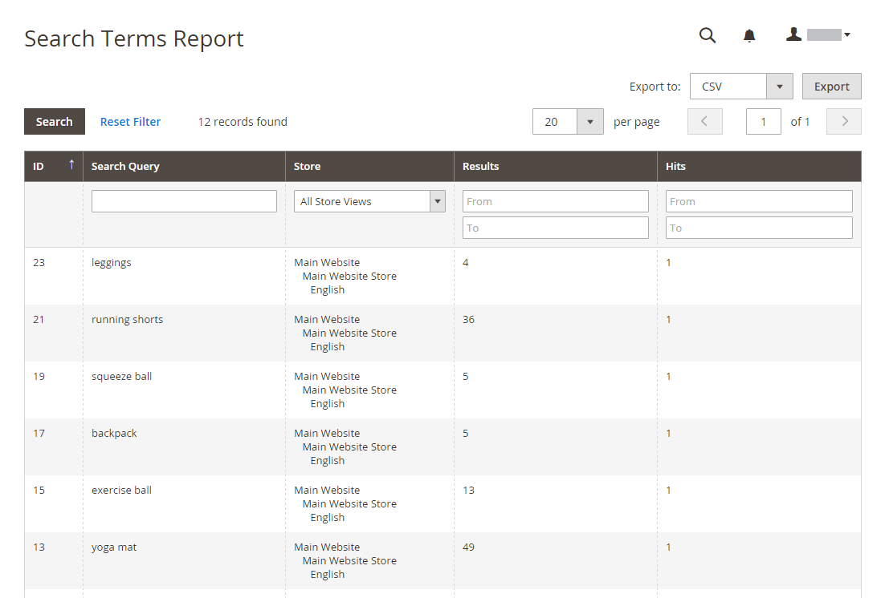

# 마케팅 보고서

마케팅 보고서는 장바구니 상태, 검색어 사용 및 뉴스레터 전송에 대한 정보를 제공합니다.

## [!UICONTROL Products in Cart]

[!UICONTROL Products in Cart] 보고서는 현재 장바구니에 있는 모든 제품 목록을 제공합니다. 각 품목의 이름과 가격, 품목이 들어 있는 장바구니 수, 각 품목의 주문 횟수 등이 포함된다.

장바구니 보고서의 {width="600"}

## [!UICONTROL Search Terms Report]

[!BADGE PaaS만]{type=Informative url="https://experienceleague.adobe.com/en/docs/commerce/user-guides/product-solutions" tooltip="Adobe Commerce 온 클라우드 프로젝트(Adobe 관리 PaaS 인프라) 및 온프레미스 프로젝트에만 적용됩니다."}

[검색어](../catalog/search-terms.md#search-terms-report) 보고서는 고객이 각 스토어 보기에서 찾고 있는 내용을 보여줍니다. 이 보고서에는 카탈로그에 있는 일치하는 항목의 수와 검색어가 사용된 횟수가 포함됩니다.

{width="600"}

## [!UICONTROL Abandoned Carts]

[!UICONTROL Abandoned Carts] 보고서에는 아직 만료되지 않은 장바구니를 포기한 등록된 모든 고객이 나열됩니다. 이 보고서에는 고객 이름 및 이메일 주소, 장바구니에 있는 제품 수 및 소계, 만든 날짜 및 마지막으로 업데이트한 날짜가 포함됩니다.

{width="600"}

## [!UICONTROL Newsletter Problems Report]

[!BADGE PaaS만]{type=Informative url="https://experienceleague.adobe.com/en/docs/commerce/user-guides/product-solutions" tooltip="Adobe Commerce 온 클라우드 프로젝트(Adobe 관리 PaaS 인프라) 및 온프레미스 프로젝트에만 적용됩니다."}

[!UICONTROL Newsletter Problems Report]에 전송 실패한 뉴스레터 큐에 대한 정보가 포함되어 있습니다. 이 보고서에는 각 가입자의 이름, 대기열 날짜와 제목, 오류에 대한 정보가 포함됩니다.

{width="600"}
