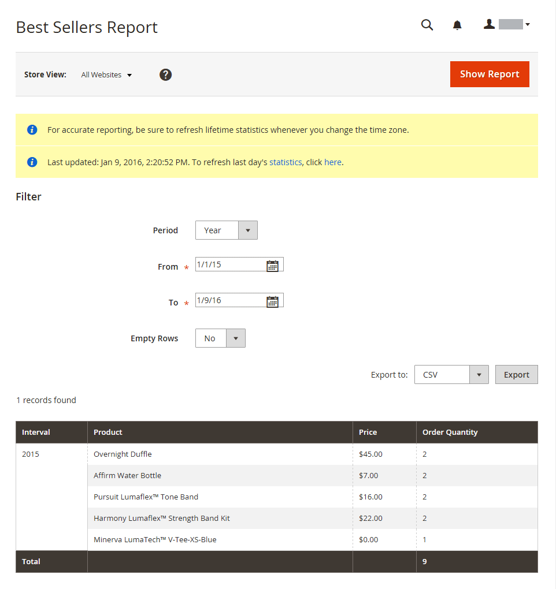
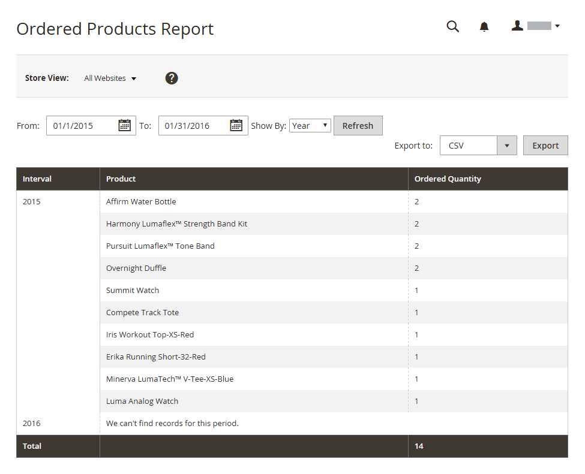

# 제품 보고서

제품 보고서는 보고 주문한 제품, 베스트셀러, 재고 수준 및 다운로드에 대한 insight을 제공합니다.

## [!UICONTROL Product Views Report]

[!UICONTROL Product Views Report]은(는) 시간 간격 또는 날짜 범위 동안 본 제품을 표시합니다. 이 보고서에는 제품 이름, 가격 및 보기 수가 포함됩니다.

_관리자_ 사이드바에서 **[!UICONTROL Reports]** > _[!UICONTROL Products]_>**[!UICONTROL Views]**(으)로 이동합니다.

{width="600"}

## [!UICONTROL Bestsellers Report]

[!UICONTROL Bestsellers Report]은(는) 시간 또는 날짜 범위 동안 가장 많이 판매되는 5개를 표시합니다. 이 보고서에는 제품명, 가격 및 주문 수량이 포함됩니다.

_관리자_ 사이드바에서 **[!UICONTROL Reports]** > _[!UICONTROL Products]_>**[!UICONTROL Bestsellers]**(으)로 이동합니다.

{width="600"}

## [!UICONTROL Low Stock Report]

[!UICONTROL Low Stock Report]은(는) 재고 수준이 지정된 범위 내에 있는 모든 제품을 나열합니다. [[!DNL Inventory Management]](../inventory-management/introduction.md)을(를) 사용하도록 설정한 경우 보고서에 나열된 원본 코드와 함께 소스당 낮은 재고 재고량이 포함됩니다.

_관리자_ 사이드바에서 **[!UICONTROL Reports]** > _[!UICONTROL Products]_>**[!UICONTROL Low Stock]**(으)로 이동합니다.

{width="600"}

## [!UICONTROL Ordered Products Report]

[!UICONTROL Ordered Products Report]은(는) 지정된 시간 간격 또는 날짜 범위 동안 주문된 모든 제품을 나열합니다. 이 보고서에는 주문된 제품명과 수량이 포함되어 있습니다.

_관리자_ 사이드바에서 **[!UICONTROL Reports]** > _[!UICONTROL Products]_>**[!UICONTROL Ordered]**(으)로 이동합니다.

{width="600"}

## [!UICONTROL Downloads Report]

[!UICONTROL Downloads Report]은(는) 지정된 시간 간격 또는 날짜 범위 동안의 모든 다운로드를 나열합니다. 이 보고서에는 제품 이름, 다운로드 링크 및 SKU와 구매 및 다운로드 수가 포함됩니다.

_관리자_ 사이드바에서 **[!UICONTROL Reports]** > _[!UICONTROL Products]_>**[!UICONTROL Downloaded]**(으)로 이동합니다.

{width="600"}
