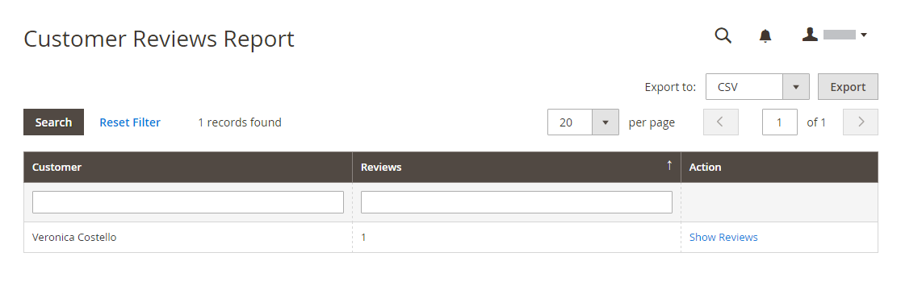

# 보고서 검토

기본 제공 [!DNL Commerce] 검토를 사용하는 경우 검토 보고서에서 고객 및 제품별 제품 검토에 대한 정보를 제공합니다.

## [!UICONTROL Customer Reviews Report]

[!UICONTROL Customer Reviews Report]은(는) 제품 검토를 제출한 모든 고객 목록을 제공합니다. 이 보고서에는 각 고객이 제출한 리뷰 수와 리뷰 목록에 대한 링크가 포함되어 있습니다.

_관리자_ 사이드바에서 **[!UICONTROL Reports]** > _[!UICONTROL Reviews]_>**[!UICONTROL By Customers]**(으)로 이동합니다.

{width="600"}

## [!UICONTROL Product Reviews Report]

[!UICONTROL Product Reviews Report]은(는) 고객이 검토한 모든 제품을 나열합니다. 이 보고서에는 리뷰 수와 평균 등급, 마지막으로 리뷰한 제품, 각 제품에 대한 리뷰 목록에 대한 링크가 포함되어 있습니다.

_관리자_ 사이드바에서 **[!UICONTROL Reports]** > _[!UICONTROL Reviews]_>**[!UICONTROL By Products]**(으)로 이동합니다.

{width="600"}
