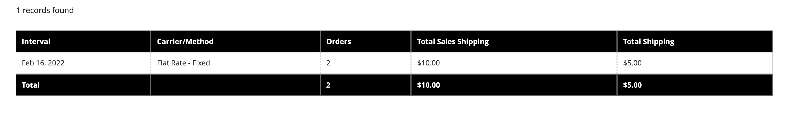

# 영업 보고서

판매 보고서의 선택에는 주문, 세금, 송장, 배송, 환불, 쿠폰 및 PayPal 결제가 포함됩니다.

## 보고서 필터

전체 웹 사이트 또는 한 스토어에 대한 판매 보고서를 생성할 수 있습니다. 영업 보고서는 시간 간격, 날짜 및 상태로 필터링할 수 있습니다.

{width="600"}

판매 보고서를 필터링하려면 다음 옵션을 설정합니다.

| 옵션 | 설명 |
|--- |--- |
| [!UICONTROL Date Used] | 보고서에 사용할 데이터를 설정합니다. |
| [!UICONTROL Period] | 데이터가 사용되는 기간: 일/월/년. |
| [!UICONTROL From/To] | 시작 및 종료 날짜별로 검색 데이터를 정의하는 데 사용됩니다. |
| [!UICONTROL Order Status] | 주문 상태를 나타냅니다. |
| [!UICONTROL Empty Rows] | 보고서에 빈 행을 추가할지 여부를 나타냅니다. |

## [!UICONTROL Orders Report]

[!UICONTROL Orders Report]에는 주문 건수와 취소 건수가 포함되어 있으며 판매, 송장 발행 금액, 환불, 세금 징수, 운송 비용 및 할인 합계도 포함되어 있습니다.

1. _관리자_ 사이드바에서 **[!UICONTROL Reports]** > _[!UICONTROL Sales]_>**[!UICONTROL Orders]**(으)로 이동합니다.

1. **[!UICONTROL Filter]** 섹션에서 보고서를 채우는 데 사용되는 보고 기간 옵션 및 주문 상태를 선택합니다.

1. **[!UICONTROL Show Report]**&#x200B;을(를) 클릭합니다.

{width="600"}

## [!UICONTROL Tax Report]

[!UICONTROL Tax Report]에는 적용된 세금 규칙, 세율, 주문 수 및 부과된 세액이 포함됩니다.

1. _관리자_ 사이드바에서 **[!UICONTROL Reports]** > _[!UICONTROL Sales]_>**[!UICONTROL Tax]**(으)로 이동합니다.

1. **[!UICONTROL Filter]** 섹션에서 보고서를 채우는 데 사용되는 보고 기간 옵션 및 주문 상태를 선택합니다.

1. **[!UICONTROL Show Report]**&#x200B;을(를) 클릭합니다.

{width="600"}

## [!UICONTROL Invoice Report]

[!UICONTROL Invoice Report]에는 해당 기간 동안의 주문 및 송장 수와 송장 발행, 지급 및 미지급 금액이 포함됩니다.

1. _관리자_ 사이드바에서 **[!UICONTROL Reports]** > _[!UICONTROL Sales]_>**[!UICONTROL Invoiced]**(으)로 이동합니다.

1. **[!UICONTROL Filter]** 섹션에서 보고서를 채우는 데 사용되는 보고 기간 옵션 및 주문 상태를 선택합니다.

1. **[!UICONTROL Show Report]**&#x200B;을(를) 클릭합니다.

{width="600"}

## [!UICONTROL Shipping Report]

[!UICONTROL Shipping Report]에는 사용된 통신사 또는 배송 방법에 대한 주문 수가 포함되어 있습니다. 여기에는 총 판매 및 총 배송 금액이 포함됩니다.

1. _관리자_ 사이드바에서 **[!UICONTROL Reports]** > _[!UICONTROL Sales]_>**[!UICONTROL Shipping]**(으)로 이동합니다.

1. **[!UICONTROL Filter]** 섹션에서 보고서를 채우는 데 사용되는 보고 기간 옵션 및 주문 상태를 선택합니다.

1. **[!UICONTROL Show Report]**&#x200B;을(를) 클릭합니다.

{width="600"}

## [!UICONTROL Refunds Report]

[!UICONTROL Refunds Report]에는 환불된 주문 수와 온라인 및 오프라인에서 환불된 총 금액이 포함됩니다.

1. _관리자_ 사이드바에서 **[!UICONTROL Reports]** > _[!UICONTROL Sales]_>**[!UICONTROL Refunds]**(으)로 이동합니다.

1. **[!UICONTROL Filter]** 섹션에서 보고서를 채우는 데 사용되는 보고 기간 옵션 및 주문 상태를 선택합니다.

1. **[!UICONTROL Show Report]**&#x200B;을(를) 클릭합니다.

{width="600"}

## [!UICONTROL Coupons Report]

[!UICONTROL Coupons Report]에는 지정된 시간 간격 동안 사용된 각 쿠폰 코드, 관련 가격 규칙 및 사용 횟수, 판매 및 할인에 대한 합계 및 소계가 포함됩니다.

1. _관리자_ 사이드바에서 **[!UICONTROL Reports]** > _[!UICONTROL Sales]_>**[!UICONTROL Coupons]**(으)로 이동합니다.

1. **[!UICONTROL Filter]** 섹션에서 보고서를 채우는 데 사용되는 보고 기간 옵션 및 주문 상태를 선택합니다.

1. **[!UICONTROL Show Report]**&#x200B;을(를) 클릭합니다.

[!UICONTROL Coupons Report]을(를) 사용하여 프로모션 캠페인에 대한 데이터를 수집하는 방법에 대한 자세한 내용은 _머천다이징 및 프로모션 안내서_&#x200B;의 [쿠폰 보고](../merchandising-promotions/price-rules-cart-coupon.md#coupons-report)를 참조하십시오.

<!---  need coupon data  -->

## [!UICONTROL PayPal Settlement Reports]

[PayPal 결제 보고서] 페이지에는 직불 카드 거래, 시작 및 종료 날짜, 총액 및 관련 수수료와 같은 이벤트 유형이 포함되어 있습니다. PayPal의 최신 데이터로 보고서를 자동으로 업데이트할 수 있습니다. 날짜 범위, 판매자 계정, 거래 ID, 송장 ID 또는 PayPal 참조 ID에 대한 필터링 옵션이 있습니다.

_관리자_ 사이드바에서 **[!UICONTROL Reports]** > _[!UICONTROL Sales]_>**[!UICONTROL PayPal Settlement]**(으)로 이동합니다.

{width="600"}

[!UICONTROL PayPal Settlement Reports]을(를) 사용하여 자금 결제에 영향을 주는 각 PayPal 거래에 대한 정보를 검색하는 방법에 대한 자세한 내용은 _저장 및 구매 경험 안내서_&#x200B;에서 [PayPal 결제 보고서](../stores-purchase/paypal-settlement-reports.md)를 참조하십시오.

## [!UICONTROL Braintree Settlement Report]

[Braintree](../stores-purchase/braintree.md) 결제 보고서는 만든 날짜, 금액, 상태, 거래 유형, 결제 유형, 거래 ID, 주문 ID, PayPal 결제 ID, 유형, 판매자 계정 ID 또는 결제 배치 ID에 따라 필터링될 수 있습니다. 이 보고서에는 거래 ID, 주문 ID, PayPal 결제 ID, 유형, 생성일, 금액, 결제 코드, 상태, 결제 응답 텍스트, 환급 ID, 판매자 계정 ID, 결제 배치 ID 및 통화가 포함되어 있습니다.

_관리자_ 사이드바에서 **[!UICONTROL Reports]** > _[!UICONTROL Sales]_>**[!UICONTROL Braintree Settlement]**(으)로 이동합니다.

<!---  need a Braintree connection to update report screen -->

## 보고서 내보내기

1. 보고서를 내보내려면 파일 형식(`Excel XML` 또는 `CSV`)을 선택하십시오.

1. **[!UICONTROL Export]**&#x200B;을(를) 클릭합니다.

## 통계 새로 고침

판매 보고서를 생성함으로써 성능에 미치는 영향을 줄이기 위해 [!DNL Commerce]에서는 각 보고서에 필요한 통계를 계산하고 저장합니다. 보고서가 생성될 때마다 통계를 다시 계산하지 않고, 통계를 새로 고치지 않는 한 저장된 통계가 사용됩니다. 가장 최근 데이터를 포함하려면 판매 보고서가 생성되기 전에 보고서 통계를 새로 고쳐야 합니다.

{width="700"}

1. _관리자_ 사이드바에서 **[!UICONTROL Reports]** > _[!UICONTROL Statistics]_>**[!UICONTROL Refresh Statistics]**(으)로 이동합니다.

1. 목록에서 새로 고칠 각 보고서에 대한 확인란을 선택합니다.

1. **[!UICONTROL Actions]** 컨트롤을 다음 중 하나로 설정합니다.

   - `Refresh Lifetime Statistics`
   - `Refresh Statistics for the Last Day`

1. **[!UICONTROL Submit]**&#x200B;을(를) 클릭합니다.
